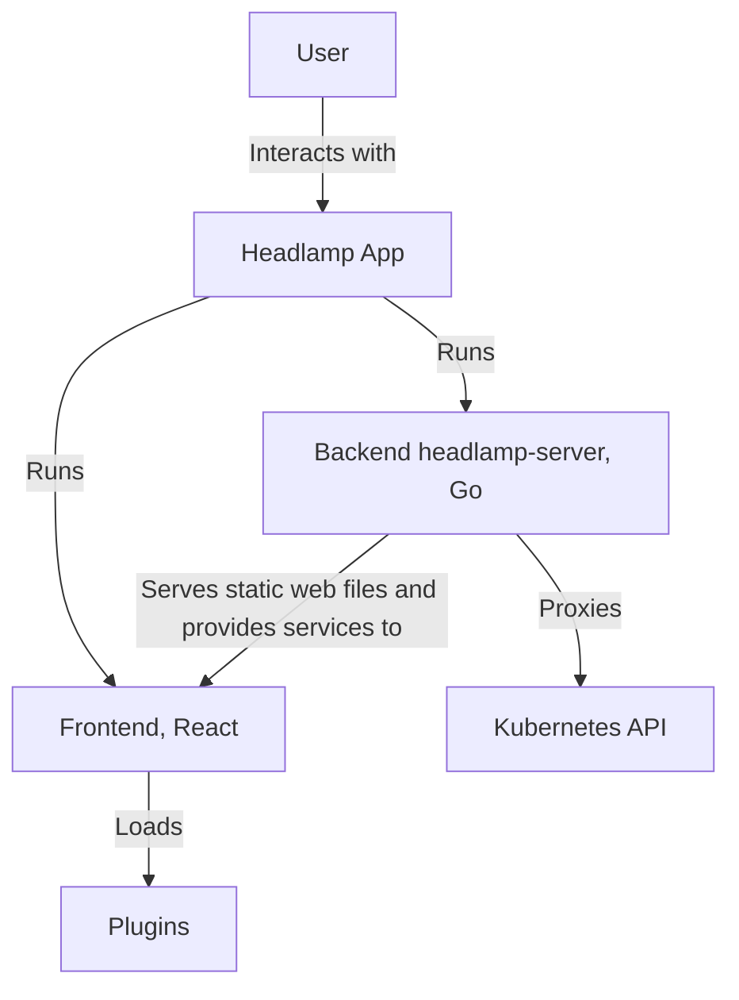
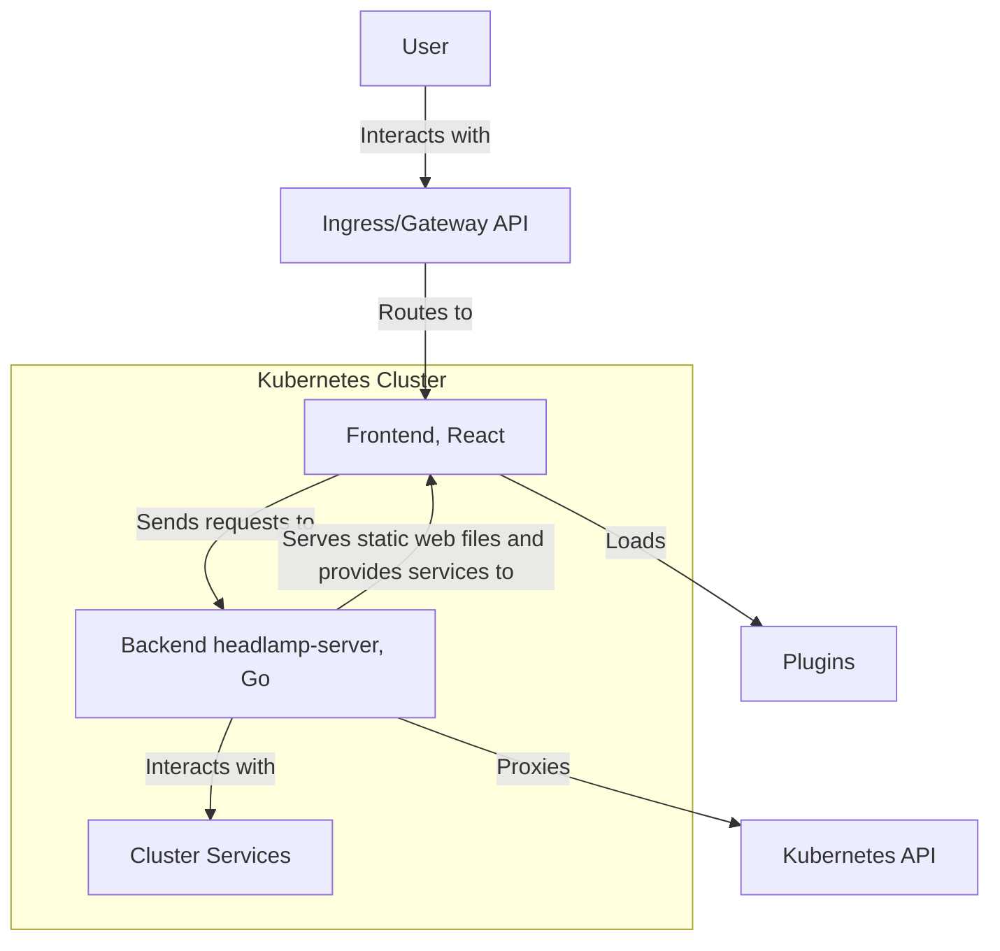
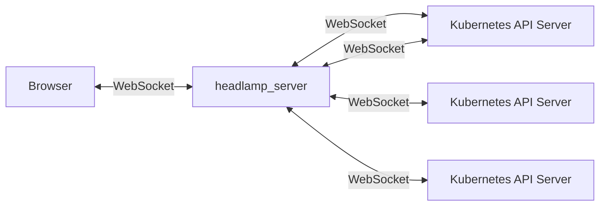
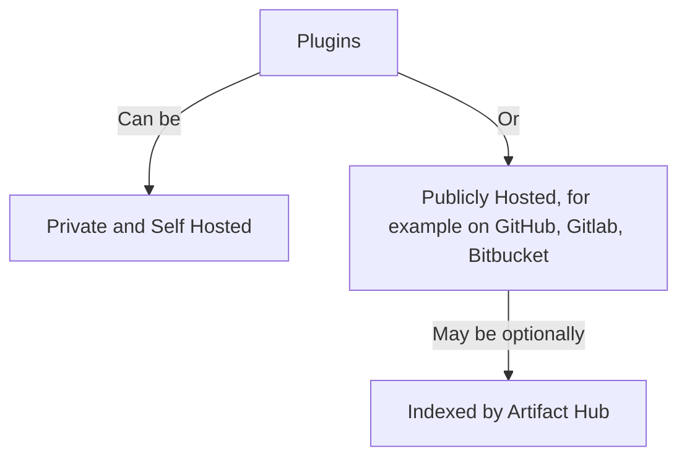
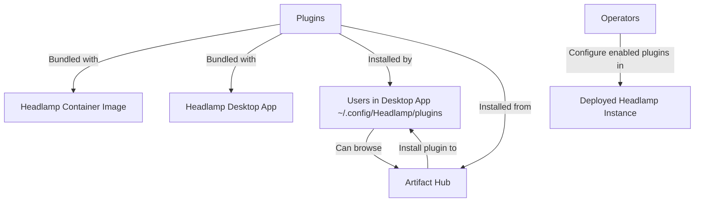

## Introduction

This document explains how Headlamp is built. It covers the main parts of the system, how you can run it, how to customize it, and the ideas behind its design.

Headlamp is a user-friendly and extensible Kubernetes UI. It is designed to provide a seamless experience for managing Kubernetes clusters. It can connect to one or multiple Kubernetes clusters and can be deployed as a web app in-cluster or as a desktop app. You can customize Headlamp using plugins, which let you change how it looks and works to fit your needs.


## High-Level Architecture and Request Lifecycle

The diagrams below show how Headlamp works and the different ways you can run it.

### Data Flow / Request Lifecycle

How does a typical user request flow through Headlamp?

#### Headlamp running as a Desktop App (on MacOS, Windows, Linux etc)



#### Headlamp Web App running inside a Kubernetes Cluster



Notes:
- Frontend handles user interactions and displays data.
- Backend acts as a proxy and service layer. Handling authentication, RBAC, and API aggregation.
- Kubernetes API is the source of truth for cluster state.
- WebSocket connections follow a similar path. However, they maintain persistent connections for real-time updates.


### WebSocket Lifecycle and Real-Time Updates

How does Headlamp get real-time updates from Kubernetes clusters?

- WebSockets are used for real-time updates from Kubernetes. 
- Browsers support a limited number of connections: six usually.
- How is the browser's WebSocket limit overcome? Headlamp uses one WebSocket from the browser to the `headlamp-server`. That server then opens many WebSockets to different Kubernetes API servers.



### Plugins

#### Plugin Hosting Options

Where can plugins be hosted? It's possible to host plugins in many places both publicly and privately.

See:
- [headlamp-k8s/plugins repo](https://github.com/headlamp-k8s/plugins) maintained by Headlamp developers.
- [headlamp plugins on Artifact Hub](https://artifacthub.io/packages/search?kind=21&sort=relevance&page=1) for a list of plugins published publicly. Artifact Hub is an index of Cloud Native project artifacts like helm charts and Headlamp Plugins.




#### Plugin Using and Bundling Options

How can plugins be enabled?

- Operators can configure which plugins which they enable for their deployed version of Headlamp.
- Users of the Headlamp Desktop app can install and enable their own plugins.
- The Headlamp Desktop App can browse and install Headlamp Plugins indexed on Artifact Hub.
- Some plugins are bundled with the Headlamp app.
- Some plugins are bundled with the container image.




## Source Map for Components

Headlamp consists of the following major components:
- **frontend/**: A React-based UI that interacts with the backend to manage clusters.
- **backend/**: A Go-based server that communicates with the Kubernetes API and the frontend.
- **app/**: A native Electron-based application for running Headlamp as a desktop app.
- **plugins/examples**: Example plugins demonstrating how to extend Headlamp.
- **plugins/headlamp-plugin**: A component to manage plugins in development and in deployment.
- **docs/**: Documentation that is in Markdown, and gets put on the Headlamp Website.

The following components are in separate GitHub repos:
- **Plugins**: Extensible modules that add custom functionality to the UI. The Headlamp team maintains their plugins in the [headlamp-k8s/plugins repo](https://github.com/headlamp-k8s/plugins). These include plugins for projects like Flux, Backstage and Inspektor Gadget.
- **Headlamp Website**: Maintained in the [headlamp-k8s/website repo](https://github.com/headlamp-k8s/website). This contains things like the blog and the documentation. The website can be found at https://headlamp.dev/

### Makefile task entry point

The headlamp/ repo [Makefile](https://github.com/kubernetes-sigs/headlamp/blob/main/Makefile) contains targets for building and testing different components.

Here are some examples:

```shell
make backend
make backend-lint
make backend-test
make run-backend
make frontend
make frontend-lint
make frontend-test
make run-frontend
```

### Frontend

- Entry point is [frontend/src/index.tsx](https://github.com/kubernetes-sigs/headlamp/blob/main/frontend/src/index.tsx)
- See the [Frontend Documentation](https://headlamp.dev/docs/latest/development/frontend) for more information including a Quickstart.

A few key dependencies:

- **TypeScript**: Written in TypeScript.
- **React Components**: Modular and reusable components that form the UI.
- **MUI**: For UI components, it uses MUI, a Material UI component library.
- **State Management**: Uses Redux for managing application state.
- **Routing**: Utilizes React Router for navigation within the app.
- **Npm**: Uses npm for package management.

Each component has a matching `.stories.tsx` file. For example, `Tables.stories.tsx` is the story file for the `Table.tsx` component.

### Backend (headlamp-server)

- The [backend/](https://github.com/kubernetes-sigs/headlamp/blob/main/backend/) folder contains the source code for the headlamp-server binary.
- Entry point is [backend/cmd/headlamp.go](https://github.com/kubernetes-sigs/headlamp/blob/main/backend/cmd/headlamp.go)
- See the [Backend Documentation](https://headlamp.dev/docs/latest/development/backend/) for more information including a Quickstart.
- **Golang**: Written in the [Go programming language](https://golang.org/).
- **Gorilla**: Uses the Gorilla web toolkit for HTTP routing and middleware.
- **Kubernetes and Helm**: Integrates with Kubernetes and Helm Go packages.

Packages are stored in the [backend/pkg](https://github.com/kubernetes-sigs/headlamp/blob/main/backend/pkg/) folder. The packages available are cache, config, helm, kubeconfig, logger, plugins, portforward, and utils. Future code should be organized in packages. Some code in the cmd/ folder should move into separate packages.

For each module we have a test file. For example config.go comes with config_test.go.

### Desktop App

- The [app/](https://github.com/kubernetes-sigs/headlamp/tree/main/app) folder contains everything to do with the desktop app.
- Entry point is [app/electron/main.ts](https://github.com/kubernetes-sigs/headlamp/blob/main/app/electron/main.ts)

A few key dependencies:
**TypeScript**: Language in which the app's code is written.
**Electron**: Used to create a native desktop application for Headlamp.
**Yargs**: Used for command line argument processing.

### Plugins

What plugin-related resources are available, and where are they located?

- The [plugins/headlamp-plugin](https://github.com/kubernetes-sigs/headlamp/tree/main/plugins/headlamp-plugin) folder contains the headlamp-plugin tool which provides plugin build and management tools.
- [plugins/examples](https://github.com/kubernetes-sigs/headlamp/tree/main/plugins/examples) folder contains some example plugins.
- [frontend/src/plugin](https://github.com/kubernetes-sigs/headlamp/tree/main/frontend/src/plugin) folder contains frontend code related to plugins.
- [backend/pkg/plugins/](https://github.com/kubernetes-sigs/headlamp/tree/main/backend/pkg/plugins/) folder contains backend code related to plugins.
- [headlamp-k8s/plugins repo](https://github.com/headlamp-k8s/plugins) contains plugins maintained by the Headlamp team. Including plugins for projects like Flux, Backstage and Inspektor Gadget.
- See the [Plugin Development Documentation](https://headlamp.dev/docs/latest/development/plugins/) for more information about developing plugins.

A key dependency:
- **headlamp-plugin**: provides commands for running builds, linting, formatting, and testing. Provides shared config for tools like TypeScript, linting and formatting. Also provides tools for upgrading plugins between releases of Headlamp.

## Design Principles and Core Behaviors

This section outlines the key ideas that guide how Headlamp is built and what must always be true about how it works.

- **Extensibility**: Headlamp supports plugins, so users can customize how it looks and works.
- **Multi-Cluster Support**: It can connect to and manage more than one Kubernetes cluster at the same time.
- **Security**: All actions must be secure and follow Kubernetes RBAC rules.
- **Accessibility**: The interface should be easy and comfortable for everyone to use.
- **Realtime**: It updates automatically when something changes in the cluster.
- **Consistency**: The UI should always show the current state of the cluster.
- **Adaptive UI**: The interface should adjust based on what the user is allowed to do. For example, if a user can’t edit something, they’ll only see a “view” button.

If you're planning a big change to Headlamp, please open an issue first. See the [contribution guide](https://headlamp.dev/docs/latest/faq/) for more info.

## Deployment Options

See the [Installation Documentation](https://headlamp.dev/docs/latest/installation/) for more information, including a Quickstart.

As mentioned above, Headlamp can be deployed as a container inside a Kubernetes cluster or as a Desktop app.

## Future Work

To see planned or in progress features, check the [Release Plan / Roadmap](https://github.com/orgs/headlamp-k8s/projects/1/views/1). It’s regularly updated, but it's a tentative plan. 

Note: Since Headlamp is open source, people contribute things that aren’t listed there. You can also explore:
- [Open issues](https://github.com/kubernetes-sigs/headlamp/issues) — for bugs, feature requests, and discussions.
- [Pull requests](https://github.com/kubernetes-sigs/headlamp/pulls) — to see what changes are being proposed or reviewed.
- [Milestones](https://github.com/kubernetes-sigs/headlamp/milestones) — to track progress toward upcoming releases.

## Releases

We aim to release Headlamp monthly, with bug fix releases as needed. Please see the releases on GitHub for information about released artifacts:
- [Headlamp repo releases](https://github.com/kubernetes-sigs/headlamp/releases)
- [Plugins repo releases](https://github.com/headlamp-k8s/plugins/releases)

See the [Release Guide](https://headlamp.dev/docs/latest/development/release-guide) for more information on how releases are done.
