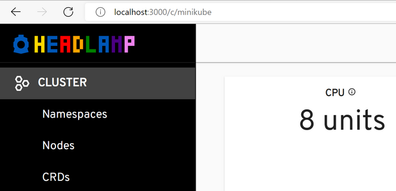
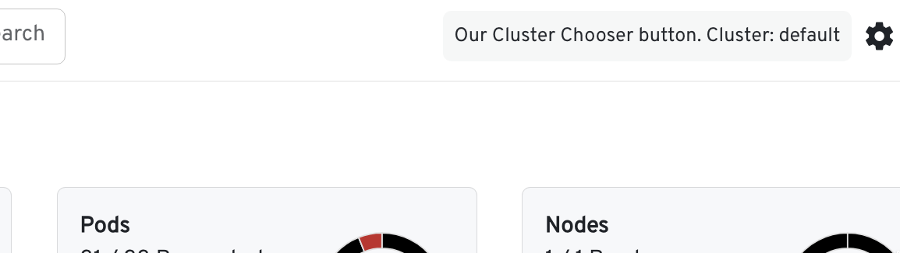
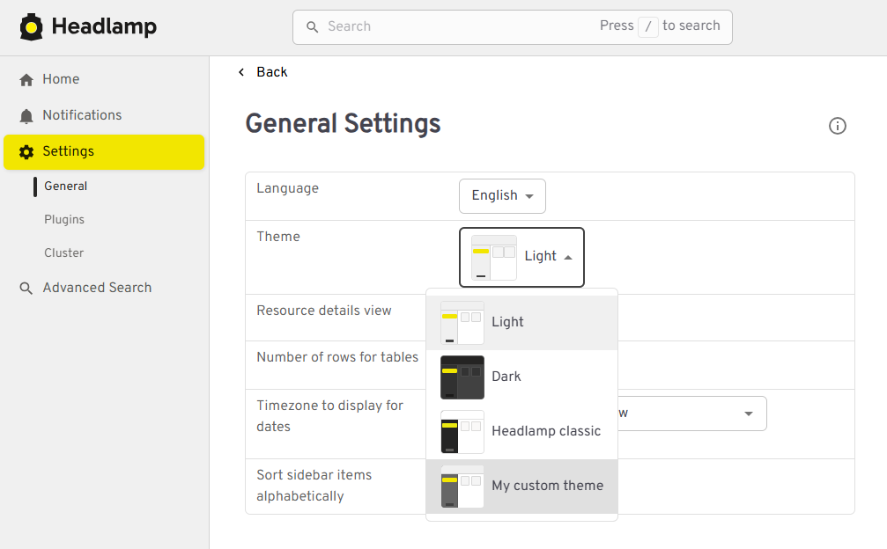
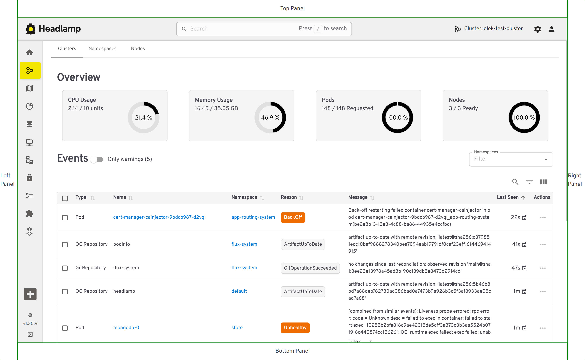
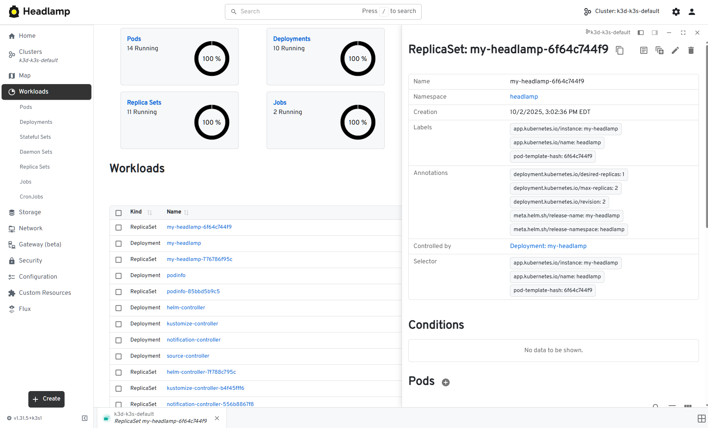

Headlamp's plugins exist to change or add functionality related to
the user interface and experience.

## Plugins Lib

The `@kinvolk/headlamp-plugin` module provides a library
(`@kinvolk/headlamp-plugin/lib`) with Headlamp development modules.

The main ones are:

- K8s: Kubernetes functionality.
- Headlamp: To register plugins.
- CommonComponents: Commonly used React components in the Headlamp UI.
- Notification: This module exports two members: `Notification` and `setNotificationsInStore`.
  The `Notification` class creates notifications. The `setNotificationsInStore`
  function sends the notification to Headlamp to be displayed.
- Router: To get or generate routes.

### Shared Modules

Headlamp shares many npm modules with plugins. It includes VSCode configuration
files to find them.

These are:

- react
- @iconify-react
- react-redux
- @material-ui/core
- @material-ui/styles
- lodash
- notistack
- recharts

This means that plugins only need to install dependencies not already in Headlamp. If a plugin
installs a dependency that Headlamp already has, make sure the versions are the
same. The build process will not bundle these shared modules. Instead, they are
replaced by the version in the `pluginLib` global object.

Older guides suggested using `const React: window.pluginLib.React` to access
React. This is no longer needed.

## Functionality

The plugin registry makes functionality available to plugins.

The goal is to make more functionality available to plugins. Here is what we
have so far:

### App Bar Action

Show a component in the top right of the app bar with
[registerAppBarAction](../../api/plugin/registry/functions/registerappbaraction).

- Example plugin: [How To Register an App Bar Action](https://github.com/kubernetes-sigs/headlamp/tree/main/plugins/examples/pod-counter)
- API reference: [registerAppBarAction](../../api/plugin/registry/functions/registerappbaraction)

### App Logo

Change the logo in the top left with
[registerAppLogo](../../api/plugin/registry/functions/registerapplogo).

- Example plugin: [How To Change The Logo](https://github.com/kubernetes-sigs/headlamp/tree/main/plugins/examples/change-logo)
- API reference: [registerAppLogo](../../api/plugin/registry/functions/registerapplogo)

### App Menus

Add menus when Headlamp runs as an app with
[Headlamp.setAppMenu](../../api/plugin/lib/classes/Headlamp#setappmenu).

- Example plugin: [How To Add App Menus](https://github.com/kubernetes-sigs/headlamp/tree/main/plugins/examples/app-menus)
- API reference: [Headlamp.setAppMenu](../../api/plugin/lib/classes/Headlamp#setappmenu)

### Cluster Chooser

Change the Cluster Chooser button in the top right of the app bar with
[registerClusterChooser](../../api/plugin/registry/functions/registerclusterchooser).

- Example plugin: [How To Register Cluster Chooser button](https://github.com/kubernetes-sigs/headlamp/tree/main/plugins/examples/cluster-chooser)
- API reference: [registerClusterChooser](../../api/plugin/registry/functions/registerclusterchooser)

### Details View Header Action

Show a component in the top right of a detail view with
[registerDetailsViewHeaderAction](../../api/plugin/registry/functions/registerdetailsviewheaderaction).

- Example plugin: [How To set a Details View Header Action](https://github.com/kubernetes-sigs/headlamp/tree/main/plugins/examples/details-view)
- API reference: [registerDetailsViewHeaderAction](../../api/plugin/registry/functions/registerdetailsviewheaderaction)

### Details View Section

Change sections in a Kubernetes resource's details view with
[registerDetailsViewSectionsProcessor](../../api/plugin/registry/functions/registerdetailsviewsectionsprocessor).
This lets you add, remove, update, or move sections.

Or, add a component to the bottom of a details view with
[registerDetailsViewSection](../../api/plugin/registry/functions/registerdetailsviewsection).

- Example plugin: [How To set a Details View Section](https://github.com/kubernetes-sigs/headlamp/tree/main/plugins/examples/details-view)
- API reference: [registerDetailsViewSection](../../api/plugin/registry/functions/registerdetailsviewsection)

### Dynamic Clusters

Set a cluster dynamically, instead of from a configuration file, with
[Headlamp.setCluster](../../api/plugin/lib/classes/Headlamp.md#setcluster).

- Example plugin: [How To Dynamically Set a Cluster](https://github.com/kubernetes-sigs/headlamp/tree/main/plugins/examples/dynamic-clusters)
- API reference: [Headlamp.setCluster](../../api/plugin/lib/classes/Headlamp.md#setcluster)

### Route

Show a component in the main area at a given URL with
[registerRoute](../../api/plugin/registry/functions/registerroute).

- Example plugin: [How To Register a Route](https://github.com/kubernetes-sigs/headlamp/tree/main/plugins/examples/sidebar)
- API reference: [registerRoute](../../api/plugin/registry/functions/registerroute)
- API reference: [registerRouteFilter](../../api/plugin/registry/functions/registerroutefilter)

### Sidebar Item

Add items to the left sidebar with
[registerSidebarEntry](../../api/plugin/registry/functions/registersidebarentry).
Remove items with
[registerSidebarEntryFilter](../../api/plugin/registry/functions/registersidebarentryfilter).

- Example plugin: [How To add items to the sidebar](https://github.com/kubernetes-sigs/headlamp/tree/main/plugins/examples/sidebar)
- API reference: [registerSidebarEntry](../../api/plugin/registry/functions/registersidebarentry)
- API reference: [registerSidebarEntryFilter](../../api/plugin/registry/functions/registersidebarentryfilter)

### Tables

Change tables in Headlamp with
[registerResourceTableColumnsProcessor](../../api/plugin/registry/functions/registersidebarentry).
This lets you add, remove, update, or move table columns.

- Example plugin: [How to add a context menu to each row in the pods list table](https://github.com/kubernetes-sigs/headlamp/tree/main/plugins/examples/tables)
- API reference: [registerResourceTableColumnsProcessor](../../api/plugin/registry/functions/registerresourcetablecolumnsprocessor)

### Headlamp Events

Headlamp fires events when something important happens.

React to Headlamp events with
[registerHeadlampEventCallback](../../api/plugin/registry/functions/registerheadlampeventcallback).

- Example plugin: [How to show snackbars for Headlamp events](https://github.com/kubernetes-sigs/headlamp/tree/main/plugins/examples/headlamp-events)
- API reference: [registerHeadlampEventCallback](../../api/plugin/registry/functions/registerheadlampeventcallback)

### Plugin Settings

Plugins can have user settings. Create them with
[registerPluginSettings](../../api/plugin/registry/functions/registerpluginsettings).

- Example plugin: [How to create plugin settings and use them](https://github.com/kubernetes-sigs/headlamp/tree/main/plugins/examples/change-logo)

### App Theme

Add a custom Headlamp theme with
[registerAppTheme](../../api/plugin/registry/functions/registerapptheme).
The theme name must be unique. You can specify 'light' or 'dark' as a base.
The default is 'light'.

Check the [AppTheme](../../api/lib/AppTheme/interfaces/AppTheme.md)
definition for all customizable properties.

After you register your theme, it will be in the 'Theme' selection in General
Settings.

### UI Panels

Register a side panel with
[registerUIPanel](../../api/plugin/registry/functions/registerUIPanel).
A side panel is a UI element on one side of the application. You can define
more than one panel per side. Each panel needs a unique ID, a side (top, left,
right, bottom), and a React component.

Check the
[example plugin](https://github.com/kubernetes-sigs/headlamp/tree/main/plugins/examples/ui-panels)
for the full code.

### Projects customization

Customize Headlamp's Projects feature with several registration functions:

Add custom tabs to the project details view with
[registerProjectDetailsTab](../../api/plugin/registry/functions/registerProjectDetailsTab).
Each tab needs a unique ID, a label, and a React component that receives the project as a prop.

Add custom sections to the project overview page with
[registerProjectOverviewSection](../../api/plugin/registry/functions/registerProjectOverviewSection).
These sections appear in the project's main overview area.

Example plugin: [How to customize projects](https://github.com/kubernetes-sigs/headlamp/tree/main/plugins/examples/projects)

### Activities

Activity is a Headlamp feature that allows you to create resizable popup windows.
For example when you click on a resource (like a Pod or ReplicaSet), the details will open in Activity.

You can create and update Actitivities from plugins using [Activity API](../../api/components/activity/Activity/variables/Activity.md)

Check the [example plugin](https://github.com/kubernetes-sigs/headlamp/tree/main/plugins/examples/activity) for the full code.
