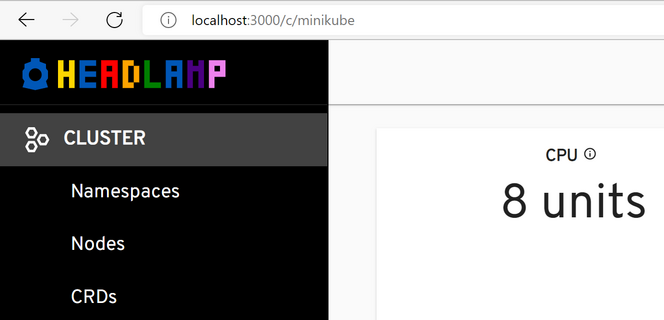
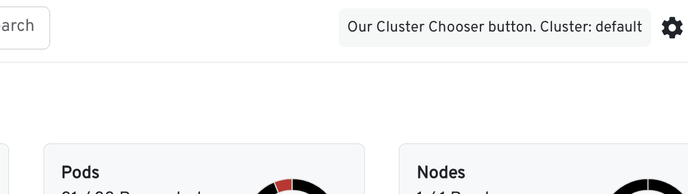
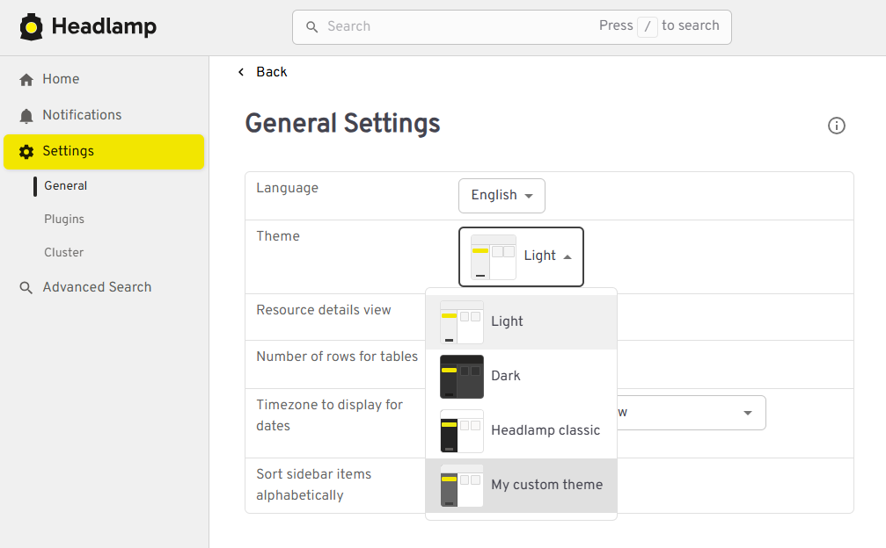
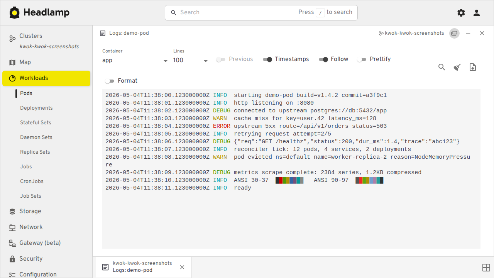
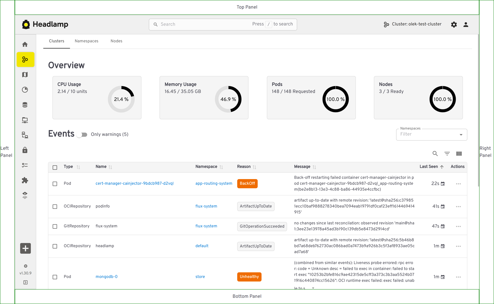
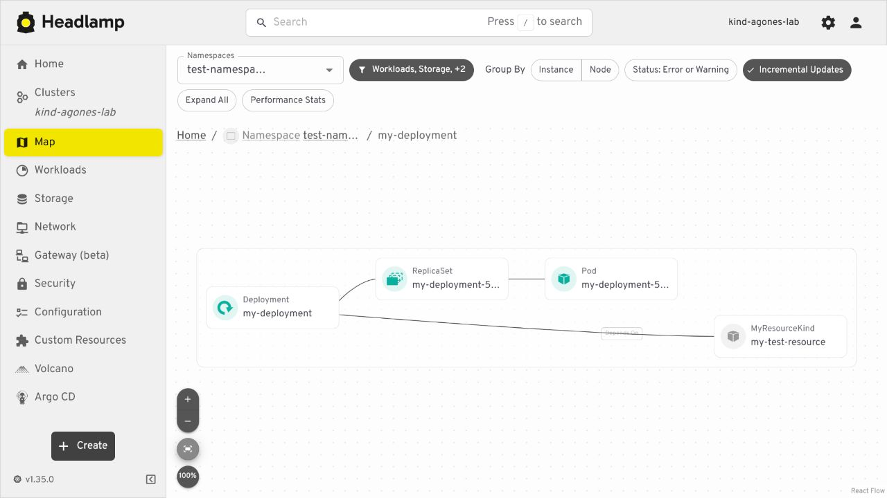
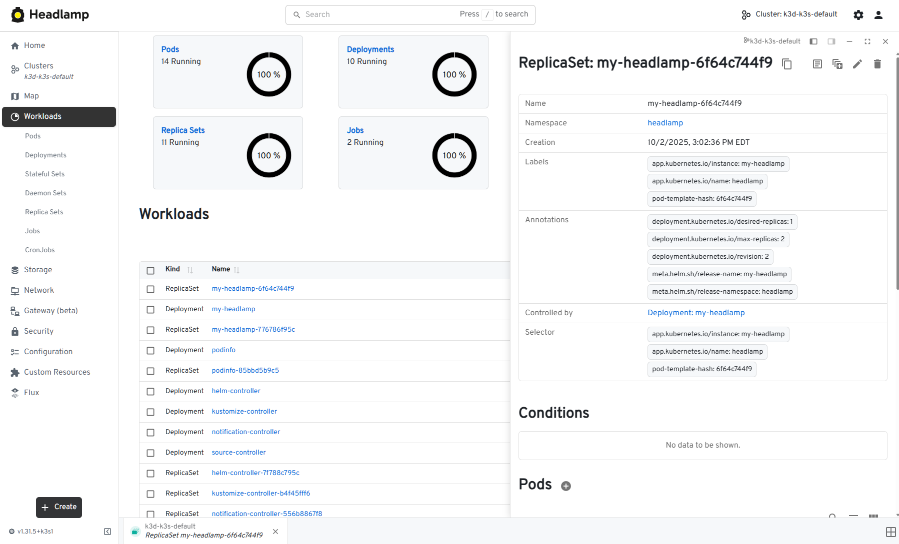

Headlamp's plugins exist to change or add functionality related to
the user interface and experience.

## Plugins Lib

The `@kinvolk/headlamp-plugin` module provides a library
(`@kinvolk/headlamp-plugin/lib`) with Headlamp development modules.

The main ones are:

- K8s: Kubernetes functionality.
- Headlamp: To register plugins.
- CommonComponents: Commonly used React components in the Headlamp UI.
- Notification: This module exports two members: `Notification` and `setNotificationsInStore`.
  The `Notification` class creates notifications. The `setNotificationsInStore`
  function sends the notification to Headlamp to be displayed.
- Router: To get or generate routes.

### Shared Modules

Headlamp shares many npm modules with plugins. It includes VSCode configuration
files to find them.

These are:

- react
- @iconify-react
- react-redux
- @material-ui/core
- @material-ui/styles
- lodash
- notistack
- recharts

This means that plugins only need to install dependencies not already in Headlamp. If a plugin
installs a dependency that Headlamp already has, make sure the versions are the
same. The build process will not bundle these shared modules. Instead, they are
replaced by the version in the `pluginLib` global object.

Older guides suggested using `const React: window.pluginLib.React` to access
React. This is no longer needed.

## Functionality

The plugin registry makes functionality available to plugins.

The goal is to make more functionality available to plugins. Here is what we
have so far:

### App Bar Action

Show a component in the top right of the app bar with
[registerAppBarAction](../../api/plugin/registry/functions/registerappbaraction).


- Example plugin: [How To Register an App Bar Action](https://github.com/kubernetes-sigs/headlamp/tree/main/plugins/examples/pod-counter)
- API reference: [registerAppBarAction](../../api/plugin/registry/functions/registerappbaraction)

### App Logo

Change the logo in the top left with
[registerAppLogo](../../api/plugin/registry/functions/registerapplogo).



- Example plugin: [How To Change The Logo](https://github.com/kubernetes-sigs/headlamp/tree/main/plugins/examples/change-logo)
- API reference: [registerAppLogo](../../api/plugin/registry/functions/registerapplogo)

### App Menus

Add menus when Headlamp runs as an app with
[Headlamp.setAppMenu](../../api/plugin/lib/classes/Headlamp#setappmenu).


- Example plugin: [How To Add App Menus](https://github.com/kubernetes-sigs/headlamp/tree/main/plugins/examples/app-menus)
- API reference: [Headlamp.setAppMenu](../../api/plugin/lib/classes/Headlamp#setappmenu)

### Cluster Chooser

Change the Cluster Chooser button in the top right of the app bar with
[registerClusterChooser](../../api/plugin/registry/functions/registerclusterchooser).



- Example plugin: [How To Register Cluster Chooser button](https://github.com/kubernetes-sigs/headlamp/tree/main/plugins/examples/cluster-chooser)
- API reference: [registerClusterChooser](../../api/plugin/registry/functions/registerclusterchooser)

### Cluster Empty State

Customize the Home page shown when no clusters are configured with
[registerClusterEmptyState](../../api/plugin/registry/functions/registerclusteremptystate).
The registered component receives Headlamp's standard empty state as
`defaultContent`. Render it to extend the default onboarding, or omit it to
replace the empty state completely.

- Example plugin: [How To Customize The Cluster Empty State](https://github.com/kubernetes-sigs/headlamp/tree/main/plugins/examples/cluster-chooser)
- API reference: [registerClusterEmptyState](../../api/plugin/registry/functions/registerclusteremptystate)

### Details View Header Action

Show a component in the top right of a detail view with
[registerDetailsViewHeaderAction](../../api/plugin/registry/functions/registerdetailsviewheaderaction).


- Example plugin: [How To set a Details View Header Action](https://github.com/kubernetes-sigs/headlamp/tree/main/plugins/examples/details-view)
- API reference: [registerDetailsViewHeaderAction](../../api/plugin/registry/functions/registerdetailsviewheaderaction)

### Details View Section

Change sections in a Kubernetes resource's details view with
[registerDetailsViewSectionsProcessor](../../api/plugin/registry/functions/registerdetailsviewsectionsprocessor).
This lets you add, remove, update, or move sections.

Or, add a component to the bottom of a details view with
[registerDetailsViewSection](../../api/plugin/registry/functions/registerdetailsviewsection).


- Example plugin: [How To set a Details View Section](https://github.com/kubernetes-sigs/headlamp/tree/main/plugins/examples/details-view)
- API reference: [registerDetailsViewSection](../../api/plugin/registry/functions/registerdetailsviewsection)

### Dynamic Clusters

Set a cluster dynamically, instead of from a configuration file, with
[Headlamp.setCluster](../../api/plugin/lib/classes/Headlamp.md#setcluster).

- Example plugin: [How To Dynamically Set a Cluster](https://github.com/kubernetes-sigs/headlamp/tree/main/plugins/examples/dynamic-clusters)
- API reference: [Headlamp.setCluster](../../api/plugin/lib/classes/Headlamp.md#setcluster)

### Secure Storage

Desktop plugins can save small local credentials with the `pluginSecureStorage`
argument that Headlamp injects when it runs the plugin. Values are encrypted by
Electron `safeStorage` and scoped to the plugin's trusted installation identity.
The plugin chooses only a key within its own storage area; it cannot choose or
name another plugin's namespace.

Declare the injected argument in TypeScript and check every operation result:

```ts
interface PluginSecureStorage {
  save(key: string, value: string): Promise<{ success: boolean; error?: string }>;
  load(key: string): Promise<{ success: boolean; value?: string | null; error?: string }>;
  delete(key: string): Promise<{ success: boolean; error?: string }>;
}

declare const pluginSecureStorage: PluginSecureStorage;

const saved = await pluginSecureStorage.save('oauth-token', token);
if (!saved.success) {
  throw new Error(saved.error);
}

const loaded = await pluginSecureStorage.load('oauth-token');
if (!loaded.success) {
  throw new Error(loaded.error);
}
const tokenOrNull = loaded.value ?? null;

const deleted = await pluginSecureStorage.delete('oauth-token');
if (!deleted.success) {
  throw new Error(deleted.error);
}
```

`load` returns `value: null` when the key does not exist. A failed operation
returns `success: false` and an `error`; plugins should not treat a failure as a
missing value. Headlamp may reject an operation when the operating-system key
store is unavailable, when persisted data cannot be read safely, or when an
input or storage limit is exceeded.

This API is available only in the Headlamp desktop app. Check
`Headlamp.isRunningAsApp()` before registering UI that uses it. It stores data
on the computer running Headlamp and does not synchronize across computers or
create a Kubernetes Secret. Use the Kubernetes API when a credential needs to
be shared with workloads or other cluster users.

- Example plugin: [How To Use Plugin Secure Storage](https://github.com/kubernetes-sigs/headlamp/tree/main/plugins/examples/secure-storage)

### Route

Show a component in the main area at a given URL with
[registerRoute](../../api/plugin/registry/functions/registerroute).

- Example plugin: [How To Register a Route](https://github.com/kubernetes-sigs/headlamp/tree/main/plugins/examples/sidebar)
- API reference: [registerRoute](../../api/plugin/registry/functions/registerroute)
- API reference: [registerRouteFilter](../../api/plugin/registry/functions/registerroutefilter)

### Sidebar Item

Add items to the left sidebar with
[registerSidebarEntry](../../api/plugin/registry/functions/registersidebarentry).
Filter items with
[registerSidebarEntryFilter](../../api/plugin/registry/functions/registersidebarentryfilter).
Filter items from the home (non-cluster) sidebar with
[registerHomeSidebarEntryFilter](../../api/plugin/registry/functions/registerhomesidebarentryfilter).
Use `entryType: 'subheader'` with `registerSidebarEntry` to add a
non-clickable section header that groups sidebar entries. Subheaders render as
dividers when the sidebar is collapsed. Use `sx` to override the default
subheader styles.


- Example plugin: [How To add items to the sidebar](https://github.com/kubernetes-sigs/headlamp/tree/main/plugins/examples/sidebar)
- API reference: [registerSidebarEntry](../../api/plugin/registry/functions/registersidebarentry)
- API reference: [registerSidebarEntryFilter](../../api/plugin/registry/functions/registersidebarentryfilter)
- API reference: [registerHomeSidebarEntryFilter](../../api/plugin/registry/functions/registerhomesidebarentryfilter)

### Tables

Change tables in Headlamp with
[registerResourceTableColumnsProcessor](../../api/plugin/registry/functions/registersidebarentry).
This lets you add, remove, update, or move table columns.


- Example plugin: [How to add a context menu to each row in the pods list table](https://github.com/kubernetes-sigs/headlamp/tree/main/plugins/examples/tables)
- API reference: [registerResourceTableColumnsProcessor](../../api/plugin/registry/functions/registerresourcetablecolumnsprocessor)

### Headlamp Events

Headlamp fires events when something important happens.

React to Headlamp events with
[registerHeadlampEventCallback](../../api/plugin/registry/functions/registerheadlampeventcallback).


- Example plugin: [How to show snackbars for Headlamp events](https://github.com/kubernetes-sigs/headlamp/tree/main/plugins/examples/headlamp-events)
- API reference: [registerHeadlampEventCallback](../../api/plugin/registry/functions/registerheadlampeventcallback)

### Plugin Settings

Plugins can have user settings. Create them with
[registerPluginSettings](../../api/plugin/registry/functions/registerpluginsettings).

- Example plugin: [How to create plugin settings and use them](https://github.com/kubernetes-sigs/headlamp/tree/main/plugins/examples/change-logo)


### App Theme

Add a custom Headlamp theme with
[registerAppTheme](../../api/plugin/registry/functions/registerapptheme).
The theme name must be unique. You can specify 'light' or 'dark' as a base.
The default is 'light'.

Check the [AppTheme](../../api/lib/AppTheme/interfaces/AppTheme.md)
definition for all customizable properties.

After you register your theme, it will be in the 'Theme' selection in General
Settings.



The terminal/log surfaces (pod logs, exec, node shell) follow the active
theme automatically. To override their colors, set the optional `terminal`
field on `AppTheme` — `background`, `foreground`, `cursor`, and a 16-color
`ansi` palette. Anything you leave out is auto-derived from the surrounding
MUI palette and contrast-clamped to stay readable on the chosen background.
See the [custom-theme example](https://github.com/kubernetes-sigs/headlamp/tree/main/plugins/examples/custom-theme)
for a working `registerAppTheme({ ..., terminal: { ... } })` call.



### UI Panels

Register a side panel with
[registerUIPanel](../../api/plugin/registry/functions/registerUIPanel).
A side panel is a UI element on one side of the application. You can define
more than one panel per side. Each panel needs a unique ID, a side (top, left,
right, bottom), and a React component.



Check the
[example plugin](https://github.com/kubernetes-sigs/headlamp/tree/main/plugins/examples/ui-panels)
for the full code.

### Resource Map Relations

Register a custom relation provider for the Resource Map graph with
`registerResourceRelationProvider`. This enables plugins to define custom edges
and surface implicit dependencies between resources. Each relation needs a
globally unique `id`, a `fromSource` graph source ID, and a `predicate` that
returns whether two graph nodes should be connected. Use a plugin-prefixed
relation ID to avoid colliding with Headlamp's built-in relations.

```tsx
import { registerResourceRelationProvider } from '@kinvolk/headlamp-plugin/lib';

registerResourceRelationProvider({
  id: 'my-plugin.deployment-secret',
  fromSource: 'apps/Deployment',
  toSource: 'Secret',
  label: 'Uses Secret',
  predicate: (from, to) => {
    // predicate receives GraphNode objects; access K8s data via kubeObject.
    return (
      from.kubeObject?.jsonData.metadata.name === 'my-deployment' &&
      to.kubeObject?.jsonData.metadata.name === 'my-secret'
    );
  },
});

registerResourceRelationProvider({
  id: 'my-plugin.custom-source-deployment',
  fromSource: 'my-source',
  toSource: 'apps/Deployment',
  label: 'Depends On',
  predicate: (from, to) => {
    // `my-source` is the ID passed to registerMapSource.
    return (
      from.kubeObject?.jsonData.metadata.name === 'my-test-resource' &&
      to.kubeObject?.jsonData.metadata.name === 'my-deployment'
    );
  },
});
```

See the
[customizing-map example](https://github.com/kubernetes-sigs/headlamp/blob/main/plugins/examples/customizing-map/src/index.tsx)
for a complete relation provider registration.



### Projects customization

Customize Headlamp's Projects feature with several registration functions:

Add custom tabs to the project details view with
[registerProjectDetailsTab](../../api/plugin/registry/functions/registerProjectDetailsTab).
Each tab needs a unique ID, a label, and a React component that receives the project as a prop.

Add custom sections to the project overview page with
[registerProjectOverviewSection](../../api/plugin/registry/functions/registerProjectOverviewSection).
Each section needs a unique `id` and a component. The component receives the current
`project` and its loaded `projectResources`.

Use the optional asynchronous `isEnabled` callback to display a section only for
matching projects. The callback receives `{ project }` and returns a `Promise<boolean>`.
Sections without the callback are displayed by default. A section is hidden when the
callback resolves to `false`, rejects, or throws, and eligibility is checked again when
the project changes.

```tsx
registerProjectOverviewSection({
  id: 'multi-cluster-summary',
  component: ({ project, projectResources }) => (
    <MultiClusterSummary project={project} resources={projectResources} />
  ),
  isEnabled: async ({ project }) => project.clusters.length > 1,
});
```

Add action buttons to the project details header with
[registerProjectHeaderAction](../../api/plugin/registry/functions/registerProjectHeaderAction).
The action component receives the current project and an optional
`setSelectedTab?: (tabId: string) => void` callback. Call it with the ID of a
registered, enabled tab to select that tab. Unknown tabs and tabs without a
component are ignored.

```tsx
registerProjectHeaderAction({
  id: 'view-metrics',
  component: ({ setSelectedTab }) => (
    <Button onClick={() => setSelectedTab?.('my-plugin.metrics')}>View metrics</Button>
  ),
});
```

Register custom API resources (e.g. CRDs) for project resource tracking with
[registerProjectApiResource](../../api/plugin/registry/functions/registerProjectApiResource).
Once registered, the CRD resources will appear in the project's resource count,
health status, and Resources tab. Only namespaced resources can be registered,
since Projects are scoped to namespaces.

Example plugin: [How to customize projects](https://github.com/kubernetes-sigs/headlamp/tree/main/plugins/examples/projects),
including conditionally displayed overview sections.

### Activities

Activity is a Headlamp feature that allows you to create resizable popup windows.
For example when you click on a resource (like a Pod or ReplicaSet), the details will open in Activity.



You can create and update Actitivities from plugins using [Activity API](../../api/components/activity/Activity/variables/Activity.md)

Check the [example plugin](https://github.com/kubernetes-sigs/headlamp/tree/main/plugins/examples/activity) for the full code.
