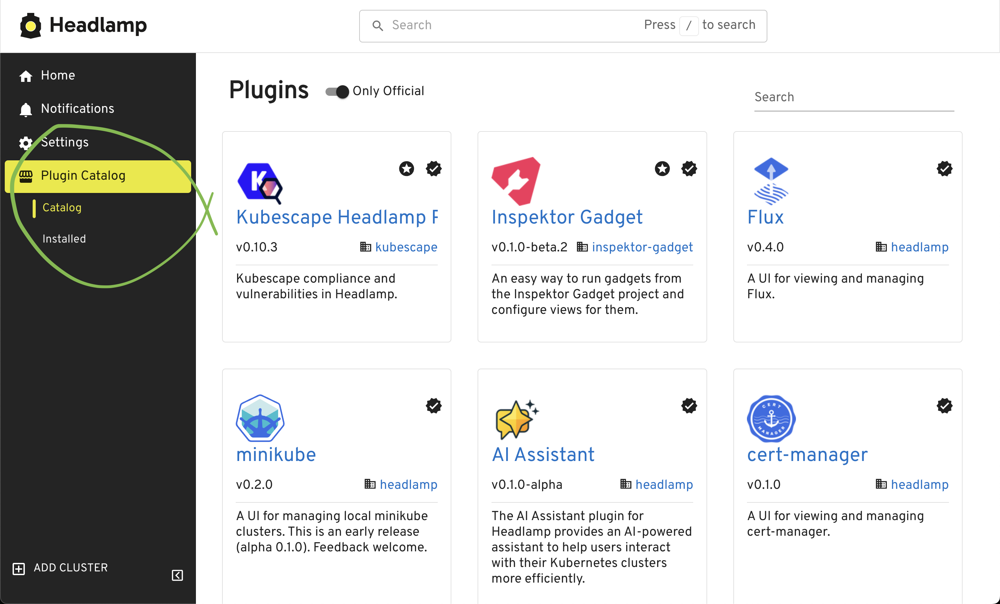
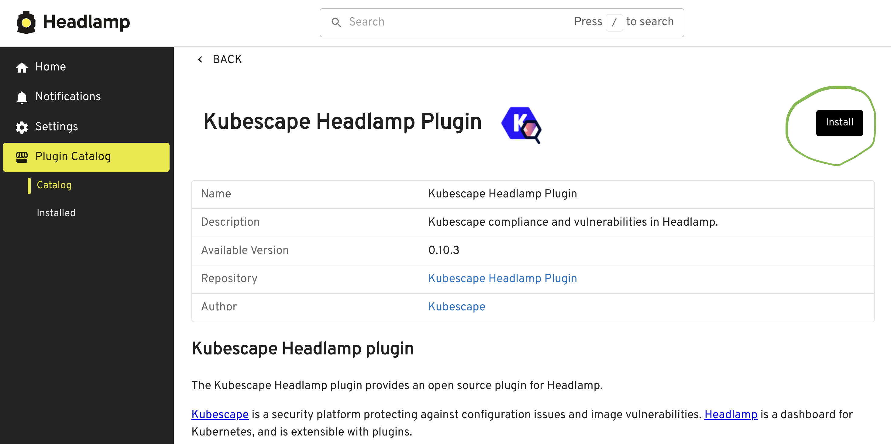
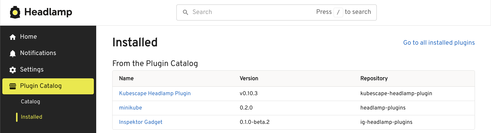

Headlamp Desktop app supports installing plugins via the Plugin Catalog.

There is also [documentation for using plugins Headlamp running in-cluster](../in-cluster/index.md#plugin-management).

## Plugin Catalog

When you start the Headlamp app, you should see "Plugin Catalog" link in the sidebar.

You can use the interface to search through plugins and find the ones you want to install, update or remove.

### Plugin List view

On this view, you can see a list of plugins.

Note: the badges are a quick way to see where the plugins come from.

### Plugin view

From here, you can see more details about the plugin. Often, there are install instructions for any dependencies that might need to be installed in the cluster to use the plugin. For example, if it's a Flux plugin, you'd need to install Flux in the cluster first.

The plugin install button is shown here.

### Installed plugins list

On this view, you can see which plugins you have installed. From here, you can disable them or uninstall them. 

Click on the individual plugin to remove or update it.

### Official, Verified, and CNCF labels

Plugins in the Headlamp Plugin Catalog may display Official, Verified, or CNCF labels supplied by Artifact Hub to indicate publisher provenance, affiliation, or CNCF stewardship. These badges can help you assess a plugin's source and decide if you trust them or not. They are not a substitute, however, for reviewing the plugin's code, permissions, and maintenance history.

#### Official plugins

Official plugins are plugins released by the creators of that project. For example, if there is a Kubescape plugin released by the Kubescape project, it will be marked Official.

#### CNCF plugins

CNCF plugins are plugins stewarded or endorsed by the Cloud Native Computing Foundation, indicating they adhere to CNCF governance and community standards.

#### Verified plugins

Verified plugins are packages on Artifact Hub whose publisher identity has been validated. They show a "Verified" badge in the Plugin Catalog inside Headlamp, making it easier to confirm the plugin's source. Verification attests to publisher identity, not to a security audit. Always review a plugin's source, permissions, and maintainership before installing.

## Headlamp developers, Manual Plugin Catalog Installation

This is a note for those developing Headlamp, not people using the Headlamp Desktop app.

The Plugin Catalog is not installed by default when you are developing Headlamp. You will need to [manually install the Plugin Catalog](https://github.com/headlamp-k8s/plugins/tree/main/plugin-catalog#plugin-catalog).
