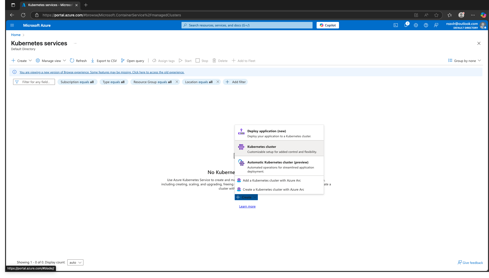
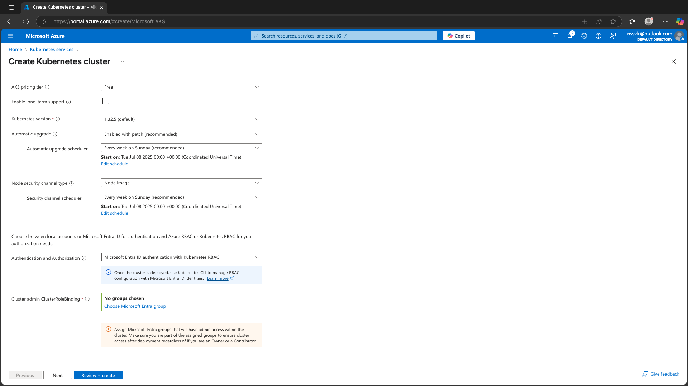
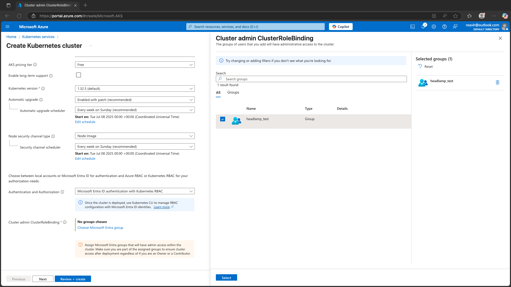
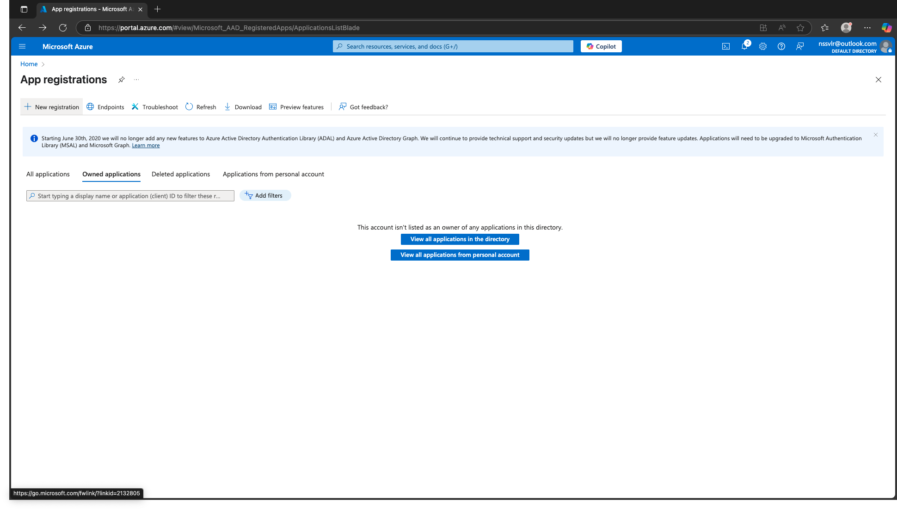
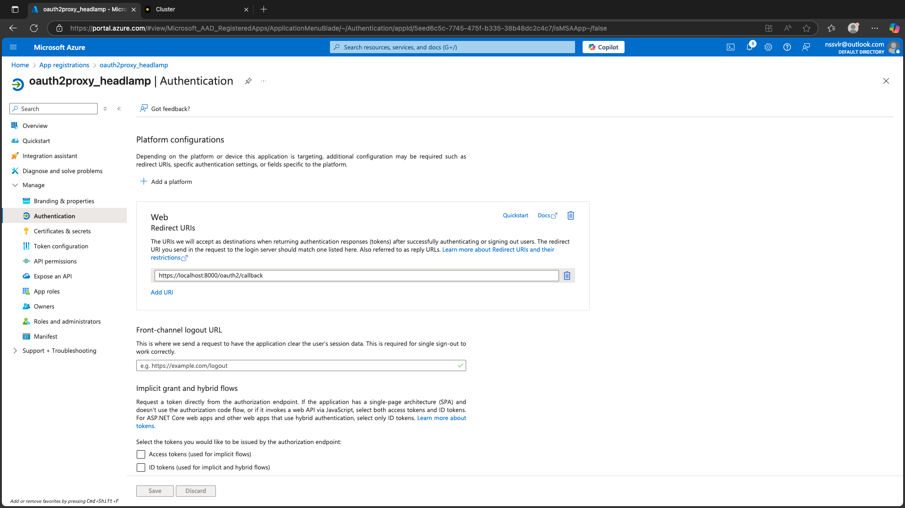
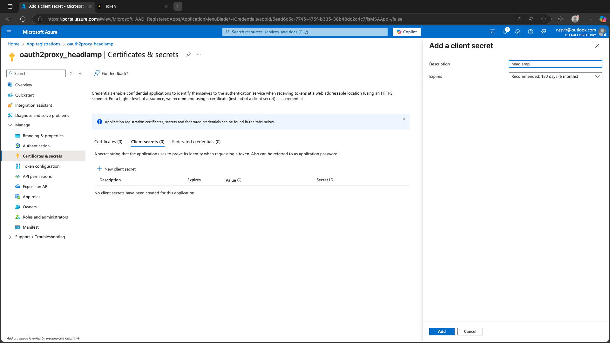
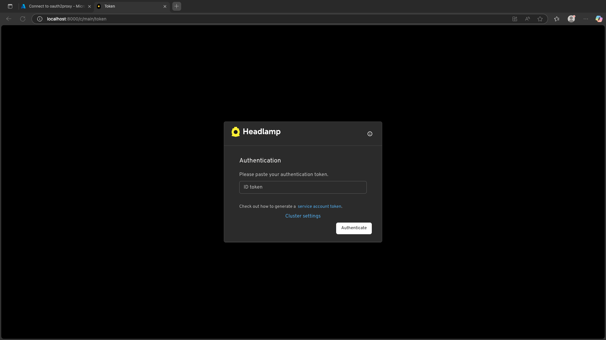
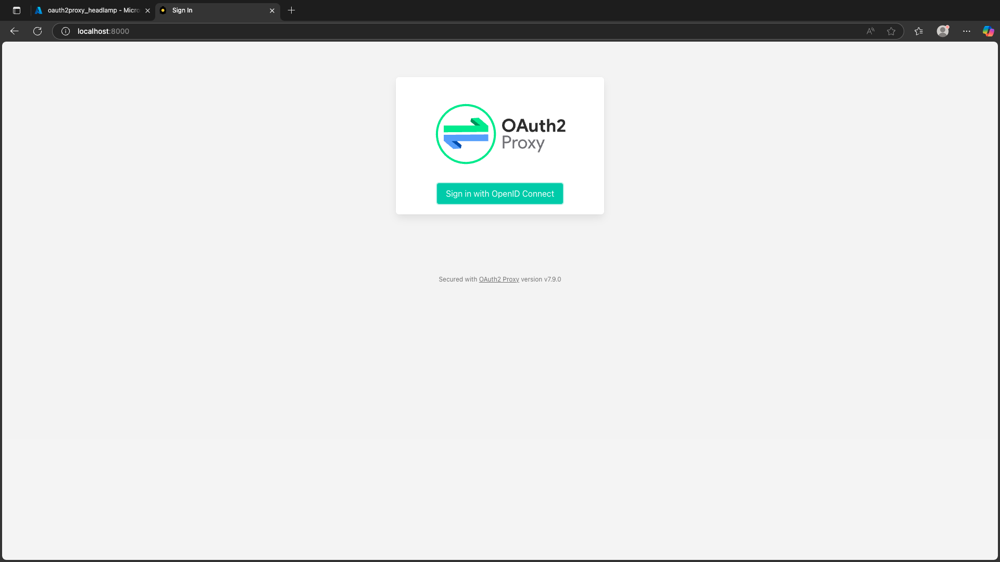

This guide walks you through configuring Headlamp in an AKS cluster using OAuth2Proxy for authentication via Azure Entra ID (Microsoft Entra ID) and RBAC.

We'll cover:

1. Setting up AKS with OIDC  
2. Creating an Azure App Registration  
3. Deploying Headlamp via Helm  
4. Setting up OAuth2Proxy  

---

## Step 1: Set Up AKS Cluster with OIDC Enabled

1. Go to **Kubernetes Services** in the Azure portal and click **Create Cluster**.



2. In the **Authentication and Authorization** step:
   - Select **Microsoft Entra ID authentication**.
   - Enable **Kubernetes RBAC**.



3. Under **Cluster Admin ClusterRoleBinding**, choose an Entra group that should have cluster-admin privileges.



4. Continue with your preferred settings for the agent pool, networking, etc., and create the cluster.

Make sure to enable **OIDC Issuer** while creating the cluster.

---

## Step 2: Create an Azure App Registration

1. In the Azure portal, navigate to **Microsoft Entra ID** > **App registrations**.



2. Click **+ New registration**.

3. Provide:
   - **Name** of your choice.
   - Supported account type (usually *Accounts in this organizational directory only*).
   - **Redirect URI**: For local testing, you can use:
     ```
     http://localhost:8000/oidc-callback
     ```



4. Click **Register**.

5. Record the **Application (client) ID** and **Directory (tenant) ID**.



---

## Step 3: Configure API Permissions for OAuth2Proxy

1. Go to **API permissions** → **Add a permission**.
2. Choose **Microsoft Graph** → **Delegated permissions**.
3. Add: `openid`, `profile`, `email`.
4. Click **Grant admin consent**.

---

## Step 4: Create a Client Secret for OAuth2Proxy

1. Go to **Certificates & secrets** → **New client secret**.
2. Add and copy the value.

---

## Step 5: Deploy Headlamp to AKS

### Prerequisites:
- Install [Helm](https://helm.sh/)
- Download kubeconfig for the AKS cluster

### Add Headlamp Helm repo:
```bash
helm repo add headlamp https://kubernetes-sigs.github.io/headlamp/
helm repo update
```

### Create a `values.yaml` for any customizations (optional) and deploy:
```bash
helm install my-headlamp headlamp/headlamp --namespace kube-system
```

### Verify Headlamp is running:
```bash
kubectl get pods -n kube-system
```

### Port-forward to access the UI:
```bash
kubectl port-forward svc/my-headlamp 8000:80 -n kube-system
```

Headlamp should now show an **Authentication** screen.



---

## Step 6: Deploy OAuth2Proxy via Helm

### Add the Helm repo:
```bash
helm repo add oauth2-proxy https://oauth2-proxy.github.io/manifests
helm repo update
```

### Prepare your `values.yaml`

Below is an example configuration you can start with. Be sure to replace placeholders like `<Client-ID>`, `<Client-Secret>`, `<Tenant-ID>`, etc.

```yaml
config:
  configFile: |-
    email_domains = ["*"]
    cookie_secret = <Cookie-Secret>

alphaConfig:
  enabled: true
  configFile: |-
    injectRequestHeaders:
      - name: Authorization
        values:
          - claim: access_token
            prefix: 'Bearer '
    providers:
      - clientID: <Client-ID>
        clientSecret: <Client-Secret>
        id: entra
        oidcConfig:
          issuerURL: https://login.microsoftonline.com/<Tenant-ID>/v2.0
          audienceClaims:
            - aud
          emailClaim: email
          insecureAllowUnverifiedEmail: true
        provider: oidc
        scope: 6dae42f8-4368-4678-94ff-3960e28e3630/user.read openid email profile User.Read
    upstreamConfig:
      upstreams:
        - id: main
          path: /
          uri: http://<your-headlamp-service-name>.<your-headlamp-namespace>.svc.cluster.local
```

### Deploy OAuth2Proxy:
```bash
helm install my-release oauth2-proxy/oauth2-proxy -f values.yaml
```

Verify it's up:
```bash
kubectl get pods
```

---

## Step 7: Set Kubernetes RBAC Policies Based on Azure Entra Groups

```yaml
apiVersion: rbac.authorization.k8s.io/v1
kind: ClusterRoleBinding
metadata:
  name: read-only-binding
subjects:
- kind: Group
  apiGroup: rbac.authorization.k8s.io
  name: "<AzureEntraGroupObjectID>"
roleRef:
  kind: ClusterRole
  name: view
  apiGroup: rbac.authorization.k8s.io
```

Apply:
```bash
kubectl apply -f your-rbac-binding.yaml
```

---

## Step 8: Login Flow

- Navigate to the port-forwarded Headlamp UI.
- Click **Sign in**.
- Follow the Entra login prompt.



Note: In a development environment, OAuth2Proxy may try to redirect to `https://` by default. For local testing, ensure your redirect URI and settings use `http://`.

Once authenticated, you'll be redirected back to Headlamp and should have access to your cluster UI.

---

## Step 9: Test Authentication Flow

- Access your protected endpoint.
- Login via Entra.
- Validate RBAC access.
