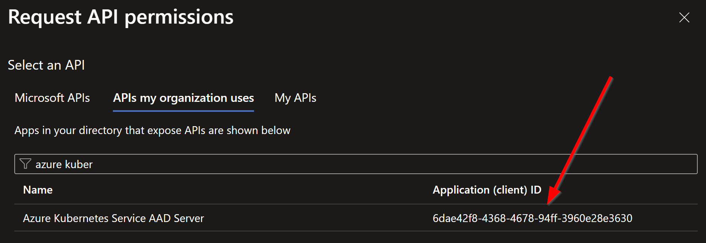
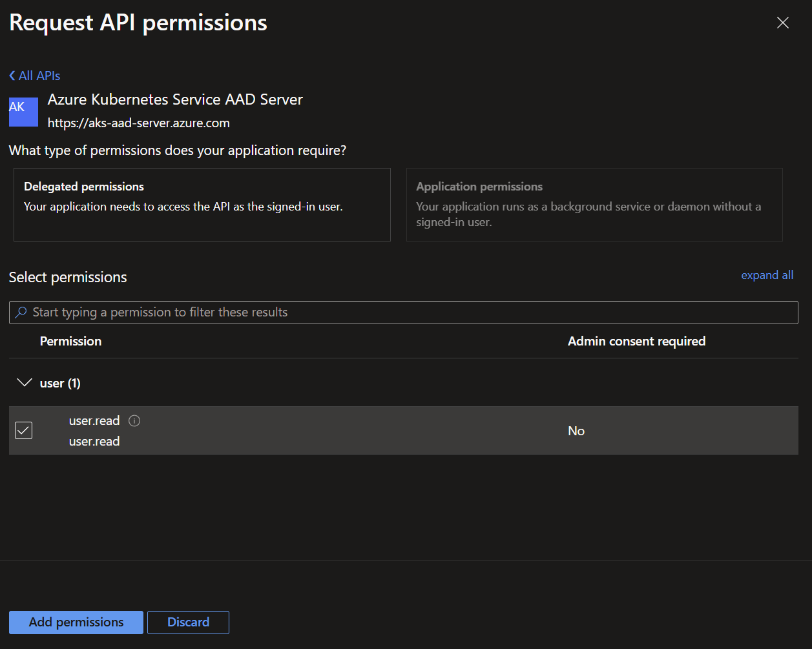
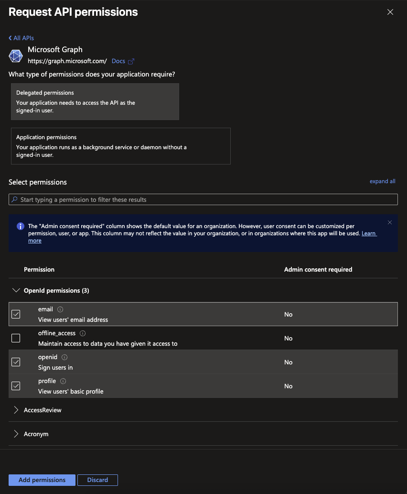
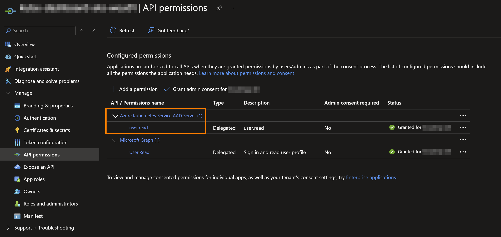
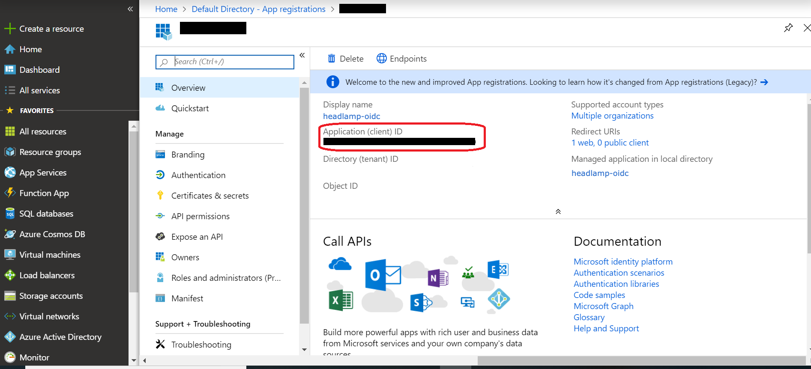
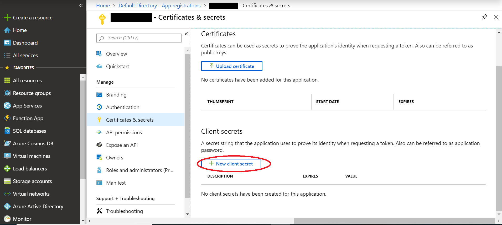

This tutorial is about configuring Headlamp 0.30.1 with:

1. [Azure Entra ID OIDC](https://learn.microsoft.com/en-us/azure/aks/enable-authentication-microsoft-entra-id) for [OpenID Connect (OIDC)](https://www.microsoft.com/en-us/security/business/security-101/what-is-openid-connect-oidc) authentication
2. [Azure AKS](https://azure.microsoft.com/en-us/products/kubernetes-service)
3. Kubernetes v1.31.5


## Configure Azure AKS for Entra ID OIDC

The AKS-managed Microsoft Entra integration simplifies the Microsoft Entra integration process. Previously, you were required to create a client and server app, and the Microsoft Entra tenant had to assign Directory Readers role permissions. Now, the AKS resource provider manages the client and server apps for you.

Cluster administrators can configure Kubernetes role-based access control (Kubernetes RBAC) based on a user's identity or directory group membership. Microsoft Entra authentication is provided to AKS clusters with OpenID Connect. OpenID Connect is an identity layer built on top of the OAuth 2.0 protocol. For more information on OpenID Connect, see the OpenID Connect documentation.

The following steps follow the [Microsoft reference documentation](https://learn.microsoft.com/en-us/azure/aks/enable-authentication-microsoft-entra-id). See the documentation for relevant limitations, prerequisites, and best practices before continuing.


### Creating a new AKS Cluster with EntraID OIDC

1. Create an Azure resource group using the az group create command.

```shell
az group create --name myResourceGroup --location centralus
```

2. Create an AKS cluster and enable administration access for your Microsoft Entra group using the az aks create command.

```shell
az aks create \
    --resource-group myResourceGroup \
    --name myManagedCluster \
    --enable-aad \
    --aad-admin-group-object-ids <id> [--aad-tenant-id <id>] \
    --generate-ssh-keys
```

A successful creation of an AKS-managed Microsoft Entra ID cluster has the following section in the response body:

```json
"AADProfile": {
    "adminGroupObjectIds": [
    "5d24****-****-****-****-****afa27aed"
    ],
    "clientAppId": null,
    "managed": true,
    "serverAppId": null,
    "serverAppSecret": null,
    "tenantId": "72f9****-****-****-****-****d011db47"
}
```

### Use an existing cluster

Enable AKS-managed Microsoft Entra integration on your existing Kubernetes RBAC enabled cluster using the az aks update command. Make sure to set your admin group to keep access on your cluster.

```shell
az aks update --resource-group MyResourceGroup --name myManagedCluster --enable-aad --aad-admin-group-object-ids <id-1>,<id-2> [--aad-tenant-id <id>]
```

A successful activation of an AKS-managed Microsoft Entra ID cluster has the following section in the response body:

```json
"AADProfile": {
    "adminGroupObjectIds": [
        "5d24****-****-****-****-****afa27aed"
    ],
    "clientAppId": null,
    "managed": true,
    "serverAppId": null,
    "serverAppSecret": null,
    "tenantId": "72f9****-****-****-****-****d011db47"
    }
```

## Set up Enterprise App for Headlamp integration


1. Log in to the Microsoft Azure Portal and choose `Microsoft Entra ID` from the sidebar or search menu.

2. Under Manage, select `App Registrations`.

3. Select `New Registration`


4. Enter a meaningful Name for your, for example `headlamp-oidc`. App users can see this name, and it can be changed at any time. You can have multiple app registrations with the same name.

5. Under Supported account types, specify who can use the application. We recommend you select `Accounts in this organizational directory only` for most applications. Refer to the table for more information on each option.

6. Under `Redirect URI`, select the `Web` platform, and for the purposes of this tutorial, input `http://localhost:8000/oidc-callback`. For an actual production implementation, you would replace this with the ingress url of your headlamp installation with the `/oidc-callback` path.

6. Select `Register` to complete the app registration.

7. Once the application is created, browse back to `App registrations`, locate the created application, and click on it.

8. To allow users to use this App Registration to auth to AKS, we need to assign delegated permissions for Azure Kubernetes. Select `API Permissions` from the left hand side, then `Add a Permission`.




Select `APIs my organization uses`, then input `Azure Kubernetes Service AAD Server` and select the resulting permission with the clientID of `6dae42f8-4368-4678-94ff-3960e28e3630` (this will be the same for all users of AKS with EntraID)


Select the corresponding `user.read` permission, then `Add permissions`.



9. Now Select `Add a Permission` again, `Microsoft Graph`, `Delegated Permissions`, and then select the checkboxes next to `email`, `openid`, and `profile` before clicking `Add` at the bottom.



10. Select `Grant admin consent for <Tenant Name>` to finish setting up the permissions.



11. With this complete, we need to record a few pieces of information used when deploying headlamp. The first two can be obtained from the `Overview` panel of the `App Registration`. You will need the `Application (client) ID` and the `Directory (tenant) ID`



12. Lastly, you'll need to generate a ClientSecret for headlamp to use. Select `Certificates and secrets` from the `App Registration` menu, then `New client secret`.

13. Enter a description and expiry length, then select `Add`. Now copy the value of the newly generated client secret and record it for the next step.


## Setting up Headlamp with EntraID OIDC

Now that we have our cluster configured and our App Registration configured for OIDC auth flows, we need to deploy headlamp.

1. First make sure you have the [Helm package manager](https://helm.sh/) installed on your local machine. There is a [Helm installation guide](https://helm.sh/docs/intro/install/) if you need to install it.
2. Your cluster should be running and configured with EntraID.

3. Create a `values.yaml` file and add the following OIDC configuration to it:

```yaml
config:
  oidc:
    clientID: "<Your Application (client) ID>"
    clientSecret: "<Your Application (client) Secret>"
    issuerURL: "https://login.microsoftonline.com/<Your Directory (tenant) ID>/v2.0"
    scopes: "6dae42f8-4368-4678-94ff-3960e28e3630/user.read,openid,email,profile"
    validatorClientID: "6dae42f8-4368-4678-94ff-3960e28e3630"
    validatorIssuerURL: "https://sts.windows.net/<Your Directory (tenant) ID>/"
    useAccessToken: true
```

Replace `<Your Application (client) ID>`,`<Your Application (client) Secret>`, and `<Your Directory (tenant) ID>`, with your specific Azure Entra ID app registration details obtained in the steps above.

> Note: The `scopes` string must be comma separated so each scope is passed individually to the OIDC provider.

4. Save the `values.yaml` file and Install Headlamp using helm with the following commands:

```shell
helm repo add headlamp https://kubernetes-sigs.github.io/headlamp/
helm install headlamp-oidc headlamp/headlamp -f values.yaml --namespace=headlamp --create-namespace
```

<!--  -->

This will install Headlamp in the headlamp namespace with the OIDC configuration from the values.yaml file.

7. After a successful installation, you can access Headlamp by port-forwarding to the pod:

Make sure the portforwarding is done to the port that you set as the callback URL in the Azure App Registration configuration. So in our case if you followed the steps above, the callback URL is <http://localhost:8000/oidc-callback>, and we should port forward to 8000.

```shell
kubectl port-forward svc/headlamp-oidc 8000:80 -n headlamp
```

8. Open your web browser and go to <http://localhost:8000>. Click on "sign-in." After completing the login flow successfully, you'll gain access to your Kubernetes cluster using Headlamp.


