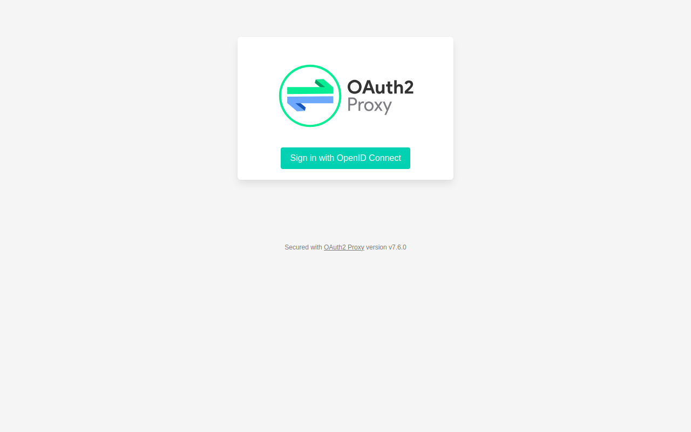
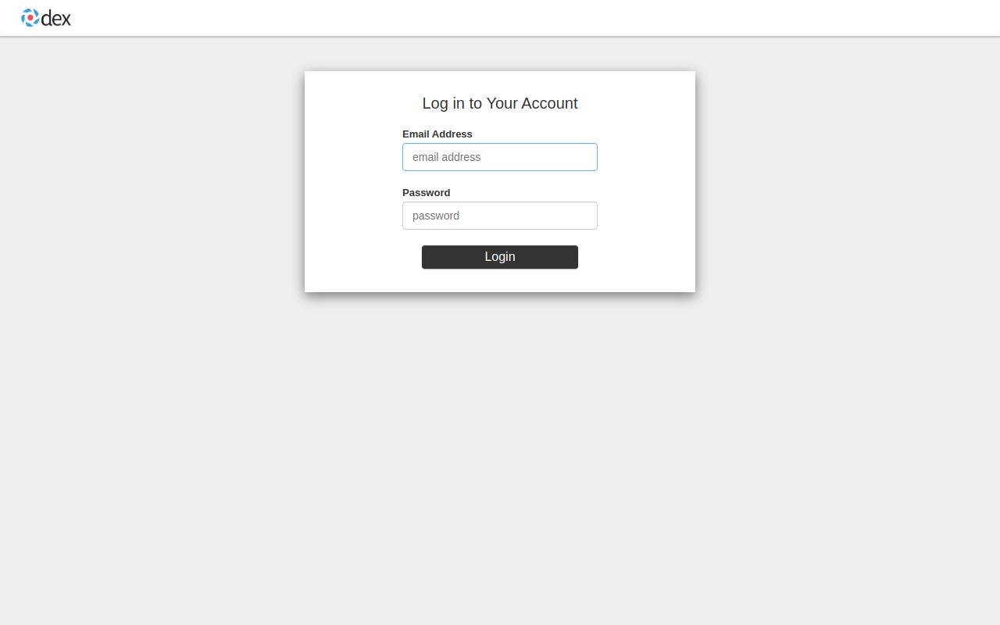
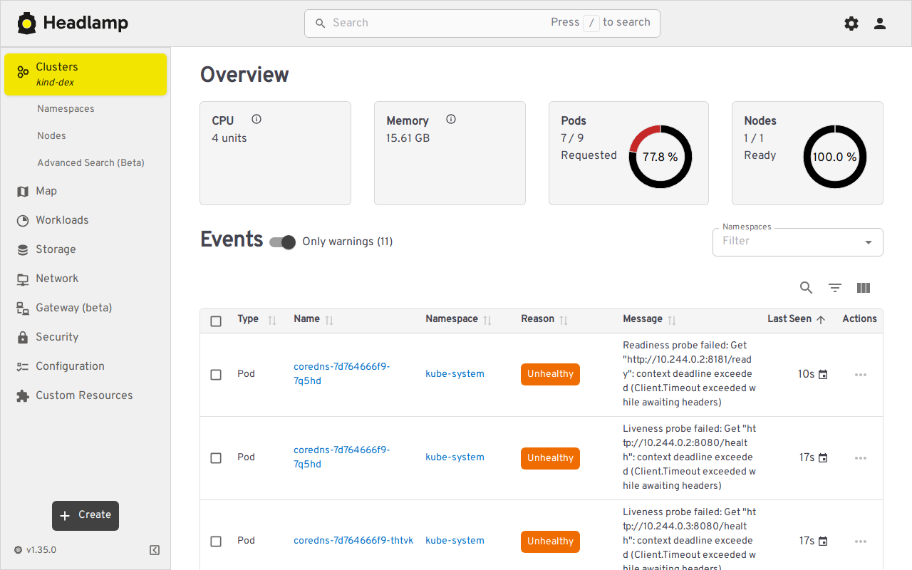

This guide places [OAuth2-Proxy](https://oauth2-proxy.github.io/oauth2-proxy/)
in front of Headlamp and uses [Dex](https://dexidp.io/) as the OpenID Connect
(OIDC) provider. OAuth2-Proxy signs users in and forwards their ID token to
Headlamp. Headlamp then uses that token for Kubernetes API requests, so the
API server can apply RBAC to the Dex identity.

This follows the upstream
[OAuth2-Proxy Headlamp integration](https://oauth2-proxy.github.io/oauth2-proxy/configuration/integrations/headlamp/).

## Architecture

```text
Browser ──► OAuth2-Proxy ──► Dex
                 │
                 │ Authorization: Bearer <ID token>
                 ▼
             Headlamp ──► Kubernetes API server
                              │
                              └─ validates the token against Dex and applies RBAC
```

## Choose a setup

This directory supports two different setups. Do not mix their configuration:

- **Local authentication demo:** Run [`test-scripts/run.sh`](./test-scripts/).
  It uses HTTP and `kubectl port-forward`. OAuth2-Proxy authenticates users,
  but Headlamp uses its ServiceAccount for Kubernetes requests, so every
  signed-in user has the same Kubernetes permissions. It does not demonstrate
  per-user RBAC.
- **Per-user Kubernetes RBAC:** Follow the manual steps below. This requires an
  HTTPS Dex issuer that is reachable from the browser, OAuth2-Proxy, and the
  Kubernetes API server.

| | Local scripts | Manual per-user setup |
|---|---|---|
| Transport | HTTP and port-forwarding | HTTPS and Ingress |
| Kubernetes identity | Headlamp ServiceAccount | Dex user and groups |
| API-server OIDC | Disabled | Enabled |
| Intended use | Login-flow evaluation | Per-user authorization |

Both paths use the same Dex client ID, OAuth2-Proxy callback path, Headlamp
upstream, and pinned chart versions. Their transport and Kubernetes identity
intentionally differ.

## Prerequisites

- [Minikube](https://minikube.sigs.k8s.io/) 1.31 or newer
- [Helm](https://helm.sh/) 3.10 or newer
- `kubectl`
- Dex 2.45.1
- An Ingress controller (the example uses NGINX)
- DNS names and TLS certificates trusted by every client that connects to them

The examples below use:

- Dex issuer: `https://dex.example.com:5556`
- Headlamp entry point: `https://headlamp.example.com`
- OIDC client ID: `headlamp`

Use those values consistently. In particular, the Dex `issuer`, Kubernetes
`--oidc-issuer-url`, and OAuth2-Proxy `oidc_issuer_url` must be identical.
`dex.example.com` must resolve and be reachable from your browser, pods, and the
Minikube control plane. `headlamp.example.com` must resolve to the Ingress
controller from your browser. Replace these reserved example domains with names
from your environment.

Set shell variables for the commands below:

```shell
export DEX_HOST="dex.example.com"
export HEADLAMP_HOST="headlamp.example.com"
export HEADLAMP_TLS_CERT="/absolute/path/to/headlamp-tls.crt"
export HEADLAMP_TLS_KEY="/absolute/path/to/headlamp-tls.key"
export OIDC_CLIENT_SECRET="$(openssl rand -hex 32)"
export COOKIE_SECRET="$(openssl rand -base64 32 | tr '+/' '-_' | tr -d '=')"
```

Keep these variables in the same shell while following the steps.

## 1. Configure Dex

Create `dex-config.yaml`:

```yaml title="dex-config.yaml"
issuer: https://dex.example.com:5556

storage:
  type: sqlite3
  config:
    file: ./dex.db

web:
  https: 0.0.0.0:5556
  tlsCert: /absolute/path/to/dex-tls.crt
  tlsKey: /absolute/path/to/dex-tls.key

staticClients:
  - id: headlamp
    name: "Headlamp via OAuth2-Proxy"
    secretEnv: OIDC_CLIENT_SECRET
    redirectURIs:
      - "https://headlamp.example.com/oauth2/callback"

# This static account is for evaluating the setup only. Use an external
# connector and managed identities in production.
enablePasswordDB: true
staticPasswords:
  - email: "admin@example.com"
    # bcrypt hash of "password":
    #   echo password | htpasswd -BinC 10 admin | cut -d: -f2
    hash: "$2a$10$2b2cU8CPhOTaGrs1HRQuAueS7JTT5ZHsHSzYiFPm1leZck7Mc8T4W"
    username: "admin"
    emailVerified: true
    userID: "08a8684b-db88-4b73-90a9-3cd1661f5466"
    groups:
      - "headlamp-readers"
```

The relative database path keeps this walkthrough runnable as an unprivileged
user. Use persistent, access-controlled storage for a real Dex deployment.
Start Dex with:

```shell
dex serve dex-config.yaml
```

Verify from the machine running your browser that its discovery document is
available and advertises the exact issuer URL:

```shell
curl --fail "https://${DEX_HOST}:5556/.well-known/openid-configuration"
```

## 2. Configure the Kubernetes API server

Start Minikube with Dex as a trusted issuer:

```shell
minikube start -p=dex \
  --extra-config=apiserver.authorization-mode=Node,RBAC \
  --extra-config=apiserver.oidc-issuer-url="https://${DEX_HOST}:5556" \
  --extra-config=apiserver.oidc-username-claim=email \
  --extra-config=apiserver.oidc-groups-claim=groups \
  --extra-config=apiserver.oidc-client-id=headlamp
```

If Dex uses a private certificate authority, also configure
`apiserver.oidc-ca-file` and mount that CA file into the Minikube control-plane
container. The certificate must also be trusted by OAuth2-Proxy and your
browser.

Verify that a pod can resolve and trust Dex:

```shell
kubectl run dex-connectivity-check \
  --image=curlimages/curl:8.12.1 \
  --restart=Never --rm -i -- \
  --fail "https://${DEX_HOST}:5556/.well-known/openid-configuration"
```

Resolve DNS or certificate errors before installing OAuth2-Proxy.

## 3. Grant the test user limited access

For this tutorial, grant the Dex group read-only access. Avoid using
`cluster-admin` for login examples because copied examples often survive into
real environments.

```yaml title="clusterrolebinding.yaml"
apiVersion: rbac.authorization.k8s.io/v1
kind: ClusterRoleBinding
metadata:
  name: dex-headlamp-view
subjects:
  - kind: Group
    name: headlamp-readers
    apiGroup: rbac.authorization.k8s.io
roleRef:
  kind: ClusterRole
  name: view
  apiGroup: rbac.authorization.k8s.io
```

```shell
kubectl apply -f clusterrolebinding.yaml
```

The group name matches the `groups` claim in `dex-config.yaml`.

## 4. Install Headlamp

OAuth2-Proxy handles login, so Headlamp does not need its own OIDC client
configuration. Keep `unsafeUseServiceAccountToken` disabled; Headlamp must use
the forwarded user token for Kubernetes API requests.

```shell
helm repo add headlamp https://kubernetes-sigs.github.io/headlamp/
helm repo update
helm install headlamp headlamp/headlamp \
  --version 0.44.0 \
  --namespace headlamp \
  --create-namespace \
  --set config.unsafeUseServiceAccountToken=false
```

## 5. Install OAuth2-Proxy

Create `oauth2-proxy-values.yaml`. The install command below supplies the two
generated secrets without writing them to this file:

```yaml title="oauth2-proxy-values.yaml"
config:
  clientID: "headlamp"
  configFile: |-
    provider = "oidc"
    oidc_issuer_url = "https://dex.example.com:5556"
    redirect_url = "https://headlamp.example.com/oauth2/callback"
    email_domains = ["example.com"]
    scope = "openid profile email groups"

    # Forward Dex's ID token to Headlamp. Headlamp uses this header for
    # Kubernetes API requests.
    pass_authorization_header = true

    upstreams = ["http://headlamp.headlamp.svc.cluster.local:80"]
    http_address = "0.0.0.0:4180"
    reverse_proxy = true
```

Install OAuth2-Proxy:

```shell
helm repo add oauth2-proxy https://oauth2-proxy.github.io/manifests
helm repo update
helm install oauth2-proxy oauth2-proxy/oauth2-proxy \
  --version 10.7.0 \
  --namespace headlamp \
  --set-string config.clientSecret="$OIDC_CLIENT_SECRET" \
  --set-string config.cookieSecret="$COOKIE_SECRET" \
  -f oauth2-proxy-values.yaml
```

Wait for both deployments:

```shell
kubectl -n headlamp rollout status deployment/headlamp
kubectl -n headlamp rollout status deployment/oauth2-proxy
```

## 6. Expose only OAuth2-Proxy

If this Minikube profile does not already have an Ingress controller, enable
the NGINX addon:

```shell
minikube addons enable ingress -p=dex
```

Create the TLS secret from the certificate for `$HEADLAMP_HOST`:

```shell
kubectl -n headlamp create secret tls headlamp-ingress-tls \
  --cert="$HEADLAMP_TLS_CERT" \
  --key="$HEADLAMP_TLS_KEY"
```

Create `headlamp-ingress.yaml`:

```yaml title="headlamp-ingress.yaml"
apiVersion: networking.k8s.io/v1
kind: Ingress
metadata:
  name: headlamp
  namespace: headlamp
spec:
  ingressClassName: nginx
  tls:
    - hosts:
        - headlamp.example.com
      secretName: headlamp-ingress-tls
  rules:
    - host: headlamp.example.com
      http:
        paths:
          - path: /
            pathType: Prefix
            backend:
              service:
                name: oauth2-proxy
                port:
                  number: 80
```

```shell
kubectl apply -f headlamp-ingress.yaml
```

Point `$HEADLAMP_HOST` at your Ingress address. For the Minikube NGINX addon,
obtain the address with `minikube ip -p=dex`.

Do not create an Ingress for the Headlamp service itself, because doing so
bypasses the authentication gate.

## 7. Verify login and RBAC

Open `https://headlamp.example.com` and sign in as
`admin@example.com` / `password`. After Dex redirects back through
`/oauth2/callback`, Headlamp should display cluster resources allowed by the
`view` role.

Confirm the same authorization boundary independently:

```shell
kubectl auth can-i --as=admin@example.com \
  --as-group=headlamp-readers list pods --all-namespaces
kubectl auth can-i --as=admin@example.com \
  --as-group=headlamp-readers delete pods --all-namespaces
```

The list command should return `yes`; the delete command should return `no`.

## Local authentication demo

To exercise the browser login flow without configuring TLS or API-server OIDC,
use the scripts next to this guide:

```shell
cd test-scripts
./run.sh
./test.sh
```

Open <http://localhost:8080>, sign in as `admin@example.com` / `password`, and
run `./cleanup.sh` when finished.

The local scripts deliberately enable Headlamp's
`unsafeUseServiceAccountToken` setting. OAuth2-Proxy still gates access, but
Kubernetes sees Headlamp's ServiceAccount rather than the Dex user. Never expose
Headlamp directly or use this shared-identity mode when you require per-user
audit or authorization.







## Production checklist

- Replace Dex's static password database with an appropriate connector.
- Store client and cookie secrets outside Helm values files and rotate them.
- Restrict `email_domains` and use least-privilege, group-based RBAC.
- Use trusted HTTPS certificates or configure the required private CA bundles.
- Expose only OAuth2-Proxy, and configure your ingress to preserve forwarded
  protocol and host headers.
- Keep `unsafeUseServiceAccountToken` disabled for per-user RBAC.
- Pin and deliberately update chart and image versions.

## Troubleshooting

- **Dex returns `invalid_redirect_uri`:** Make Dex's `redirectURIs` entry
  exactly match OAuth2-Proxy's `redirect_url`.
- **OAuth2-Proxy cannot discover Dex:** Confirm that `oidc_issuer_url` is
  reachable from its pod and exactly matches the discovery document's `issuer`.
- **Headlamp returns Kubernetes authentication errors:** Confirm that the API
  server trusts the same issuer and client ID, and can validate Dex's TLS chain.
- **Login succeeds but resources are forbidden:** Check the token's email and
  group claims, then compare them with the relevant RBAC subjects.