This is the Headlamp Local Cluster Setup Guide. If you are interested in learning how to run a cluster locally with Headlamp, then you are at the right place.

## Introduction

Kubernetes is powerful, but getting started can be intimidating. Until now, Headlamp required users to bring their own Kubernetes cluster. This meant setting up infrastructure, managing configurations, and often incurring cloud costs. For developers and Kubernetes operators who just want to test an app or learn Kubernetes basics, this setup was a barrier.

With the new Local Cluster feature, Headlamp removes that friction. You can now create and manage a fully functional Kubernetes cluster directly from the Headlamp UI. No terminal, no cloud provider, no YAML required. This makes Kubernetes more accessible than ever, especially for:

-   Developers testing apps before deploying to production
-   Students and learners exploring Kubernetes for the first time

Whether you're deploying a sample app or just curious about how Kubernetes works, Headlamp now gives you a one-click experience to get started locally.

## What You're Creating

When you use Headlamp's Local Cluster feature, you're setting up a fully functional Kubernetes cluster on your local machine using Minikube. This cluster behaves just like a remote Kubernetes environment but runs entirely on your desktop, giving you a fast, cost-free, and isolated space to experiment and build.

This cluster is:

-   **Self-contained**: No need for cloud infrastructure or external services
-   **Integrated with Headlamp**: Managed entirely through the Headlamp UI
-   **Ideal for testing and learning**: Quickly deploy apps, inspect resources, and explore Kubernetes features without setup overhead.

Once created, the cluster appears in your Headlamp interface like any other connected cluster. You can start and stop it, deploy applications, view logs, and interact with it using Headlamp's visual tools. It's a great way to:

-   Try out Kubernetes features without risk
-   Explore application behavior and resource configurations
-   Learn how clusters work in a hands-on, visual way

This setup is especially useful for developers who want to iterate quickly, students who are just getting started, or anyone looking to explore Kubernetes without needing a cloud account or command-line expertise.


## Key Capabilities

Once your local cluster is up and running, Headlamp provides a rich set of capabilities to help you interact with it visually and intuitively. These features are designed to support learning, experimentation, and lightweight development workflows.

-   **Create and delete clusters** directly from the Headlamp UI, without needing to use the terminal or write configuration files
-   **Deploy applications** using built-in tools, including support for manifests and Helm charts
-   **View cluster details** such as node status, resource usage, and active workloads
-   **Start and stop the cluster** as needed, giving you control over local resource usage
-   **Explore resources** like pods, services, deployments, and volumes
    through a visual interface
-   **Edit YAML configurations** with syntax highlighting and validation
-   **Use context actions** to quickly view, edit, or remove resources
    from lists
-   **Install and use plugins** such as Prometheus for metrics or the AI
    Assistant for natural language queries

These capabilities make Headlamp a powerful tool for working with Kubernetes locally, whether you're exploring how things work or building something new.


## Getting Started

With these detailed instructions we're going to show how to add a local cluster, deploy something, and then delete the cluster.

### Add Local Cluster

#### Add Local Cluster (Step 1) - Select the Add cluster button

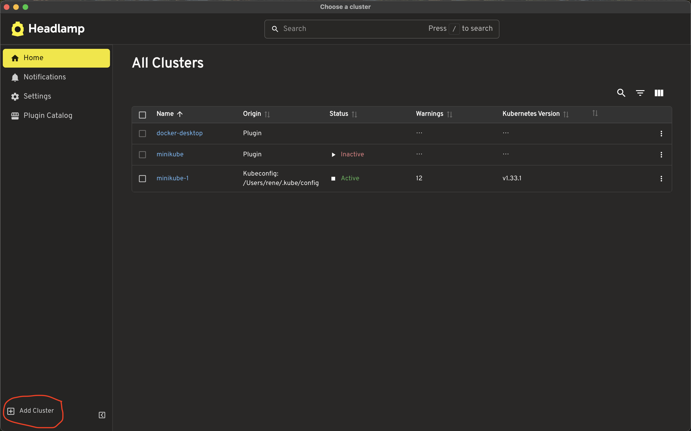

#### Add Local Cluster (Step 2) - Select the local cluster provider to create a local cluster on your PC

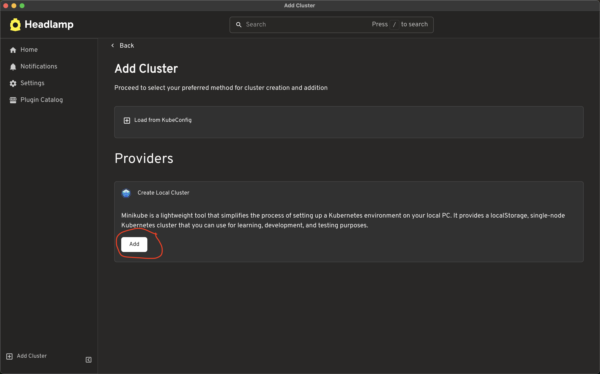

#### Add Local Cluster (Step 3) - appropriate driver is detected

Depending on the platform (Mac/Windows PC/Linux), different VM drivers are detected on the user's machine.

Note how there is a warning about memory usage? We try to limit the amount of memory allocated to as small as is needed for development and testing needs. For users with low resource laptops, we warn them in case they don't have enough memory as well.

On Windows HyperV can be used which comes built into Windows. On Mac no extra software is required (it gets bundled with vfkit).

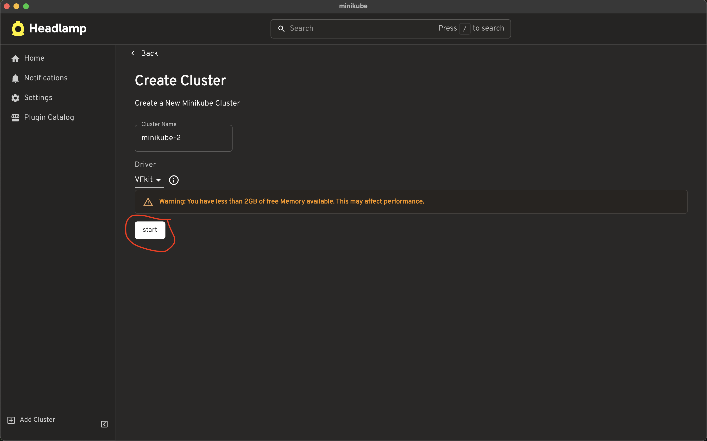

#### Add Local Cluster (Step 4) - Cluster has been created, now go Home to use it

It shows some logs during cluster creation to show what's happening. When it's done we can go to the Overview on the Home to see what's happening in our cluster.

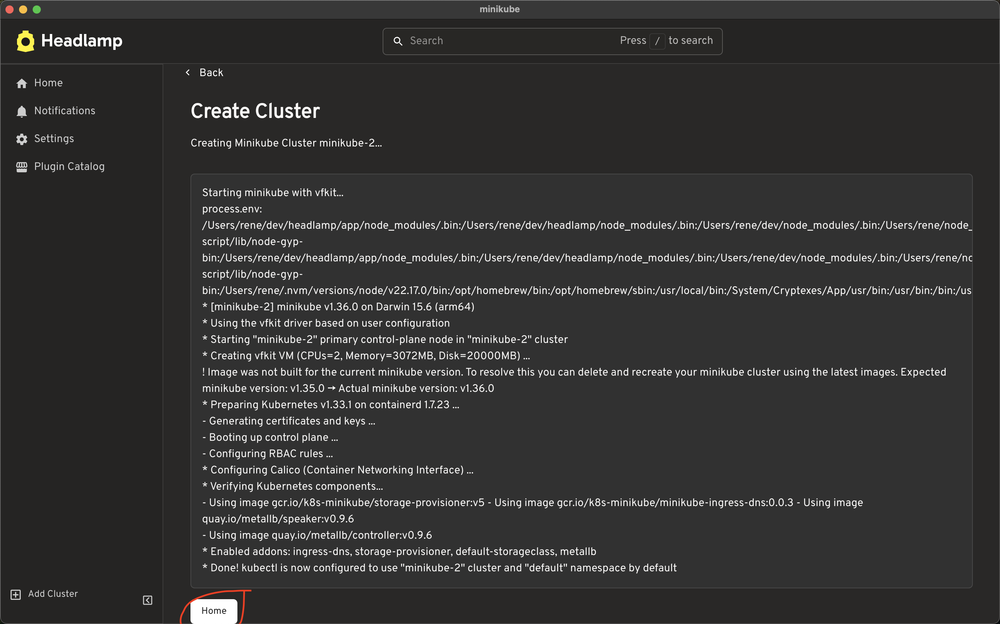

The cluster has been created. How do you access it from the command line? If you use kubectl on the command line you can access your cluster with that. The `.kube/config` file has been modified with the new cluster added.

```shell
kubectl config use-context minikube-1
kubectl get pods
```

### Deploy an Application

#### Deploy an Application (Step 1) - Apply some YAML


This is a demo web server deployment to copy/paste into Headlamp.

```yaml
apiVersion: apps/v1
kind: Deployment
metadata:
  name: demo-nginx
spec:
  replicas: 1
  selector:
    matchLabels:
      app: demo-nginx
  template:
    metadata:
      labels:
        app: demo-nginx
    spec:
      containers:
      - name: nginx
        image: nginx:latest
        ports:
        - containerPort: 80

---
apiVersion: v1
kind: Service
metadata:
  name: demo-nginx-service
spec:
  selector:
    app: demo-nginx
  ports:
    - protocol: TCP
      port: 80
      targetPort: 80
  type: NodePort
```
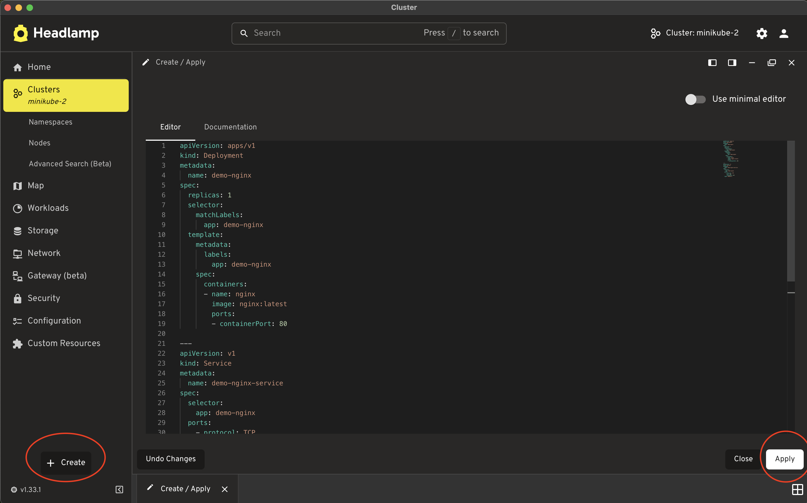

#### Deploy an Application (Step 2) - See the pod details that it has deployed

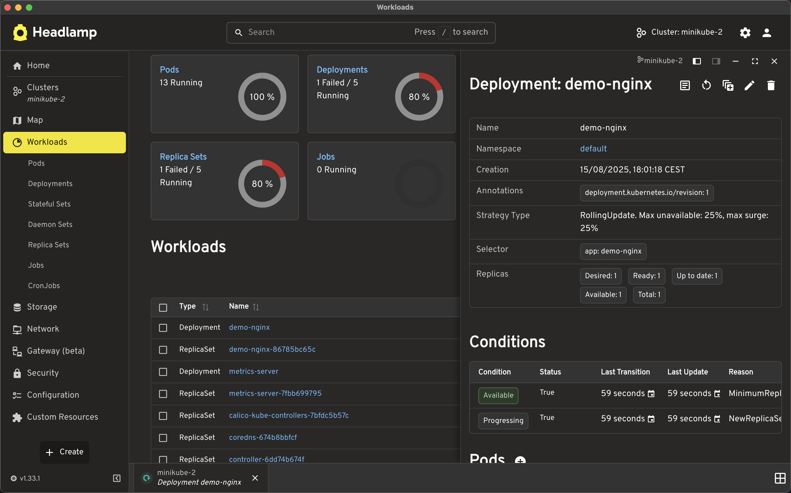

#### Deploy an Application (Step 3) - See the deployment in the browser

Here we see the deployed application in the browser.

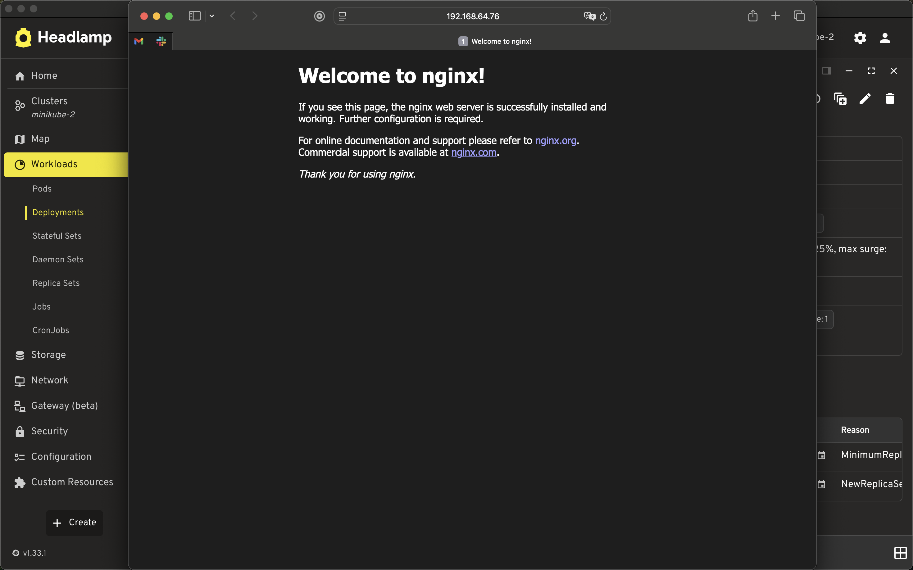

### Show Cluster Details

#### Show Cluster Details (Overview)

On the cluster overview page you can see events related to the cluster and CPU and memory, if the pods are running and if the nodes are healthy.

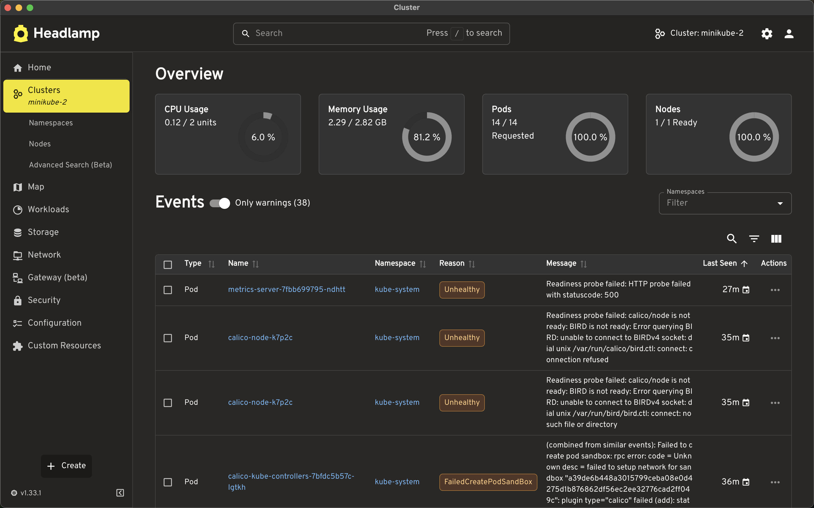

#### Show Cluster Details (Search for our demo deployment)

You can search for different resources in the Kubernetes cluster. Here we see the search results for the demo deployment we just made.

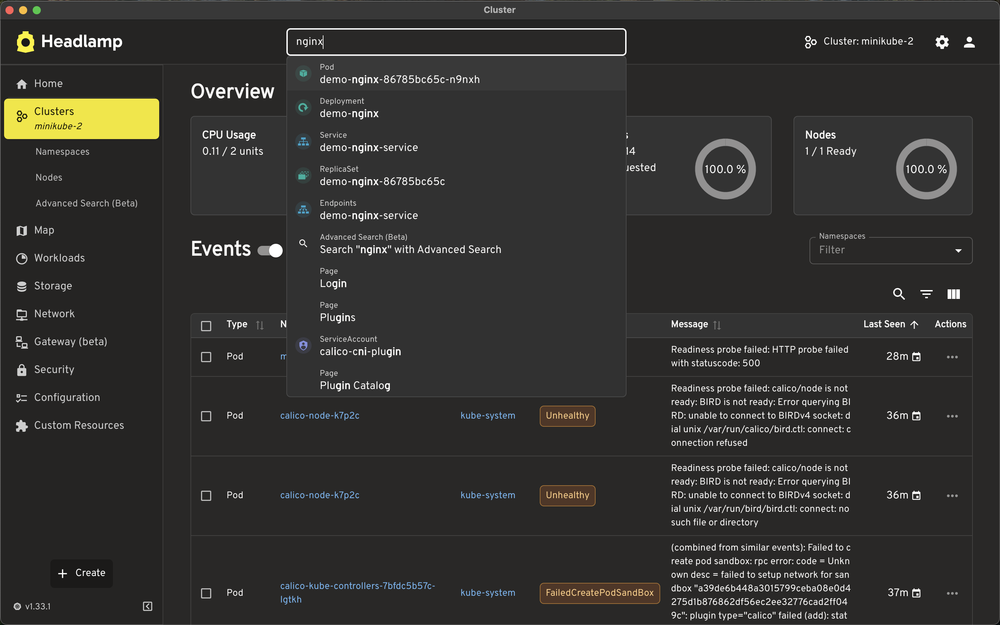

### Delete Cluster

When you want to clean up the cluster you have the option of deleting it, or stopping it to be started up later.

Deleting it frees all the memory and disk used by the cluster, and deletes all resources in the local Kubernetes cluster.

#### Delete Cluster (Step 1) - select action menu for cluster you want to delete
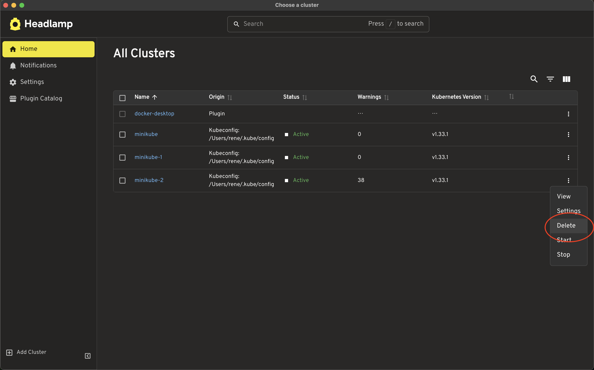

#### Delete Cluster (Step 2) - confirm deletion

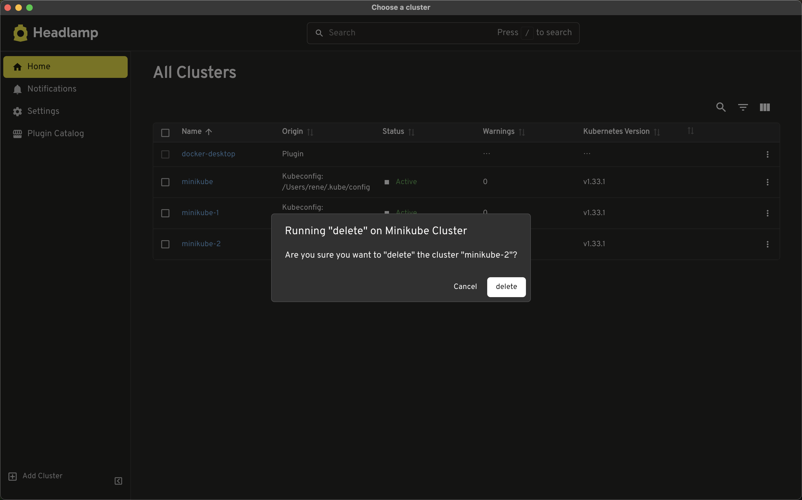

### Starting and stopping clusters

Instead of deleting a cluster, you might want to just stop it instead. This frees up the memory and CPU usage on your laptop, but the disk space is still allocated to the cluster.

Go to the Overview Home page, and you'll see a start and stop button.

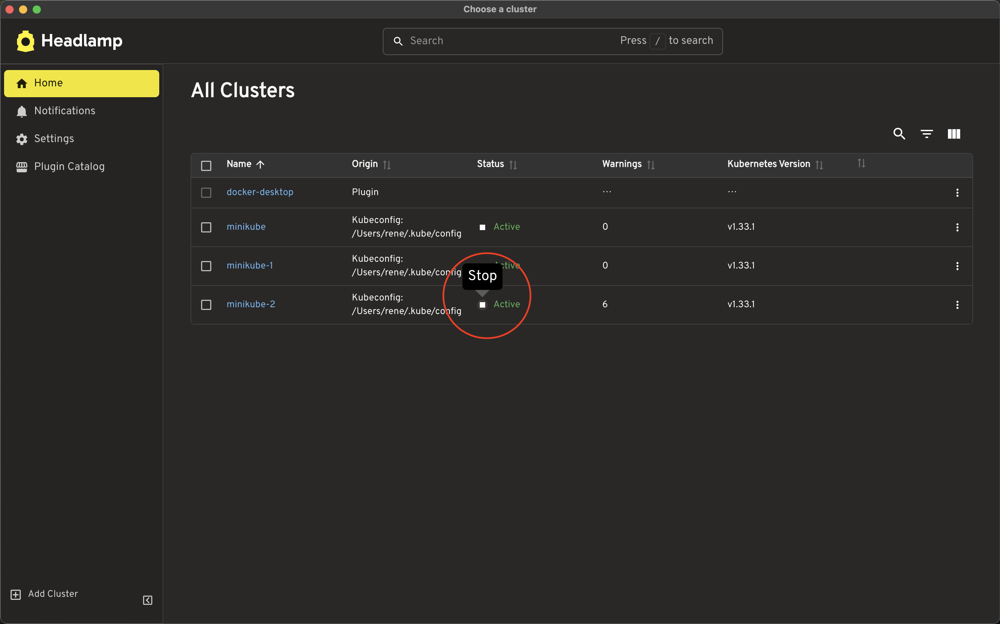

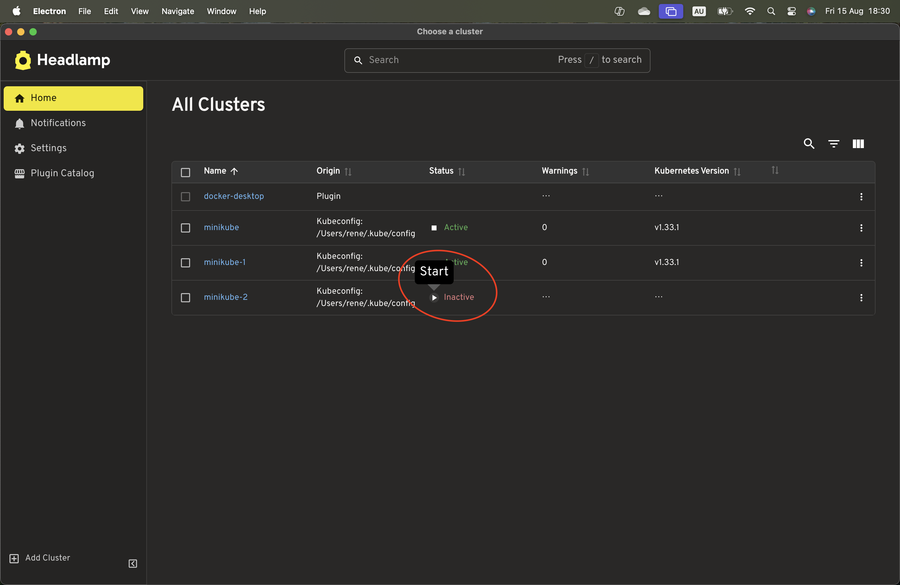

## Post-Deployment Experience

Once your local cluster is created, it becomes fully integrated into your Headlamp interface. From here, you can begin interacting with it just like you would with any other Kubernetes cluster.

Here's what you'll see and be able to do:

-   The cluster will appear in the **Cluster Chooser**, allowing you to switch between clusters easily
-   You'll have access to **real-time status indicators**, showing whether the cluster is running, stopped, or in transition
-   You can **start or stop the cluster** with a single click, giving you control over your system's resources
-   The **resource explorer** lets you browse workloads, services, pods, and more using a visual interface
-   You can **view and edit YAML configurations** directly in Headlamp, with syntax highlighting and validation
-   **Context actions** are available throughout the UI, allowing you to quickly inspect, modify, or remove resources

This experience is designed to be intuitive and responsive, making it easy to explore Kubernetes concepts, troubleshoot deployments, and iterate on your work without leaving the Headlamp UI.


## What You Can Do Next

With your local cluster running, you can begin exploring Kubernetes in a hands-on way. Headlamp makes it easy to:

-   Familiarize yourself with core concepts like pods, services, and deployments
-   Experiment with resource configurations using the YAML editor
-   Deploy sample applications to observe behavior and structure
-   Monitor activity and resource usage through visual tools
-   Extend your environment with plugins for metrics and insights

This is a safe space to learn, explore, and build without needing cloud infrastructure or command line tools.

### See relationships between resources with the map view

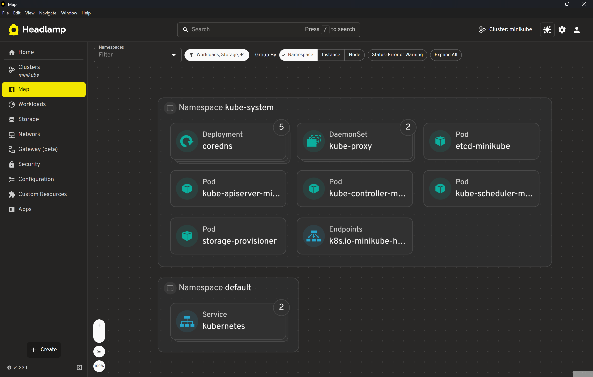

### Experiment with resource configurations using the YAML editor

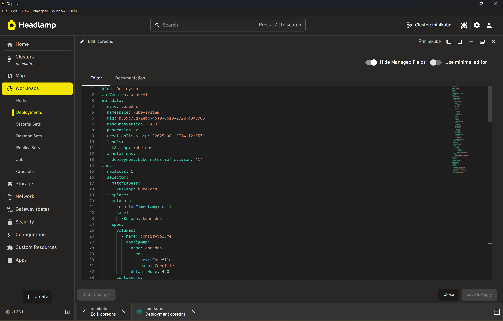

### Extend your environment with plugins for metrics and insights

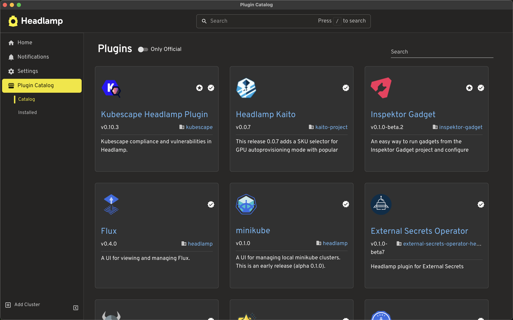

### Ask the AI assistant

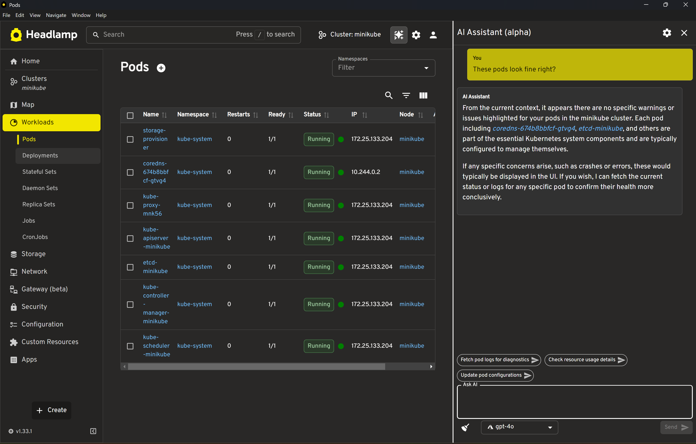


## Roadmap

Headlamp Local is growing to support more flexible and complete local Kubernetes experiences. Upcoming improvements include:

-   Support for **Windows nodes**, enabling local testing across operating systems
-   **Resource presets** for faster cluster setup based on common development needs


## FAQ

-   How much system resource does the local cluster use?
    -   By default, the local cluster uses approximately 3 GB of memory
        and 20 GB of disk space.
-   Can I run multiple clusters at once?
    -   Yes, you can run multiple clusters simultaneously.
-   What if Minikube fails to start?
    -   Headlamp provides error messages with details and suggestions.
        If one driver fails, you can try another supported option such
        as Docker, VirtualBox, or Hyper-V depending on your operating
        system.
-   Where can I get help or report issues?
    -   You can report issues or ask questions in the [Headlamp Plugins
        GitHub issue tracker](https://github.com/headlamp-k8s/plugins/issues).
