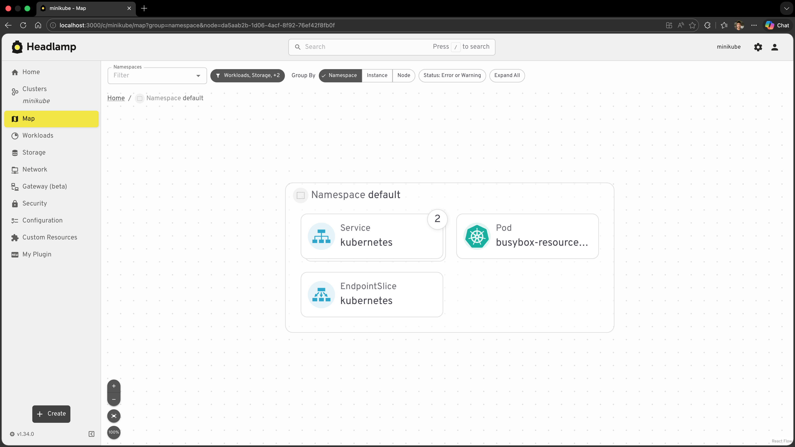

# Adding Custom Map Nodes

In [Tutorial 9](../applying-custom-themes/) we customised how Headlamp looks. In this tutorial we will extend what Headlamp **shows** — specifically, we will add the `MyPod` resources from our plugin to Headlamp's **Map view**.

---

## Table of Contents

1. [Introduction to the Map View](#introduction-to-the-map-view)
2. [Concepts: Nodes, Edges, and Sources](#concepts-nodes-edges-and-sources)
3. [Creating a Map Source for MyPod](#creating-a-map-source-for-mypod)
4. [Registering the Source](#registering-the-source)
5. [Adding a Custom Node Icon](#adding-a-custom-node-icon)
6. [Adding Edges Between Nodes](#adding-edges-between-nodes)
7. [What's Next](#whats-next)
8. [Quick Reference](#quick-reference)

---

## Introduction to the Map View

Headlamp's **Map view** (accessible via the **Map** button in the sidebar when a cluster is connected) renders your cluster as an interactive graph. Every built-in resource — Deployments, ReplicaSets, Pods, Services, and more — is displayed as a node, and the ownership relationships between them are shown as edges.



The map is not limited to built-in resources. Plugins can register their own **sources** — collections of nodes and edges that teach the map about resources that Headlamp does not know about by default. This is especially useful for:

- **Custom Resource Definitions (CRDs)** — controllers like KEDA, Argo CD, or Flux introduce CRDs that the built-in map has no knowledge of. A plugin can add those resources as first-class nodes.
- **Plugin-managed resources** — if your plugin works with a specific subset of standard resources (like our `MyPod` class), you can surface them as a dedicated, filterable source.

In this tutorial we will register our `MyPod` resource class as a map source so that all pods appear in the map under a **"My Pods"** entry in the source picker.

---

## Concepts: Nodes, Edges, and Sources

Before writing code it helps to understand the three building blocks:

| Concept | What it represents | Example |
|---------|-------------------|---------|
| **Node** | A single resource displayed on the map | One pod, one deployment |
| **Edge** | A directed relationship between two nodes | ReplicaSet → Pod (ownership) |
| **Source** | A named collection of nodes and edges | "My Pods", "KEDA ScaledObjects" |

A **source** is a `GraphSource` object with three required properties:

```tsx
// A leaf source — fetches its own nodes/edges
{
  id: string;        // Unique across all sources
  label: string;     // Shown in the source picker UI
  icon?: ReactNode;  // Optional icon in the source picker
  useData(): { nodes?: GraphNode[]; edges?: GraphEdge[] } | null;
}

// A parent source — groups child sources (cannot have useData)
{
  id: string;
  label: string;
  icon?: ReactNode;
  sources: GraphSource[];
}
```

The `useData()` function is a **React hook** — you can call other hooks inside it (like `MyPod.useList()`). It must return `null` while data is loading, or an object with `nodes` (and optionally `edges`) once data is ready. Because `useData()` is called on every render, wrap your return value in `useMemo` so the map only re-renders when the data actually changes.

---

## Creating a Map Source for MyPod

We will add the map source directly to `src/index.tsx`, alongside the existing registrations.

### Step 1: Update `src/index.tsx`

Add the `registerMapSource` import and define the source at the bottom of the file, after your existing registrations:

```tsx
import { registerMapSource } from '@kinvolk/headlamp-plugin/lib';
import { useMemo } from 'react';
import { MyPod } from './resources/pod';

// ... your existing registerRoute / registerSidebarEntry calls ...

const myPodSource = {
  id: 'hello-headlamp-pods',
  label: 'My Pods',
  useData() {
    const [pods] = MyPod.useList();

    return useMemo(() => {
      // Return null while loading — the map will show a spinner
      if (!pods) return null;

      const nodes = pods.map(pod => ({
        id: pod.metadata.uid,   // Must be unique; uid is a safe choice
        kubeObject: pod,        // Tells the map this node is a Kubernetes resource
      }));

      return { nodes };
    }, [pods]);
  },
};

registerMapSource(myPodSource);
```

**Key points:**

| Property | Purpose |
|----------|---------|
| `id` | Unique identifier for the source; namespace it with your plugin name |
| `label` | Text shown in the source picker |
| `useData()` | Hook called by the map to fetch nodes and edges |
| `node.id` | Must be unique across all nodes in the map; `metadata.uid` is a reliable choice |
| `node.kubeObject` | Attach the `KubeObject` instance so the map can show default Kubernetes details |

### Step 2: Open the Map view

1. Save the file and let the plugin rebuild.
2. Open Headlamp and connect to your cluster.
3. Click **Map** in the sidebar.
4. In the source picker (the panel on the left), find **"My Pods"** and make sure it is enabled.

You should see all pods from your cluster appear as nodes on the map under the **My Pods** source.

---

## Registering the Source

`registerMapSource` accepts the source object and registers it globally. You can call it at module load time (outside any component or hook):

```tsx
import { registerMapSource } from '@kinvolk/headlamp-plugin/lib';

registerMapSource(myPodSource);
```

That is all — there is no teardown or cleanup required. The source stays registered for the lifetime of the plugin.

### Grouping Sources

If your plugin registers multiple sources (for example, you later add a `MyService` source), you can group them under a single parent:

```tsx
const myPluginSource = {
  id: 'hello-headlamp',
  label: 'Hello Headlamp',
  sources: [myPodSource, myServiceSource],  // Nested sources
};

registerMapSource(myPluginSource);
```

The parent source becomes a collapsible group in the source picker. This is the pattern used by the [KEDA plugin](https://github.com/headlamp-k8s/plugins/blob/main/keda/src/mapView.tsx), which groups `ScaledObjects`, `ScaledJobs`, `TriggerAuthentications`, and `ClusterTriggerAuthentications` under a single **"KEDA"** entry.

---

## Adding a Custom Node Icon

By default, nodes that have a `kubeObject` show a generic icon based on the resource kind. You can register a custom icon for any kind using `registerKindIcon`:

```tsx
import { registerMapSource, registerKindIcon } from '@kinvolk/headlamp-plugin/lib';

// Register a custom icon for the "Pod" kind
registerKindIcon('Pod', {
  icon: (
    
  ),
});
```

:::info
`registerKindIcon` applies to **all** nodes of that kind in the entire map, not just the ones in your source. If you only want a custom icon for your source's nodes, provide it via the source's `icon` property instead (which only affects the source picker entry, not individual nodes).
:::

You can also use [Iconify](https://icon-sets.iconify.design/) icons (already bundled with Headlamp via `@iconify/react`):

```tsx
import { Icon } from '@iconify/react';

registerKindIcon('Pod', {
  icon: <Icon icon="mdi:kubernetes" width="100%" height="100%" />,
});
```

:::info
The map also supports providing a `detailsComponent` on individual nodes to customise the side panel that appears when a node is selected. However, avoid doing this for resource kinds that Headlamp already handles natively (like `Pod`, `Deployment`, etc.) — overriding their default detail views can confuse users who expect the standard Headlamp experience. `detailsComponent` is most valuable for **CRDs and custom resources** that Headlamp has no built-in detail view for.
:::

---

## Adding Edges Between Nodes

Edges draw connections between nodes. Each edge needs a `source` node id and a `target` node id:

```tsx
const edge = {
  id: `${fromNode.id}-${toNode.id}`, // Must be unique
  source: fromNode.id,
  target: toNode.id,
};
```

For our `MyPod` example there is no obvious second resource to connect to (our plugin only manages pods). But edges become important when your plugin handles related resources — for instance, if you also had a `MyDeployment` source, you could draw edges from each deployment to the pods it owns.

The KEDA plugin is a good real-world reference for edges: it connects each `ScaledObject` to the `HorizontalPodAutoscaler` that KEDA creates for it, and draws edges from `ScaledObjects`/`ScaledJobs` to the `TriggerAuthentication` resources they reference.

Here is the pattern to produce edges alongside nodes (inside `src/index.tsx`):

```tsx
useData() {
  const [pods] = MyPod.useList();
  // Imagine we also had a MyNode resource
  // const [nodes] = MyNode.useList();

  return useMemo(() => {
    if (!pods) return null;

    const nodes = pods.map(pod => ({
      id: pod.metadata.uid,
      kubeObject: pod,
    }));

    const edges = [];
    // Example: connect each pod to a related resource
    // pods.forEach(pod => {
    //   const relatedNode = kubeNodes?.find(n => n.metadata.name === pod.jsonData.spec.nodeName);
    //   if (relatedNode) {
    //     edges.push({
    //       id: `${pod.metadata.uid}-${relatedNode.metadata.uid}`,
    //       source: pod.metadata.uid,
    //       target: relatedNode.metadata.uid,
    //     });
    //   }
    // });

    return { nodes, edges };
  }, [pods]);
},
```

---

## What's Next

You've extended Headlamp's Map view with your own resources:

- ✅ Understood how the map is built from nodes, edges, and sources
- ✅ Created a `GraphSource` object for `MyPod` using the `useData()` hook
- ✅ Registered it with `registerMapSource`
- ✅ Added a custom node icon with `registerKindIcon`
- ✅ Learned how to group sources and add edges

**Next: [Tutorial 11 – Releasing & Publishing](../releasing-and-publishing/)**

- Packaging your plugin for distribution
- Publishing to Artifact Hub
- Versioning and changelogs

---

## Quick Reference

### Minimal Source

```tsx
import { registerMapSource } from '@kinvolk/headlamp-plugin/lib';
import { useMemo } from 'react';

registerMapSource({
  id: 'my-source',
  label: 'My Source',
  useData() {
    const [items] = MyResource.useList();
    return useMemo(() => {
      if (!items) return null;
      return {
        nodes: items.map(item => ({
          id: item.metadata.uid,
          kubeObject: item,
        })),
      };
    }, [items]);
  },
});
```

### Source with Icon

```tsx
import { Icon } from '@iconify/react';

registerMapSource({
  id: 'my-source',
  label: 'My Source',
  icon: <Icon icon="mdi:kubernetes" width="100%" height="100%" />,
  useData() { /* ... */ },
});
```

### Custom Kind Icon

```tsx
import { registerKindIcon } from '@kinvolk/headlamp-plugin/lib';

registerKindIcon('MyResourceKind', {
  icon: ,
});
```

### Edge Between Two Nodes

```tsx
const edge = {
  id: `${sourceNode.id}-${targetNode.id}`,
  source: sourceNode.id,
  target: targetNode.id,
};
```

### Grouped Sources

```tsx
registerMapSource({
  id: 'my-plugin',
  label: 'My Plugin',
  sources: [sourceA, sourceB, sourceC],
});
```

### Useful Links

- [Extending the Map — Headlamp Docs](https://headlamp.dev/docs/latest/development/plugins/functionality/extending-the-map)
- [registerMapSource API Reference](https://headlamp.dev/docs/latest/development/api/plugin/registry/functions/registerMapSource)
- [registerKindIcon API Reference](https://headlamp.dev/docs/latest/development/api/plugin/registry/functions/registerKindIcon)
- [registerKubeObjectGlance API Reference](https://headlamp.dev/docs/latest/development/api/plugin/registry/functions/registerKubeObjectGlance)
- [KEDA plugin mapView.tsx](https://github.com/headlamp-k8s/plugins/blob/main/keda/src/mapView.tsx) — real-world example with multiple sources and edges
