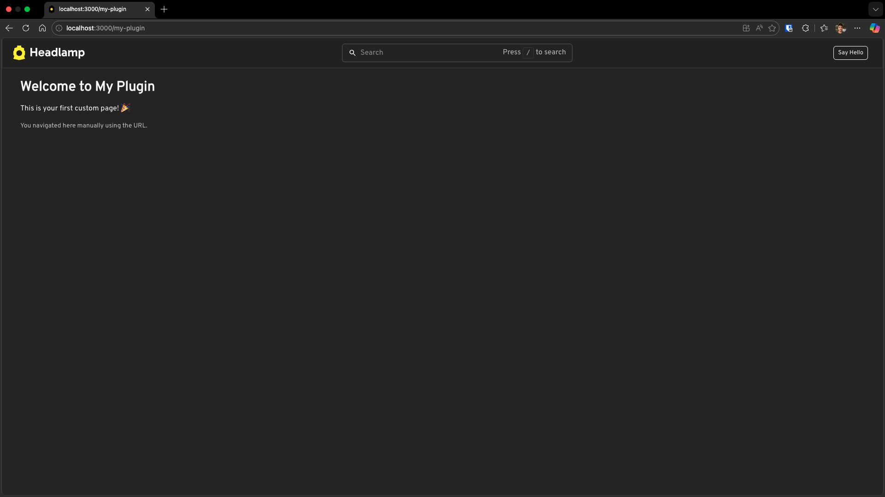
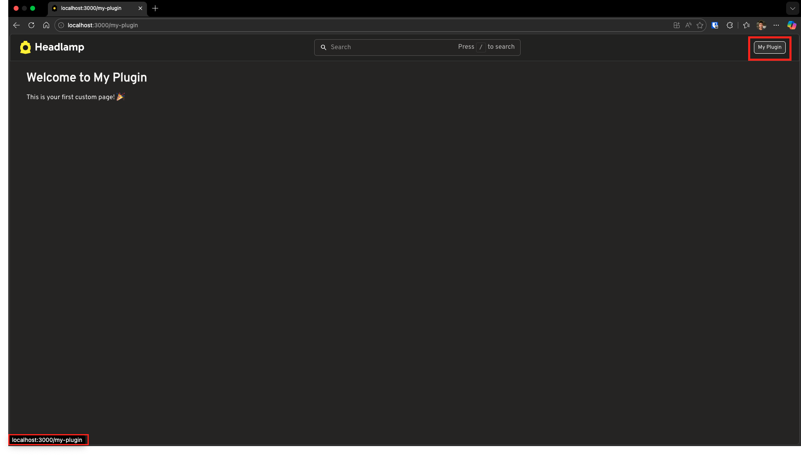
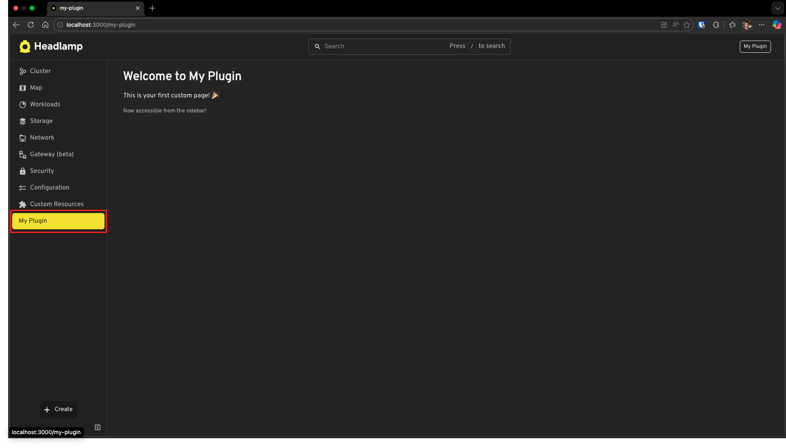
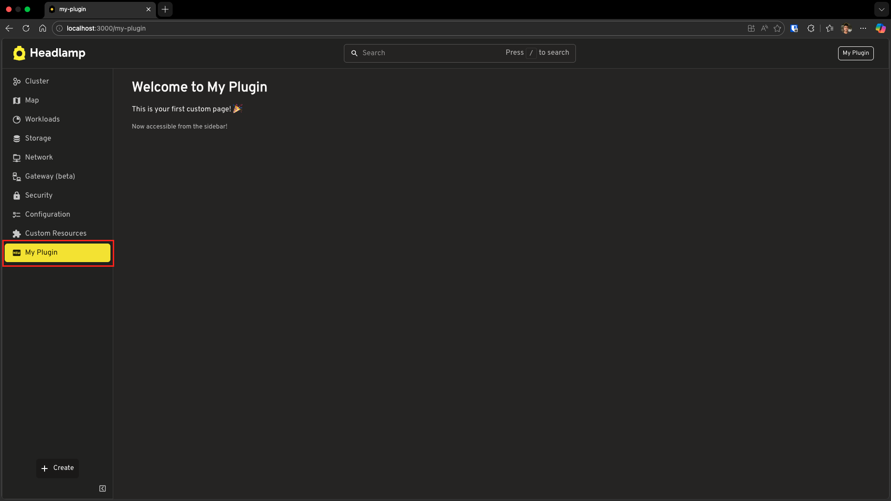
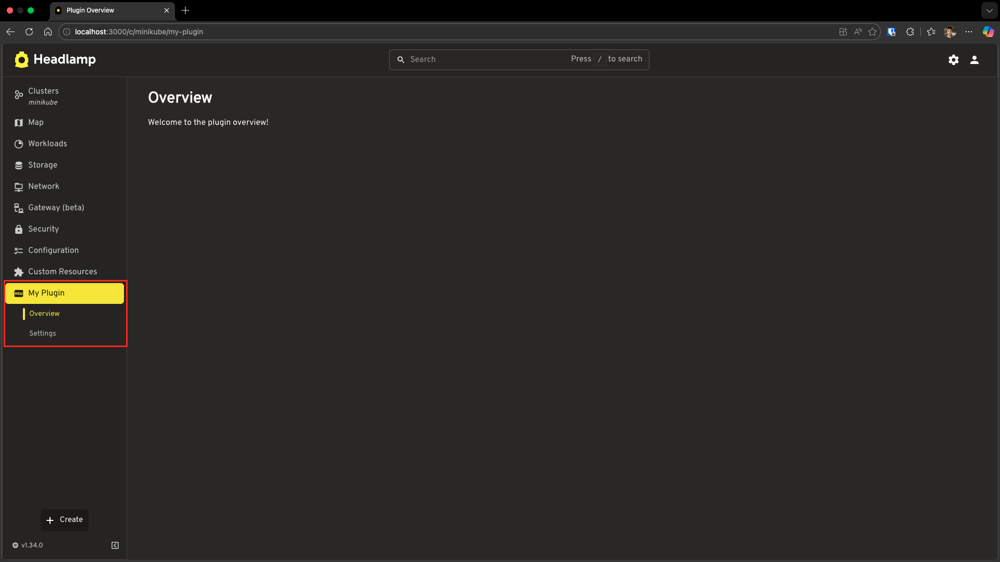
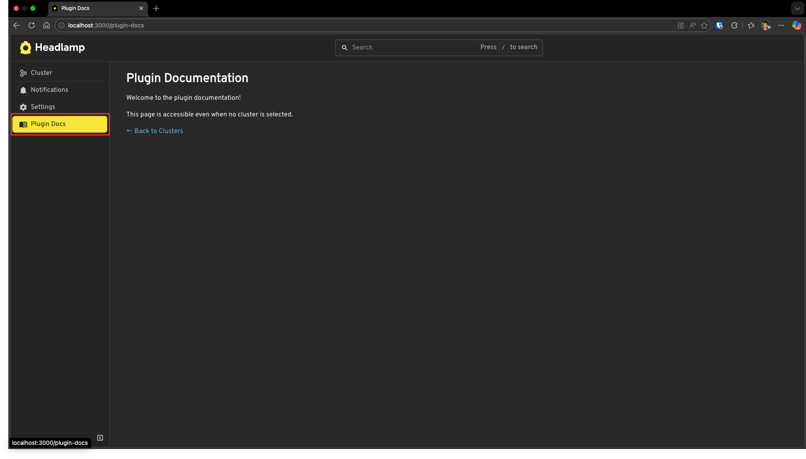

# Adding Pages and Sidebar Navigation

This tutorial will show you how to create custom pages and make them discoverable through Headlamp's sidebar navigation. You'll learn the essential pattern of creating routes and linking them to sidebar entries.

---

## Table of Contents

1. [Introduction](#introduction)
2. [Creating a Custom Page](#creating-a-custom-page)
3. [Connecting the App Bar Button](#connecting-the-app-bar-button)
4. [Why Sidebar Navigation Matters](#why-sidebar-navigation-matters)
5. [Adding a Sidebar Entry](#adding-a-sidebar-entry)
6. [Adding an Icon](#adding-an-icon)
7. [Creating Subentries](#creating-subentries)
8. [Home View vs Cluster View](#home-view-vs-cluster-view)
9. [Troubleshooting](#troubleshooting)
10. [What's Next](#whats-next)
11. [Quick Reference](#quick-reference)

---

## Introduction

In [Tutorial 2](../creating-your-first-plugin/), you created a plugin that displays content in the app bar. But what if you want to create entire pages with rich content? And how do users discover those pages?

This tutorial answers both questions:

1. **Create custom pages** using `registerRoute()`
2. **Add sidebar navigation** using `registerSidebarEntry()`

### What You'll Build

By the end of this tutorial, your plugin will have:

- A custom "Welcome" page accessible via URL
- A sidebar entry that links to your page
- Subentries for organizing related pages
- Navigation in both cluster view and home view

```
Sidebar (Home View):
├── [Clusters list]
├── 🆕 My Plugin          → expandable parent
│   ├── Overview          → /my-plugin
│   └── Settings          → /my-plugin/settings
└── 📚 Plugin Docs        → /plugin-docs
```

### Prerequisites

Before starting, ensure you have:

- ✅ Completed [Tutorial 2: Creating Your First Plugin](../creating-your-first-plugin/)
- ✅ Your `hello-headlamp` plugin ready
- ✅ Headlamp running locally

**Time to complete:** ~20 minutes

---

## Creating a Custom Page

Let's start by creating a page. A page in Headlamp is simply a React component that gets displayed at a specific URL.

### Step 1: Create a Page Component

Open `src/index.tsx` in your `hello-headlamp` plugin and replace its contents with:

```tsx
import { registerRoute } from '@kinvolk/headlamp-plugin/lib';
import { SectionBox } from '@kinvolk/headlamp-plugin/lib/CommonComponents';
import { Typography } from '@mui/material';

function WelcomePage() {
  return (
    <SectionBox title="Welcome to My Plugin">
      <Typography variant="body1">
        This is your first custom page! 🎉
      </Typography>
    </SectionBox>
  );
}

registerRoute({
  path: '/my-plugin',
  sidebar: null,
  component: WelcomePage,
  useClusterURL: false,
  noAuthRequired: true,
});
```

**What's happening here?**

| Code | Purpose |
|------|---------|
| `registerRoute()` | Tells Headlamp to display a component at a specific URL |
| `path: '/my-plugin'` | The URL path where the page will be accessible |
| `sidebar: null` | No sidebar entry linked yet (we'll add one later) |
| `component: WelcomePage` | The React component to render |
| `useClusterURL: false` | Makes the page accessible at `/my-plugin` (not cluster-specific) |
| `noAuthRequired: true` | Page accessible without authentication |

> `SectionBox` is imported from `@kinvolk/headlamp-plugin/lib/CommonComponents`. This module provides ready-to-use UI components that match Headlamp's look and feel. We'll explore more CommonComponents like `NameValueTable`, `ResourceListView` etc in future tutorials.

### Step 2: Navigate Manually

Save the file and navigate to your page manually:

1. Open your browser
2. Go to: **http://localhost:3000/my-plugin**

You should see your Welcome page! 🎉



### The Problem with Manual Navigation

Your page works, but there's a problem: **users need to know the exact URL**.

This is terrible user experience! Let's improve it step by step.

---

## Connecting the App Bar Button

Remember the "Say Hello" button from Tutorial 2? Let's modify it to navigate to our new page instead of showing an alert.

### Step 1: Modify the Hello Button

Update your `src/index.tsx`:

```tsx
import { registerAppBarAction, registerRoute } from '@kinvolk/headlamp-plugin/lib';
import { SectionBox } from '@kinvolk/headlamp-plugin/lib/CommonComponents';
import { Button, Typography } from '@mui/material';

function WelcomePage() {
  return (
    <SectionBox title="Welcome to My Plugin">
      <Typography variant="body1">
        This is your first custom page! 🎉
      </Typography>
    </SectionBox>
  );
}

registerRoute({
  path: '/my-plugin',
  sidebar: null,
  component: WelcomePage,
  useClusterURL: false,
  noAuthRequired: true,
});

function HelloButton() {
  return (
    <Button
      variant="outlined"
      size="small"
      href="/my-plugin"
      sx={{ color: 'inherit', borderColor: 'inherit', mx: 1 }}
    >
      My Plugin
    </Button>
  );
}

registerAppBarAction(<HelloButton />);
```

**What changed from Tutorial 2?**

| Before (Tutorial 2) | After (Tutorial 3) |
|---------------------|-------------------|
| `onClick={() => alert(...)}` | `href="/my-plugin"` |
| Shows an alert popup | Navigates to our custom page |

### Step 2: Test It

1. Save the file
2. Hover over the **"My Plugin"** button in the app bar — you'll see the URL (`/my-plugin`) appear in the bottom-left corner of your browser
3. Click the button — you navigate to your Welcome page!



Now we have a page and an app bar button navigating to it. But did you notice something? **The page we created doesn't have any sidebar!**

That's because we used `useClusterURL: false`, which creates a standalone page outside the cluster context. Let's explore how to add sidebar navigation.

---

## Why Sidebar Navigation Matters

The app bar button works, but there's a problem: **the app bar has limited space**.

What if your plugin has multiple pages? You can't add a button for every page!

**The solution?** Add entries to the sidebar—the navigation menu on the left side of Headlamp. The sidebar:

- Has room for multiple entries
- Supports hierarchical organization (parent/child)
- Shows users where they are (highlighted entry)
- Is the standard navigation pattern in Headlamp

---

## Adding a Sidebar Entry

Let's make your page discoverable by adding it to the sidebar.

### Step 1: Register a Sidebar Entry

Update your `src/index.tsx` to add a sidebar entry and connect it to your route:

```tsx
import { registerAppBarAction, registerRoute, registerSidebarEntry } from '@kinvolk/headlamp-plugin/lib';
import { SectionBox } from '@kinvolk/headlamp-plugin/lib/CommonComponents';
import { Button, Typography } from '@mui/material';

function WelcomePage() {
  return (
    <SectionBox title="Welcome to My Plugin">
      <Typography variant="body1">
        This is your first custom page! 🎉
      </Typography>
      <Typography variant="body2" sx={{ mt: 2, color: 'text.secondary' }}>
        Now accessible from the sidebar!
      </Typography>
    </SectionBox>
  );
}

// Register the page — note sidebar now points to our entry
registerRoute({
  path: '/my-plugin',
  sidebar: 'my-plugin',
  component: WelcomePage,
  useClusterURL: false,
  noAuthRequired: true,
});

// Register the sidebar entry
registerSidebarEntry({
  name: 'my-plugin',
  label: 'My Plugin',
  url: '/my-plugin',
  useClusterURL: false,
});

// Keep the app bar button (optional)
function HelloButton() {
  return (
    <Button
      variant="outlined"
      size="small"
      href="/my-plugin"
      sx={{ color: 'inherit', borderColor: 'inherit', mx: 1 }}
    >
      My Plugin
    </Button>
  );
}

registerAppBarAction(<HelloButton />);
```

**What's new?**

**`registerSidebarEntry` options:**

| Property | Purpose |
|----------|---------|
| `name` | Unique identifier for this entry (must match `sidebar` in the route) |
| `label` | Text displayed in the sidebar |
| `url` | URL to navigate to when clicked |
| `useClusterURL` | If `false`, URL stays as `/my-plugin`; if `true` (default), URL becomes `/c/:cluster/my-plugin` |

**`registerRoute` change:**

| Property | Before | After |
|----------|--------|-------|
| `sidebar` | `null` | `'my-plugin'` — now links the route to the sidebar entry |

> **Note:** `registerRoute` also accepts an optional `name` property (e.g., `name: 'My Plugin'`) which provides a human-readable name that may be used for the browser tab title.

**Important:** The `sidebar` value in `registerRoute` must match the `name` in `registerSidebarEntry`. This connection:
- Highlights the sidebar entry when you're on the page
- Helps Headlamp know which sidebar to show
- Works regardless of how you navigate — whether you click the sidebar entry, use the app bar button we created earlier, or type the URL manually, the sidebar entry will be selected

### Step 2: See It in Action

1. Save the file
2. Go to the Headlamp home screen (`http://localhost:3000/`)
3. Look at the sidebar on the left—you should see **"My Plugin"** as a new entry!
4. Click it—you'll navigate to your Welcome page

**The connection works both ways:**

- Clicking the sidebar entry → navigates to your page
- Being on your page → highlights the sidebar entry



---

## Adding an Icon

Your sidebar entry works, but it looks plain without an icon. Let's add one!

Headlamp uses [Iconify](https://icon-sets.iconify.design/mdi/) for icons. You can browse thousands of icons and use them by their string identifier.

### Step 1: Update the Sidebar Entry

Modify your `registerSidebarEntry` call to include an icon:

```tsx
registerSidebarEntry({
  name: 'my-plugin',
  label: 'My Plugin',
  url: '/my-plugin',
  icon: 'mdi:new-box',
  useClusterURL: false,
});
```

### Step 2: See the Icon

Save the file and look at your sidebar entry—it now has a "new" icon! 🆕




> **Tip:** Browse all available icons at [icon-sets.iconify.design/mdi/](https://icon-sets.iconify.design/mdi/)

---

## Creating Subentries

As your plugin grows, you'll want to organize related pages under a parent entry. Let's create a sidebar section with subentries.

### Step 1: Update Your Plugin

Replace your `src/index.tsx` with this expanded version:

```tsx
import { registerRoute, registerSidebarEntry } from '@kinvolk/headlamp-plugin/lib';
import { SectionBox } from '@kinvolk/headlamp-plugin/lib/CommonComponents';
import { Typography } from '@mui/material';

// Page components
function OverviewPage() {
  return (
    <SectionBox title="Overview">
      <Typography>Welcome to the plugin overview!</Typography>
    </SectionBox>
  );
}

function SettingsPage() {
  return (
    <SectionBox title="Plugin Settings">
      <Typography>Configure your plugin settings here.</Typography>
    </SectionBox>
  );
}

// Register routes
registerRoute({
  path: '/my-plugin',
  exact: true,
  name: 'Plugin Overview',
  sidebar: 'my-plugin-overview',
  component: OverviewPage,
});

registerRoute({
  path: '/my-plugin/settings',
  name: 'Plugin Settings',
  exact: true,
  sidebar: 'my-plugin-settings',
  component: SettingsPage,
});

// Register parent sidebar entry
registerSidebarEntry({
  name: 'my-plugin',
  label: 'My Plugin',
  icon: 'mdi:new-box',
  url: '/my-plugin',
});

// Register child sidebar entries
registerSidebarEntry({
  parent: 'my-plugin',
  name: 'my-plugin-overview',
  label: 'Overview',
  url: '/my-plugin',
});

registerSidebarEntry({
  parent: 'my-plugin',
  name: 'my-plugin-settings',
  label: 'Settings',
  url: '/my-plugin/settings',
});
```

**What's new?**

| Code | Purpose |
|------|---------|
| `exact: true` | Ensures the route matches exactly (not just starts with the path) |
| `parent: 'my-plugin'` | Makes Overview and Settings children of `my-plugin` |
| Parent with `url` | Parent is clickable and navigates to Overview page |
| Child entries | Overview and Settings appear as subentries under My Plugin |

### Step 2: See the Hierarchy

Save and look at your sidebar:

```
My Plugin (🆕)      → expandable parent
├── Overview        → clicks to /my-plugin
└── Settings        → clicks to /my-plugin/settings
```

Click on "My Plugin" or "Overview" to navigate to the Overview page. Click on "Settings" to navigate to the Settings page. The parent expands to show its children when you're on any of its pages.



---

## Home View vs Cluster View

Headlamp has two main contexts:

1. **Home View** — Shown when no cluster is selected (e.g., the cluster selection screen)
2. **Cluster View** — Shown when you're working with a specific cluster

By default, sidebar entries appear in the **Cluster View**. But what if you want to add navigation that's visible even without a cluster?

### Adding to Home View

Let's add a sidebar entry that appears in the home view:

```tsx
import { registerRoute, registerSidebarEntry } from '@kinvolk/headlamp-plugin/lib';
import { SectionBox } from '@kinvolk/headlamp-plugin/lib/CommonComponents';
import { Typography, Link } from '@mui/material';

// Documentation page (available without a cluster)
function DocsPage() {
  return (
    <SectionBox title="Plugin Documentation">
      <Typography paragraph>
        Welcome to the plugin documentation!
      </Typography>
      <Typography paragraph>
        This page is accessible even when no cluster is selected.
      </Typography>
      <Link href="/">← Back to Clusters</Link>
    </SectionBox>
  );
}

// Register the route (note useClusterURL: false)
registerRoute({
  path: '/plugin-docs',
  name: 'Plugin Docs',
  sidebar: {
    item: 'plugin-docs',
    sidebar: 'HOME',
  },
  component: DocsPage,
  useClusterURL: false,
  noAuthRequired: true,
});

// Register sidebar entry in HOME sidebar
registerSidebarEntry({
  name: 'plugin-docs',
  label: 'Plugin Docs',
  url: '/plugin-docs',
  icon: 'mdi:book-open-variant',
  sidebar: 'HOME',
  useClusterURL: false,
});
```

**Key differences:**

| Property | Purpose |
|----------|---------|
| `sidebar: { item, sidebar }` | In `registerRoute`, specifies which sidebar item to highlight and which sidebar it belongs to |
| `sidebar: 'HOME'` | In `registerSidebarEntry`, shows this entry in the home sidebar |
| `useClusterURL: false` | URL won't include `/c/:cluster/` prefix |
| `noAuthRequired: true` | Page accessible without authentication |

### Step 2: Test It

1. Save the file
2. Go to the home screen (click the Headlamp logo or navigate to `http://localhost:3000/`)
3. Look for "Plugin Docs" in the sidebar
4. Click it—you should see the documentation page!



### Complete Example

Here's a complete `src/index.tsx` that demonstrates both cluster view and home view navigation:

```tsx
import { registerRoute, registerSidebarEntry } from '@kinvolk/headlamp-plugin/lib';
import { SectionBox } from '@kinvolk/headlamp-plugin/lib/CommonComponents';
import { Typography, Link } from '@mui/material';

// ========== Cluster View Pages ==========

function OverviewPage() {
  return (
    <SectionBox title="Plugin Overview">
      <Typography>Welcome to My Plugin! This page is cluster-specific.</Typography>
    </SectionBox>
  );
}

function SettingsPage() {
  return (
    <SectionBox title="Plugin Settings">
      <Typography>Configure your plugin settings here.</Typography>
    </SectionBox>
  );
}

// ========== Home View Pages ==========

function DocsPage() {
  return (
    <SectionBox title="Plugin Documentation">
      <Typography paragraph>
        This page is accessible without selecting a cluster.
      </Typography>
      <Link href="/">← Back to Clusters</Link>
    </SectionBox>
  );
}

// ========== Cluster View Routes & Sidebar ==========

registerRoute({
  path: '/my-plugin',
  sidebar: 'my-plugin-overview',
  component: OverviewPage,
  exact: true,
});

registerRoute({
  path: '/my-plugin/settings',
  sidebar: 'my-plugin-settings',
  component: SettingsPage,
  exact: true,
});

registerSidebarEntry({
  name: 'my-plugin',
  label: 'My Plugin',
  icon: 'mdi:new-box',
  url: '/my-plugin',
});

registerSidebarEntry({
  parent: 'my-plugin',
  name: 'my-plugin-overview',
  label: 'Overview',
  url: '/my-plugin',
});

registerSidebarEntry({
  parent: 'my-plugin',
  name: 'my-plugin-settings',
  label: 'Settings',
  url: '/my-plugin/settings',
});

// ========== Home View Routes & Sidebar ==========

registerRoute({
  path: '/plugin-docs',
  component: DocsPage,
  useClusterURL: false,
  noAuthRequired: true,
  sidebar: {
    item: 'plugin-docs',
    sidebar: 'HOME',
  },
});

registerSidebarEntry({
  name: 'plugin-docs',
  label: 'Plugin Docs',
  url: '/plugin-docs',
  icon: 'mdi:book-open-variant',
  sidebar: 'HOME',
  useClusterURL: false,
});
```

---

## Troubleshooting

### Sidebar Entry Not Appearing

**Check your cluster context:**
- Entries without `sidebar: 'HOME'` only appear when a cluster is selected
- Make sure you've selected a cluster to see cluster view entries

**Check for typos:**
- The `name` in `registerSidebarEntry` must match the `sidebar` in `registerRoute`

**Verify the plugin is loaded:**
- Go to Settings → Plugins
- Confirm your plugin is listed and enabled

### Page Shows 404 or Blank

**Check the URL pattern:**
- Cluster view URLs have the format: `/c/:cluster/your-path`
- Home view URLs have the format: `/your-path`

**Check `useClusterURL`:**
- If `useClusterURL: false` in your route, access it without the cluster prefix
- If `useClusterURL: true` (default), include the cluster in the URL

### Sidebar Entry Not Highlighted

**Ensure `sidebar` matches `name`:**

```tsx
// These must match!
registerRoute({
  path: '/my-plugin',
  sidebar: 'my-plugin',  // ← This...
  component: MyPage,
});

registerSidebarEntry({
  name: 'my-plugin',     // ← ...must match this
  label: 'My Plugin',
  url: '/my-plugin',
});
```

### Subentries Not Showing

**Check parent reference:**
- The `parent` value must exactly match the parent's `name`

```tsx
registerSidebarEntry({
  name: 'my-plugin',  // ← Parent name
  label: 'My Plugin',
});

registerSidebarEntry({
  parent: 'my-plugin',  // ← Must match parent's name
  name: 'my-plugin-child',
  label: 'Child Entry',
  url: '/my-plugin/child',
});
```

---

## What's Next

You've learned the fundamentals of navigation in Headlamp plugins:

- ✅ Creating custom pages with `registerRoute()`
- ✅ Adding sidebar entries with `registerSidebarEntry()`
- ✅ Using icons for visual appeal
- ✅ Organizing entries with parent-child relationships
- ✅ Differentiating between home view and cluster view

Your pages are currently static. In the next tutorial, you'll learn how to make them dynamic by fetching and displaying Kubernetes data!

**Coming up:**

- **Tutorial 4: Working with Kubernetes Data** — Fetch cluster info, namespaces using built-in resource classes and ApiProxy
- **Tutorial 5: Advanced Kubernetes Interactions** — Create custom resource classes, modify resources via API

---

## Quick Reference

### registerRoute Options

```tsx
registerRoute({
  path: '/my-path',           // URL path (required)
  sidebar: 'sidebar-name',    // Sidebar entry to highlight (required)
  component: MyComponent,     // React component (required)
  useClusterURL: true,        // Include /c/:cluster/ prefix (default: true)
  noAuthRequired: false,      // Allow unauthenticated access (default: false)
  exact: true,                // Exact path match (default: true)
  name: 'route-name',         // Optional route identifier
});
```

### registerSidebarEntry Options

```tsx
registerSidebarEntry({
  name: 'unique-name',        // Unique identifier (required)
  label: 'Display Label',     // Text shown in sidebar (required)
  url: '/my-path',            // URL to navigate to
  icon: 'mdi:icon-name',      // Iconify icon string
  parent: 'parent-name',      // Parent entry name (for subentries)
  sidebar: 'HOME',            // 'HOME' for home view, omit for cluster view
  useClusterURL: true,        // Include /c/:cluster/ prefix (default: true)
});
```

### URL Patterns

| Context | Pattern | Example |
|---------|---------|---------|
| Cluster View | `/c/:cluster/your-path` | `/c/minikube/my-plugin` |
| Home View | `/your-path` | `/plugin-docs` |

### Useful Links

- [Iconify MDI Icons](https://icon-sets.iconify.design/mdi/)
- [registerSidebarEntry API](https://headlamp.dev/docs/latest/development/api/modules/plugin_registry/#registersidebarentry)
- [registerRoute API](https://headlamp.dev/docs/latest/development/api/modules/plugin_registry/#registerroute)
- [Sidebar Example Plugin](https://github.com/kubernetes-sigs/headlamp/tree/main/plugins/examples/sidebar)
