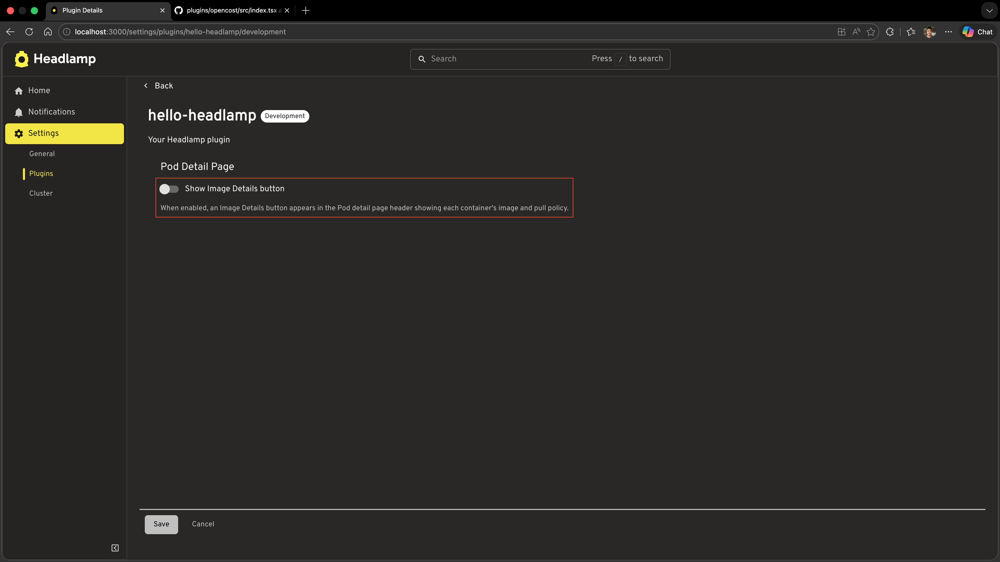
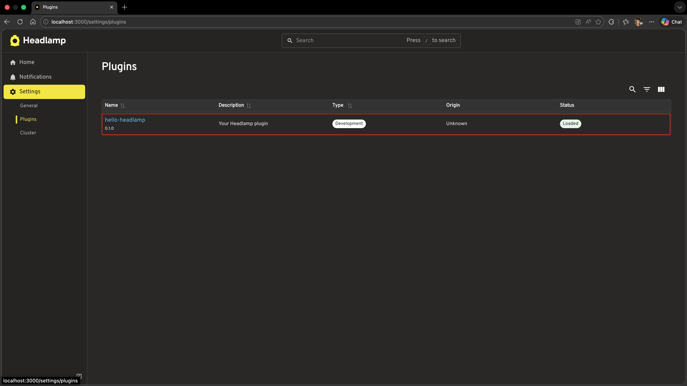
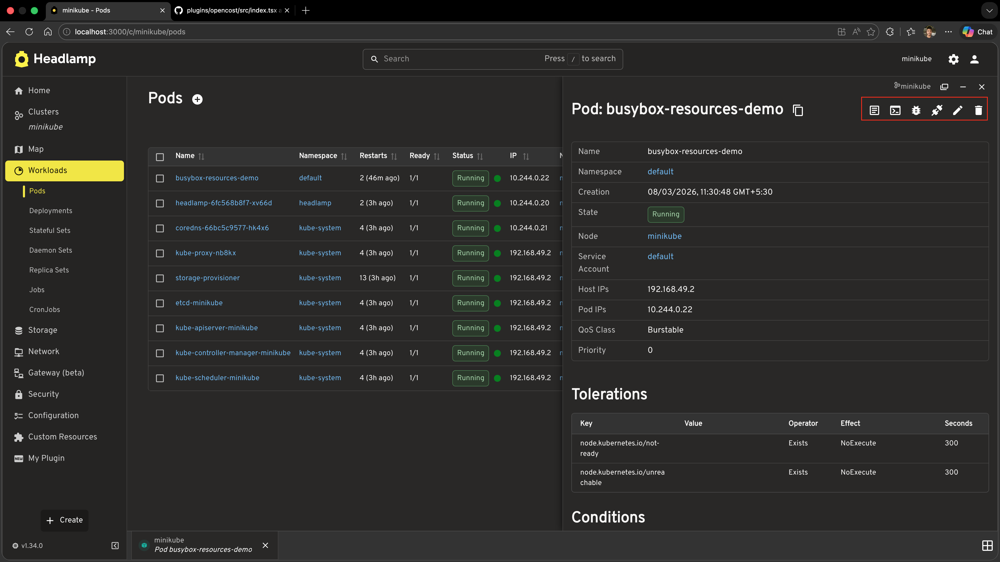

# Adding Plugin Settings

In [Tutorial 7](../extending-existing-resource-views/) we extended Headlamp's built-in Pods list and detail views by injecting a Container Images column, an Image Details action button, and a Container Resources section. Those extensions are always active — the user has no way to turn them on or off.

In this tutorial we will make the **Image Details button** configurable. We'll add a plugin settings page where users can toggle the button on or off with a switch. This will cover:

- Defining a typed `ConfigStore` to persist plugin configuration
- Extracting config logic into a reusable utility module
- Building a settings UI component with `registerPluginSettings`
- Reading config reactively inside a React component using `store.useConfig()`

---

## Table of Contents

1. [Introduction](#introduction)
2. [How Plugin Settings Work](#how-plugin-settings-work)
3. [Step 1 — Define the Config Type and Store](#step-1--define-the-config-type-and-store)
4. [Step 2 — Build the Settings UI Component](#step-2--build-the-settings-ui-component)
5. [Step 3 — Register the Settings Page](#step-3--register-the-settings-page)
6. [Step 4 — Make the Button Respect the Setting](#step-4--make-the-button-respect-the-setting)
7. [Understanding ConfigStore](#understanding-configstore)
8. [Understanding registerPluginSettings](#understanding-registerpluginsettings)
9. [Complete Example](#complete-example)
10. [Troubleshooting](#troubleshooting)
11. [What's Next](#whats-next)
12. [Quick Reference](#quick-reference)

---

## Introduction

Headlamp has a built-in **Plugin Settings** page (accessible via **Settings → Plugins → your plugin name**). To add a settings UI for your plugin, you register a React component with `registerPluginSettings`. Headlamp renders your component on that page and your component reads and writes configuration through a `ConfigStore` instance.

`ConfigStore` gives you three ways to interact with your plugin's config:

| Method | When to use |
|--------|-------------|
| `store.get()` | Read config once, outside React (e.g. in a processor function) |
| `store.set(value)` / `store.update(partial)` | Write or update config (from any context) |
| `store.useConfig()` | Read config **reactively** inside a React component |

### What You'll Build

By the end of this tutorial your plugin will have:

- A `src/config.ts` module that defines the config type and exports the shared `ConfigStore` instance
- A `src/settings.tsx` settings component with an on/off toggle for the Image Details button
- The `ImageDetailsAction` component from Tutorial 7 updated to react to the setting in real time

### Prerequisites

Before starting, ensure you have:

- ✅ Completed [Tutorial 7: Extending Existing Resource Views](../extending-existing-resource-views/)
- ✅ Your `hello-headlamp` plugin with the Image Details button from Tutorial 7
- ✅ Headlamp running with a connected cluster

**Time to complete:** ~20 minutes

---

## How Plugin Settings Work

The **Image Details button** is a React component registered via `registerDetailsViewHeaderAction`. Because it is a React component, it can call `store.useConfig()` to subscribe to config changes. When config is saved, the component re-renders automatically — the button appears or disappears immediately without any page navigation.

```
User flips the toggle in Settings → Plugins → hello-headlamp
         │
         ▼
settings.tsx calls onDataChange({ showImageDetails: true/false })
         │
         ▼
User clicks Save → Headlamp persists the config via ConfigStore
         │
         ▼
ImageDetailsAction re-renders via useConfig() → returns null or the button
```

The key difference compared to using `store.get()` in a processor function is that `useConfig()` **subscribes** to the config. Any component using it re-renders the instant the config is saved — no navigation needed.

---

## Step 1 — Define the Config Type and Store

Start by creating a dedicated file for your plugin's configuration. This keeps the `ConfigStore` instance and the config type in one place and avoids circular imports when both `settings.tsx` and `index.tsx` need to reference them.

Create the file `src/config.ts`:

```ts
import { ConfigStore } from '@kinvolk/headlamp-plugin/lib';

/**
 * Shape of the hello-headlamp plugin configuration.
 * Add new settings here as the plugin grows.
 */
export interface HelloHeadlampConfig {
  /** Whether to show the Image Details button on Pod detail pages. */
  showImageDetails: boolean;
}

/**
 * Default values applied the first time the plugin loads (before the user
 * visits the settings page).
 */
export const DEFAULT_CONFIG: HelloHeadlampConfig = {
  showImageDetails: true,
};

/**
 * Shared ConfigStore instance for the hello-headlamp plugin.
 * Import this from any file that needs to read or write plugin config.
 *
 * The key ('hello-headlamp') must match the plugin name passed to
 * registerPluginSettings.
 */
export const store = new ConfigStore<HelloHeadlampConfig>('hello-headlamp');

/**
 * Convenience helper — returns the current config, falling back to defaults
 * for any keys that haven't been set yet.
 *
 * Safe to call outside React (e.g. in processor functions).
 */
export function getConfig(): HelloHeadlampConfig {
  return { ...DEFAULT_CONFIG, ...store.get() };
}
```

**Why a separate file?**

Both `settings.tsx` and `index.tsx` need the same `ConfigStore` instance. Putting it in its own file means:

- There is exactly **one** store instance shared across the whole plugin
- The config type (`HelloHeadlampConfig`) is defined in one place
- The `getConfig()` helper applies defaults so callers never have to worry about `undefined` values on first load

---

## Step 2 — Build the Settings UI Component

Now create the settings UI component. Headlamp injects the current saved config as `data` and a staging callback as `onDataChange`; the user confirms changes by clicking Save.

Create the file `src/settings.tsx`:

```tsx
import { FormControlLabel, Switch, Typography, Box } from '@mui/material';
import { PluginSettingsDetailsProps } from '@kinvolk/headlamp-plugin/lib';
import { DEFAULT_CONFIG } from './config';

/**
 * Settings component for the hello-headlamp plugin.
 * Rendered by Headlamp inside Settings → Plugins → hello-headlamp.
 * Headlamp injects `data` (current saved config) and `onDataChange` (staging callback).
 */
export default function HelloHeadlampSettings({ data, onDataChange }: PluginSettingsDetailsProps) {
  // Merge saved config with defaults so the toggle always has a defined value
  const config = { ...DEFAULT_CONFIG, ...data };

  return (
    <Box sx={{ p: 3 }}>
      <Typography variant="h6" gutterBottom>
        Pod Detail Page
      </Typography>
      <FormControlLabel
        control={
          <Switch
            checked={config.showImageDetails}
            onChange={(event) =>
              onDataChange?.({ ...config, showImageDetails: event.target.checked })
            }
          />
        }
        label="Show Image Details button"
      />
      <Typography variant="body2" color="text.secondary" sx={{ mt: 1 }}>
        When enabled, an Image Details button appears in the Pod detail page header
        showing each container's image and pull policy.
      </Typography>
    </Box>
  );
}
```

**How it works:**

| | What it does |
|------|-------------|
| `data` prop | Current saved config injected by Headlamp — `undefined` until the user has saved at least once |
| `{ ...DEFAULT_CONFIG, ...data }` | Merges saved values with defaults so the toggle always has a defined value on first load |
| `onDataChange?.({ ... })` | Stages the updated config; Headlamp persists it when the user clicks Save |



---

## Step 3 — Register the Settings Page

Now wire the settings component into Headlamp. Open `src/index.tsx` and add the import and registration call:

```tsx
import {
  registerResourceTableColumnsProcessor,
  registerDetailsViewHeaderAction,
  registerDetailsViewSectionsProcessor,
  DefaultDetailsViewSection,
  registerPluginSettings,        // ← add
} from '@kinvolk/headlamp-plugin/lib';

import HelloHeadlampSettings from './settings';  // ← add
```

Then add the registration at the bottom of the file:

```tsx
// Register the settings page for this plugin.
// The first argument must match the plugin name in package.json.
registerPluginSettings('hello-headlamp', HelloHeadlampSettings, true);
```

The third argument (`displaySaveButton`) controls how the component is rendered and who is responsible for saving:

| Value | How component is rendered | Who saves |
|-------|--------------------------|-----------|
| `false` | `<Comp />` — no props injected | The plugin calls `store.set()` / `store.update()` directly |
| `true` | `<Comp data={…} onDataChange={…} />` | Headlamp — shows a Save button and persists config when clicked |

Because our settings component uses `data`/`onDataChange` and we want Headlamp to show a Save button, we pass `true`.

### Test it

1. Save both files
2. In Headlamp, go to **Settings** (gear icon) → **Plugins**
3. Find **hello-headlamp** in the list and click it
4. You should see your settings page with the toggle switch



---

## Step 4 — Make the Button Respect the Setting

The `ImageDetailsAction` component from Tutorial 7 is always shown on every Pod detail page. Because it is a React component, we can add `store.useConfig()` directly inside it. The component will re-render and hide the button the instant the config changes — no navigation or page refresh required.

Open `src/index.tsx` and replace the `ImageDetailsAction` function from Tutorial 7 with this updated version:

```tsx
import { store, DEFAULT_CONFIG } from './config';

function ImageDetailsAction({ item }: { item: any }) {
  const [open, setOpen] = useState(false);
  // useConfig() must be called before any early returns (React rules of hooks)
  const useConf = store.useConfig();
  const savedConfig = useConf();
  const config = { ...DEFAULT_CONFIG, ...savedConfig };

  // Only show this action on Pod detail pages
  if (!item || item.kind !== 'Pod') {
    return null;
  }

  if (!config.showImageDetails) {
    return null;
  }

  const containers: Array<{
    name: string;
    image: string;
    imagePullPolicy?: string;
  }> = item.spec?.containers || [];

  return (
    <>
      <ActionButton
        description="Image Details"
        icon="mdi:image-search-outline"
        onClick={() => setOpen(true)}
      />
      <Dialog open={open} onClose={() => setOpen(false)} maxWidth="md" fullWidth>
        <DialogTitle>Container Images — {item.metadata?.name}</DialogTitle>
        <DialogContent>
          <SimpleTable
            data={containers}
            columns={[
              { label: 'Container', getter: c => c.name },
              { label: 'Image', getter: c => c.image },
              {
                label: 'Pull Policy',
                getter: c => c.imagePullPolicy || 'IfNotPresent (default)',
              },
            ]}
          />
        </DialogContent>
        <DialogActions>
          <Button onClick={() => setOpen(false)}>Close</Button>
        </DialogActions>
      </Dialog>
    </>
  );
}
```

The two additions compared to Tutorial 7:

1. `store.useConfig()` is called at the top of the function — **before any early returns** — to follow React's rules of hooks
2. The config check (`if (!config.showImageDetails) return null`) hides the button when the setting is off

Because `useConfig()` is a reactive subscription, flipping the toggle in settings causes every mounted `ImageDetailsAction` instance to re-render immediately.

### Test it

1. Save the file
2. Go to **Settings → Plugins → hello-headlamp**, flip the toggle off, and click **Save**
3. Navigate to any Pod detail page — the **Image Details** button should no longer appear in the header
4. Go back to settings, flip the toggle on, and click **Save**
5. Switch back to the Pod detail page — the Image Details button reappears immediately, without a page refresh




---

## Understanding ConfigStore

`ConfigStore<T>` is a generic class. The type parameter `T` is the shape of your config object, which gives you type safety when reading and writing config values.

```ts
import { ConfigStore } from '@kinvolk/headlamp-plugin/lib';

interface MyConfig {
  featureEnabled: boolean;
  itemsPerPage: number;
}

const store = new ConfigStore<MyConfig>('my-plugin-name');
```

The config key passed to the constructor must be **unique across all plugins**. Using your plugin's npm package name (e.g. `'hello-headlamp'`) is a safe convention.

### Reading config

```ts
// Outside React — reads the current value synchronously
const config = store.get();   // returns MyConfig | undefined on first load

// Inside a React component — subscribes to changes
function MyComponent() {
  const useConf = store.useConfig();
  const config = useConf();   // re-renders when config changes
  // ...
}
```

Always apply defaults when reading, because `store.get()` returns `undefined` until the user visits the settings page for the first time:

```ts
const config = { featureEnabled: true, itemsPerPage: 20, ...store.get() };
```

### Writing config

```ts
// Replace the entire config object
store.set({ featureEnabled: true, itemsPerPage: 50 });

// Merge a partial update — other keys are preserved
store.update({ itemsPerPage: 50 });
```

`set()` and `update()` trigger a re-render in any component that subscribes via `useConfig()`.

### Where config is persisted

Config is persisted to the browser's **local storage**, so values survive page refreshes. Config is scoped to the current browser profile — it is not synced across users or clusters.

---

## Understanding registerPluginSettings

`registerPluginSettings` tells Headlamp to render your settings component on the plugin's settings page:

```ts
registerPluginSettings(pluginName, SettingsComponent, displaySaveButton);
```

| Argument | Type | Description |
|----------|------|-------------|
| `pluginName` | `string` | Must match the `name` field in the plugin's `package.json` |
| `SettingsComponent` | `React.ComponentType` | The component Headlamp renders for settings |
| `displaySaveButton` | `boolean` | `false` — component rendered without props, plugin saves itself; `true` — Headlamp injects `data`/`onDataChange` and shows a Save button |

### The `displaySaveButton` modes

**`displaySaveButton: false` — plugin handles saving**

Headlamp renders the component with no props: `<Comp />`. The plugin is responsible for reading config (via `store.useConfig()`) and writing it (via `store.set()` / `store.update()`). Suitable for auto-save patterns such as toggles.

```tsx
import { store } from './config';

function Settings() {
  const useConf = store.useConfig();
  const savedConfig = useConf();
  const config = { myFlag: true, ...savedConfig };

  return (
    <Switch
      checked={config.myFlag}
      onChange={e => store.set({ ...config, myFlag: e.target.checked })}
    />
  );
}

registerPluginSettings('my-plugin', Settings, false);
```

**`displaySaveButton: true` — Headlamp handles saving (used in this tutorial)**

Headlamp renders the component as `<Comp data={…} onDataChange={…} />` and shows a Save button. The component reads from `data` and calls `onDataChange` to stage changes; Headlamp persists them when the user clicks Save. Suitable for forms where the user should confirm before saving.

```tsx
import { PluginSettingsDetailsProps } from '@kinvolk/headlamp-plugin/lib';

function Settings({ data, onDataChange }: PluginSettingsDetailsProps) {
  return (
    <TextField
      value={data?.apiEndpoint || ''}
      onChange={e => onDataChange?.({ ...data, apiEndpoint: e.target.value })}
    />
  );
}

registerPluginSettings('my-plugin', Settings, true);
```

---

## Complete Example

Below is the full set of files for this tutorial. The code in `src/index.tsx` shown here is **only the additions/changes** — keep everything else from Tutorial 7 in place.

### src/config.ts *(new file)*

```ts
import { ConfigStore } from '@kinvolk/headlamp-plugin/lib';

export interface HelloHeadlampConfig {
  showImageDetails: boolean;
}

export const DEFAULT_CONFIG: HelloHeadlampConfig = {
  showImageDetails: true,
};

export const store = new ConfigStore<HelloHeadlampConfig>('hello-headlamp');

export function getConfig(): HelloHeadlampConfig {
  return { ...DEFAULT_CONFIG, ...store.get() };
}
```

### src/settings.tsx *(new file)*

```tsx
import { FormControlLabel, Switch, Typography, Box } from '@mui/material';
import { PluginSettingsDetailsProps } from '@kinvolk/headlamp-plugin/lib';
import { DEFAULT_CONFIG } from './config';

export default function HelloHeadlampSettings({ data, onDataChange }: PluginSettingsDetailsProps) {
  const config = { ...DEFAULT_CONFIG, ...data };

  return (
    <Box sx={{ p: 3 }}>
      <Typography variant="h6" gutterBottom>
        Pod Detail Page
      </Typography>
      <FormControlLabel
        control={
          <Switch
            checked={config.showImageDetails}
            onChange={(event) =>
              onDataChange?.({ ...config, showImageDetails: event.target.checked })
            }
          />
        }
        label="Show Image Details button"
      />
      <Typography variant="body2" color="text.secondary" sx={{ mt: 1 }}>
        When enabled, an Image Details button appears in the Pod detail page header
        showing each container's image and pull policy.
      </Typography>
    </Box>
  );
}
```

### Changes to src/index.tsx

Add these imports at the top:

```tsx
import { registerPluginSettings } from '@kinvolk/headlamp-plugin/lib';
import { store, DEFAULT_CONFIG } from './config';
import HelloHeadlampSettings from './settings';
```

Replace the `ImageDetailsAction` function from Tutorial 7 with:

```tsx
function ImageDetailsAction({ item }: { item: any }) {
  const [open, setOpen] = useState(false);
  const useConf = store.useConfig();
  const savedConfig = useConf();
  const config = { ...DEFAULT_CONFIG, ...savedConfig };

  if (!item || item.kind !== 'Pod') {
    return null;
  }

  if (!config.showImageDetails) {
    return null;
  }

  const containers: Array<{
    name: string;
    image: string;
    imagePullPolicy?: string;
  }> = item.spec?.containers || [];

  return (
    <>
      <ActionButton
        description="Image Details"
        icon="mdi:image-search-outline"
        onClick={() => setOpen(true)}
      />
      <Dialog open={open} onClose={() => setOpen(false)} maxWidth="md" fullWidth>
        <DialogTitle>Container Images — {item.metadata?.name}</DialogTitle>
        <DialogContent>
          <SimpleTable
            data={containers}
            columns={[
              { label: 'Container', getter: c => c.name },
              { label: 'Image', getter: c => c.image },
              {
                label: 'Pull Policy',
                getter: c => c.imagePullPolicy || 'IfNotPresent (default)',
              },
            ]}
          />
        </DialogContent>
        <DialogActions>
          <Button onClick={() => setOpen(false)}>Close</Button>
        </DialogActions>
      </Dialog>
    </>
  );
}

// ... keep registerResourceTableColumnsProcessor, registerDetailsViewSectionsProcessor from Tutorial 7 ...

registerPluginSettings('hello-headlamp', HelloHeadlampSettings, true);
```

---

## Troubleshooting

### Settings page is not appearing for my plugin

- Confirm the first argument to `registerPluginSettings` exactly matches the `name` field in `package.json`. The name is case-sensitive.
- Make sure `registerPluginSettings` is called at module level (outside any component), so it runs when the plugin loads.
- Reload the Headlamp page — newly registered settings sometimes require a full reload.

### Toggle is always shown as "off" even after saving

- Check that `onDataChange` is being called when the toggle fires — add a `console.log` inside the `onChange` handler to confirm.
- Make sure the `name` argument to `registerPluginSettings` exactly matches the plugin's `name` field in `package.json`.

### Button does not disappear after toggling

- Ensure `store.useConfig()` and `useConf()` are called at the **top level** of `ImageDetailsAction`, before any early returns — React hooks must not be called conditionally.
- Check for typos in the config key (`'showImageDetails'`) — a mismatch between what `settings.tsx` writes and what `ImageDetailsAction` reads means they never see the same value.

### `store.get()` returns `undefined` on first load

- This is expected — the user has never set a value yet. Always apply defaults:

```ts
const config = { ...DEFAULT_CONFIG, ...store.get() };
```

---

## What's Next

You've learned how to make your plugin configurable:

- ✅ Creating a typed `ConfigStore` with shared defaults in `src/config.ts`
- ✅ Building a settings UI with an explicit Save button using `registerPluginSettings`
- ✅ Reading config reactively with `store.useConfig()` inside a React component
- ✅ Applying defaults to handle first-load before the user visits settings

**Coming up in Tutorial 9: Applying Custom Themes**
- Registering a custom MUI theme for your plugin
- Supporting light and dark mode
- Overriding colour tokens and typography

---

## Quick Reference

### ConfigStore

```ts
import { ConfigStore } from '@kinvolk/headlamp-plugin/lib';

// Create a typed store — key must be unique (use your plugin package name)
const store = new ConfigStore<MyConfig>('my-plugin');

// Write
store.set({ key: 'value' });          // Replace entire config
store.update({ key: 'value' });       // Merge partial update

// Read (outside React)
const config = store.get();           // undefined until first save

// Read (inside React component) — reactive
const useConf = store.useConfig();
const config = useConf();             // re-renders on change
```

### registerPluginSettings

```ts
import { registerPluginSettings } from '@kinvolk/headlamp-plugin/lib';

// Self-managed saving (auto-save pattern)
registerPluginSettings('my-plugin', MySettingsComponent, false);

// Headlamp-managed saving (explicit Save button)
registerPluginSettings('my-plugin', MySettingsComponent, true);
```

### PluginSettingsDetailsProps (for displaySaveButton: true)

```tsx
import { PluginSettingsDetailsProps } from '@kinvolk/headlamp-plugin/lib';

function MySettings({ data, onDataChange }: PluginSettingsDetailsProps) {
  return (
    <input
      value={data?.myKey || ''}
      onChange={e => onDataChange?.({ myKey: e.target.value })}
    />
  );
}
```

### Suggested src/config.ts structure

```ts
import { ConfigStore } from '@kinvolk/headlamp-plugin/lib';

export interface MyPluginConfig {
  featureEnabled: boolean;
  // ... add more settings here
}

export const DEFAULT_CONFIG: MyPluginConfig = { featureEnabled: true };

export const store = new ConfigStore<MyPluginConfig>('my-plugin');

export function getConfig(): MyPluginConfig {
  return { ...DEFAULT_CONFIG, ...store.get() };
}
```
