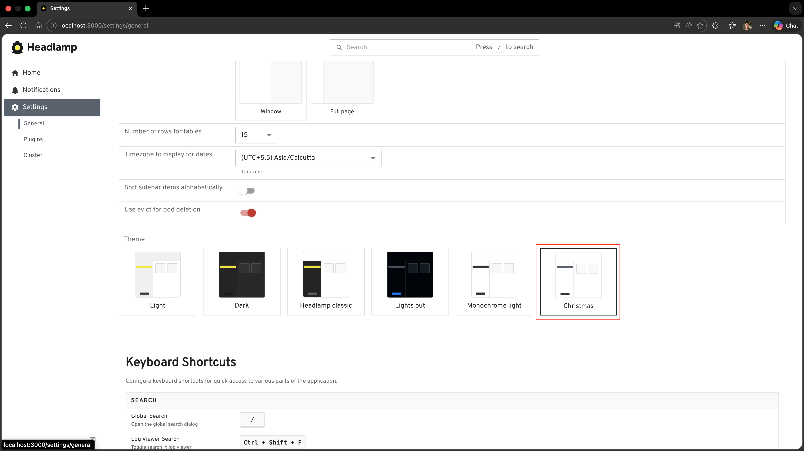
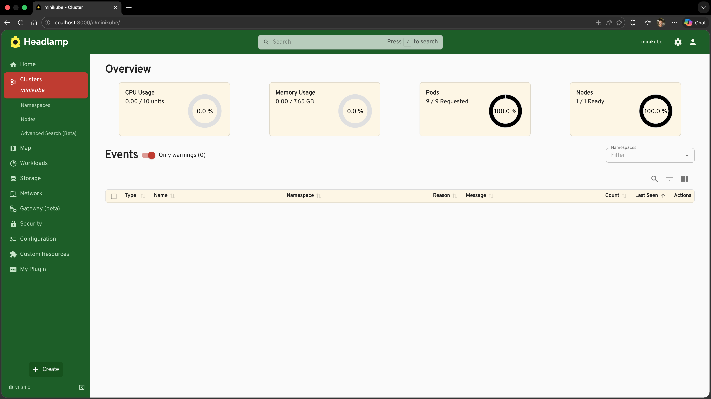
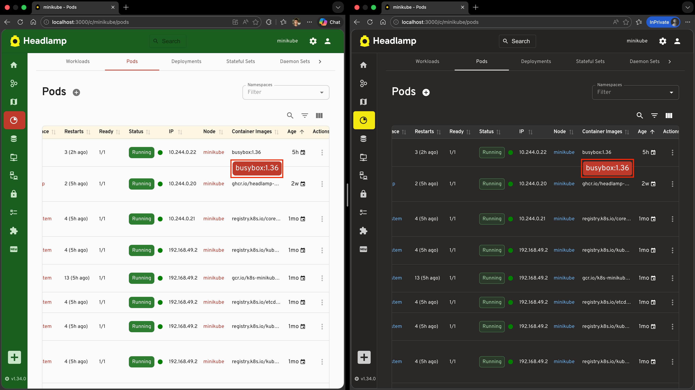
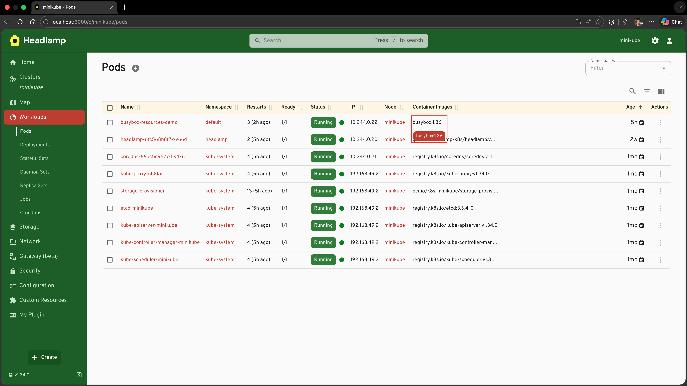
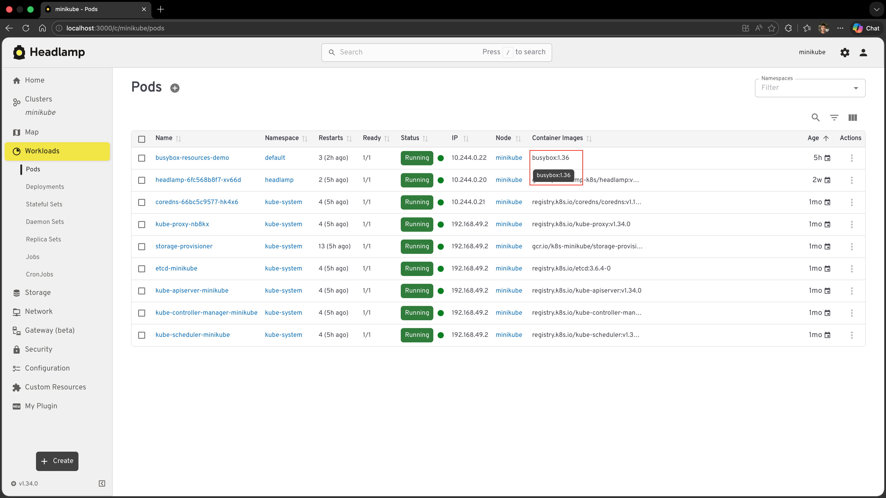
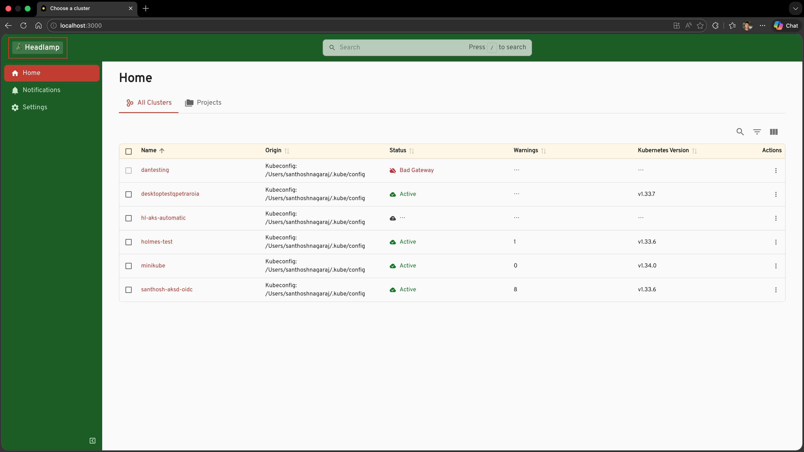
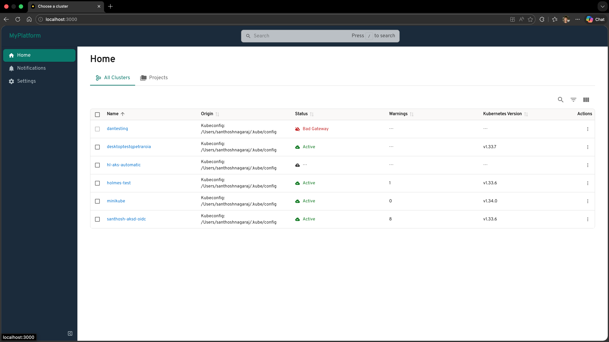

# Applying Custom Themes

In [Tutorial 8](../adding-plugin-settings/) we made parts of our plugin configurable through a settings page. In this tutorial we will look at a completely different kind of plugin capability: **customising the visual appearance of the entire Headlamp application**.

Headlamp provides a theming system that lets any plugin register one or more named themes. Once registered, a theme appears as a selectable option in the **Themes** section of **Settings → General**, alongside the built-in Light and Dark choices. The entire application — sidebar, navbar, buttons, backgrounds, text — re-renders in your chosen colours.

We will build this up with a concrete, fun example: a **Christmas theme** that dresses Headlamp in festive deep greens and reds. Along the way we will also learn something equally important: **how to make your own plugin components respond to theme changes**, so they always look at home regardless of which theme the user has chosen.

---

## Table of Contents

1. [Introduction](#introduction)
2. [Registering the Christmas Theme](#registering-the-christmas-theme)
3. [The AppTheme Object](#the-apptheme-object)
4. [Why Your Plugin Components Should Use Theme Colours](#why-your-plugin-components-should-use-theme-colours)
5. [Updating the Container Images Tooltip to Use Theme Colours](#updating-the-container-images-tooltip-to-use-theme-colours)
6. [Replacing the Application Logo](#replacing-the-application-logo)
7. [Building a White-label Headlamp Flavour](#building-a-white-label-headlamp-flavour)
8. [What's Next](#whats-next)
9. [Quick Reference](#quick-reference)

---

## Introduction

Headlamp's UI is built on [Material UI (MUI)](https://mui.com/). Rather than exposing the raw MUI theme object, Headlamp provides a simpler, flatter `AppTheme` structure. You set the values you care about; everything else inherits from the chosen `base` theme (`'light'` or `'dark'`).

This keeps theming approachable — you don't need to know MUI internals — while still giving fine-grained control over the parts of the UI that matter most: the sidebar, the navbar, the primary accent colour, backgrounds, and typography.

### What You'll Build

By the end of this tutorial your plugin will:

- Register a custom **"Christmas"** theme — a light base with a deep green sidebar and Christmas red accent — selectable from the theme options
- Understand **why** plugin components must read colours from the active theme rather than hard-coding them
- Update the **Container Images tooltip** from Tutorial 7 so its colour adapts automatically when any theme (including Christmas) is active
- Replace the **application logo** with a custom component using `registerAppLogo`
- Combine a custom theme and logo to produce a **white-label Headlamp flavour**

### Prerequisites

- ✅ Completed [Tutorial 7: Extending Existing Resource Views](../extending-existing-resource-views/) (the Container Images column is the component we will improve)
- ✅ Your `hello-headlamp` plugin running in Headlamp

**Time to complete:** ~20 minutes

---

## Registering the Christmas Theme

Registering a theme takes a single import and a single call in `src/index.tsx`:

```tsx
import { registerAppTheme } from '@kinvolk/headlamp-plugin/lib';

registerAppTheme({
  name: 'Christmas',
  base: 'light',
  primary: '#c0392b',
});
```

That's it. After saving, go to **Settings → General** and your theme will appear as one of the selectable options in the **Themes** section.



The `name` field is what the user sees in the theme options — make it descriptive. Once selected, Headlamp stores the user's choice in local storage and restores it on the next visit.

Now let's flesh it out into a proper Christmas theme. Replace the minimal call above with the full version:

```tsx
import { registerAppTheme } from '@kinvolk/headlamp-plugin/lib';

registerAppTheme({
  name: 'Christmas',
  base: 'light',

  // Christmas red for interactive elements — buttons, links, active states
  primary: '#c0392b',
  secondary: '#f9e79f',

  text: {
    primary: '#212121',
  },
  link: {
    color: '#c0392b',
  },

  background: {
    default: '#fafafa',
    surface: '#ffffff',
    muted: '#fdf6e3',
  },

  // Deep Christmas green sidebar with red active highlight
  sidebar: {
    background: '#1b5e20',
    color: '#c8e6c9',
    selectedBackground: '#c0392b',
    selectedColor: '#ffffff',
    actionBackground: '#145214',
  },

  navbar: {
    background: '#1b5e20',
    color: '#f1f8e9',
  },

  radius: 8,
  buttonTextTransform: 'none',
});
```

Save the file, go to **Settings → General**, and choose **"Christmas"** in the **Themes** section. The sidebar turns deep festive green, the active navigation item gets a red highlight, and all interactive elements (buttons, focus rings, progress bars) switch to Christmas red.



---

## The AppTheme Object

All fields except `name` are optional. Anything you omit inherits its value from the `base` theme.

```ts
interface AppTheme {
  name: string;
  base?: 'light' | 'dark';      // which built-in theme to extend (default: 'light')

  primary?: string;              // main accent colour — buttons, links, highlights
  secondary?: string;            // secondary accent colour

  text?: {
    primary?: string;            // body text colour
  };
  link?: {
    color?: string;              // hyperlink colour (defaults to primary if unset)
  };

  background?: {
    default?: string;            // main page background
    surface?: string;            // cards, dialogs, dropdown menus
    muted?: string;              // subtle shaded areas (table row stripes, etc.)
  };

  sidebar?: {
    background?: string;         // sidebar background
    color?: string;              // sidebar icon and text colour
    selectedBackground?: string; // highlight behind the active menu item
    selectedColor?: string;      // text/icon colour for the active menu item
    actionBackground?: string;   // background of the collapse/expand button
  };

  navbar?: {
    background?: string;         // top app bar background
    color?: string;              // top app bar icon and text colour
  };

  radius?: number;               // border radius in px — applied to buttons, chips, dialogs
  buttonTextTransform?: 'uppercase' | 'none'; // button label capitalisation
  fontFamily?: string[];         // font stack, e.g. ['Inter', 'sans-serif']
}
```

### Tips on choosing values

- **`base`** — Start from `'light'` if your palette is bright, `'dark'` if it is muted or dark. Every field you omit falls back to the base values, so you only need to specify what you want to change.
- **`primary`** — This colour drives the most visible interactive elements (active states, focus rings, progress bars). Choose something with enough contrast against both the `background.default` and `sidebar.background`.
- **`sidebar` vs `navbar`** — These two surface areas are visually dominant. Setting them explicitly gives your theme a strong identity even if you leave the rest at base values.

---

## Why Your Plugin Components Should Use Theme Colours

Here is the key insight for this tutorial: **registering a theme only changes how Headlamp's own built-in components look**. Any colour you hard-code in your own plugin components using a plain `style` attribute will not change when the user switches themes.

Consider the Container Images tooltip we built in Tutorial 7. It renders like this:

```tsx
// ❌ Hard-coded colour — stays this colour regardless of which theme is active
<Tooltip
  title={images.join('\n')}
  placement="bottom-start"
  componentsProps={{
    tooltip: { sx: { bgcolor: '#c0392b' } },
  }}
>
  ...
</Tooltip>
```

If the user is running the Christmas theme, this looks fine — the red matches. But if they switch to the built-in Dark theme or the Light theme, the tooltip stays Christmas red. It is out of place; it looks like a bug.



The fix is to read the **current** primary colour from the active MUI theme at render time, using the `useTheme` hook:

```tsx
import { useTheme } from '@mui/material/styles';

function ContainerImagesCell({ pod }: { pod: Pod }) {
  // ✅ Always reads from whatever theme is currently active
  const theme = useTheme();
  const images = pod.spec.containers.map(c => c.image);

  return (
    <Tooltip
      title={images.join('\n')}
      placement="bottom-start"
      componentsProps={{
        tooltip: {
          sx: {
            bgcolor: theme.palette.primary.main,
            color: theme.palette.primary.contrastText,
          },
        },
      }}
    >
      <Typography noWrap style={{ maxWidth: 240, fontSize: 'inherit' }}>
        {images[0]}{images.length > 1 ? ` (+${images.length - 1} more)` : ''}
      </Typography>
    </Tooltip>
  );
}
```

Now:
- Christmas theme active → tooltip is Christmas red (`#c0392b`)
- Light theme active → tooltip is black (Headlamp's default primary colour)
- Dark theme active → tooltip is white (Headlamp's default primary colour)
- Any future custom theme → tooltip automatically matches its primary colour

This is the right pattern for **every** colour a plugin component displays. Whenever you would otherwise write a colour literal like `'#c0392b'` or `'rgba(255,0,0,0.8)'`, ask: *"Should this change when the user switches themes?"*. If yes, reach for `useTheme()` and pull the value from `theme.palette`.

### The most useful theme palette values

| `theme.palette.*` | What it represents |
|-------------------|--------------------|
| `primary.main` | The primary accent colour — same as `AppTheme.primary` |
| `primary.contrastText` | A text colour guaranteed to be readable on top of `primary.main` |
| `secondary.main` | The secondary accent colour |
| `background.default` | The main page background |
| `background.paper` | Cards, dialogs, surface areas |
| `text.primary` | The main body text colour |
| `text.secondary` | Subdued text, hints, secondary labels |

---

## Updating the Container Images Tooltip to Use Theme Colours

Let's apply this pattern to the actual code from Tutorial 7. We need to:

1. Extract the tooltip cell into a small React component (so we can use the `useTheme` hook)
2. Replace the hard-coded colour with `theme.palette.primary.main`

### Step 1: Import `useTheme`

Add `useTheme` to your existing MUI imports in `src/index.tsx`:

```tsx
import { Tooltip, Typography } from '@mui/material';
import { useTheme } from '@mui/material/styles';
```

### Step 2: Create the `ContainerImagesCell` Component

Add this component **before** the `registerResourceTableColumnsProcessor` call:

```tsx
function ContainerImagesCell({ pod }: { pod: Pod }) {
  const theme = useTheme();
  const images = pod.spec.containers.map(c => c.image);

  return (
    <Tooltip
      title={images.join('\n')}
      placement="bottom-start"
      componentsProps={{
        tooltip: {
          sx: {
            bgcolor: theme.palette.primary.main,
            color: theme.palette.primary.contrastText,
            fontSize: '0.8rem',
            whiteSpace: 'pre-line',
          },
        },
      }}
    >
      <Typography noWrap style={{ maxWidth: 240, fontSize: 'inherit' }}>
        {images[0]}{images.length > 1 ? ` (+${images.length - 1} more)` : ''}
      </Typography>
    </Tooltip>
  );
}
```

### Step 3: Update the Column Registration

In your existing `registerResourceTableColumnsProcessor` call, replace the inline `render` function with the new component:

```tsx
registerResourceTableColumnsProcessor(function addContainerImagesColumn({ id, columns }) {
  if (id !== 'headlamp-pods') {
    return columns;
  }

  const podColumns = columns as ResourceTableColumn<Pod>[];

  podColumns.push({
    id: 'hello-headlamp-container-images',
    label: 'Container Images',
    getValue: (pod: Pod) => pod.spec.containers.map(c => c.image).join(', '),
    render: (pod: Pod) => <ContainerImagesCell pod={pod} />,  // ← uses useTheme internally
  });

  return columns;
});
```

### Step 4: Test It

1. Save the file
2. Navigate to **Workloads** → **Pods** and hover over a cell in the Container Images column
3. You should see the tooltip appear with a **Christmas red** background — because the Christmas theme is active and its `primary` is `#c0392b`



4. Now go to **Settings → General** and choose **Light** in the **Themes** section, then hover again
5. The tooltip is now **black** — Headlamp's default primary colour for the Light theme



The tooltip automatically follows whichever theme the user has selected, with no extra code on your part. This is what it means for a plugin to be **coherent with the app**.

---

## Replacing the Application Logo

`registerAppLogo` lets you swap out the Headlamp logo that appears in the sidebar and the top bar. It is a natural companion to `registerAppTheme` — combine them and your users see your branding everywhere.

`registerAppLogo` accepts either a **React element** (always renders the same thing) or a **React component** that receives `AppLogoProps` and can adapt to context.

### Adding a Christmas tree logo

For a festive touch, let's swap the Headlamp logo for a Christmas tree. The component receives `AppLogoProps` and can adapt based on `logoType` (whether the sidebar is expanded or collapsed):

```tsx
import { AppLogoProps, registerAppLogo } from '@kinvolk/headlamp-plugin/lib';

function ChristmasLogo({ logoType }: AppLogoProps) {
  const style = {
    background: 'rgba(255, 255, 255, 0.15)',
    borderRadius: 4,
    padding: '2px 8px',
  };

  if (logoType === 'small') {
    return <span style={{ ...style, fontSize: '1.4rem', padding: '2px 4px' }}>🎄</span>;
  }

  return (
    <span style={{ ...style, fontSize: '1.1rem', fontWeight: 700, letterSpacing: '0.02em' }}>
      🎄 Headlamp
    </span>
  );
}

registerAppLogo(ChristmasLogo);
```



> **Only one logo at a time.** If multiple plugins call `registerAppLogo`, the last registration wins. This is intentional — a single logo is always shown.

---

## Building a White-label Headlamp Flavour

Combining a custom theme and a custom logo is the standard pattern for shipping a **branded flavour of Headlamp** — for example, an internal platform portal, a managed Kubernetes product, or an enterprise console.

A typical white-label `src/index.tsx` looks like this:

```tsx
import { registerAppLogo, registerAppTheme, AppLogoProps } from '@kinvolk/headlamp-plugin/lib';

// ── 1. Register a branded theme ───────────────────────────────────────────────

registerAppTheme({
  name: 'MyPlatform',
  base: 'light',
  primary: '#00796b',
  secondary: '#e0f2f1',
  sidebar: {
    background: '#1a2b3c',
    color: '#b0bec5',
    selectedBackground: '#00796b',
    selectedColor: '#ffffff',
    actionBackground: '#0d1b2a',
  },
  navbar: {
    background: '#1a2b3c',
    color: '#eceff1',
  },
  radius: 8,
  buttonTextTransform: 'none',
});

// ── 2. Replace the logo ────────────────────────────────────────────────────────

function MyPlatformLogo({ logoType, themeName }: AppLogoProps) {
  if (logoType === 'small') {
    return <span style={{ fontWeight: 'bold' }}>MP</span>;
  }
  const color = themeName === 'dark' ? '#4db6ac' : '#00796b';
  return <span style={{ fontWeight: 700, fontSize: '1.2rem', color }}>MyPlatform</span>;
}

registerAppLogo(MyPlatformLogo);
```

After the user chooses the **"MyPlatform"** theme in the **Themes** section of **Settings → General**, the entire application takes on the branded look — your logo, your colours, your typography.



---

## What's Next

You've learned how to fully customise the look of the whole Headlamp application, and — just as importantly — how to make your plugin's own components respect that customisation:

- ✅ Using `registerAppTheme` to register a named theme (the Christmas theme)
- ✅ Understanding every field in the `AppTheme` object
- ✅ Why hard-coding colours in plugin components breaks theme coherence
- ✅ Using `useTheme()` to read the active theme's palette at render time
- ✅ Applying this pattern to the Container Images tooltip from Tutorial 7
- ✅ Replacing the application logo with `registerAppLogo`
- ✅ Combining theme and logo to ship a white-label Headlamp flavour

**Coming up in Tutorial 10: Adding Custom Map Nodes**
- Registering custom node types for the Headlamp resource map
- Controlling how your resources are visualised in the topology view

---

## Quick Reference

### registerAppTheme

```tsx
import { registerAppTheme } from '@kinvolk/headlamp-plugin/lib';

registerAppTheme({
  name: 'My Theme',          // shown in the Themes section of Settings → General (required)
  base: 'light',             // 'light' | 'dark' — what to inherit from (default: 'light')

  primary: '#hex',           // accent colour
  secondary: '#hex',         // secondary accent

  text: { primary: '#hex' },
  link: { color: '#hex' },

  background: {
    default: '#hex',         // page background
    surface: '#hex',         // cards / dialogs
    muted: '#hex',           // subtle shading
  },

  sidebar: {
    background: '#hex',
    color: '#hex',
    selectedBackground: '#hex',
    selectedColor: '#hex',
    actionBackground: '#hex',
  },

  navbar: {
    background: '#hex',
    color: '#hex',
  },

  radius: 8,                          // border radius in px
  buttonTextTransform: 'none',        // 'none' | 'uppercase'
  fontFamily: ['Inter', 'sans-serif'],
});
```

### Using `useTheme` in plugin components

```tsx
import { useTheme } from '@mui/material/styles';

function MyPluginComponent() {
  const theme = useTheme();

  return (
    <div style={{ color: theme.palette.primary.main }}>
      This text colour matches the active theme's primary accent.
    </div>
  );
}
```

**Useful palette tokens:**

| Token | Meaning |
|-------|---------|
| `theme.palette.primary.main` | Primary accent (buttons, links, highlights) |
| `theme.palette.primary.contrastText` | Readable text colour on top of `primary.main` |
| `theme.palette.secondary.main` | Secondary accent |
| `theme.palette.background.default` | Page background |
| `theme.palette.background.paper` | Card / dialog surface |
| `theme.palette.text.primary` | Main body text |
| `theme.palette.text.secondary` | Subdued / secondary text |

### registerAppLogo

```tsx
import { registerAppLogo, AppLogoProps } from '@kinvolk/headlamp-plugin/lib';

// Simple — a React element (always the same)
registerAppLogo();

// Adaptive — a React component that receives context props
function MyLogo({ logoType, themeName }: AppLogoProps) {
  // logoType: 'large' (sidebar expanded) | 'small' (sidebar collapsed)
  // themeName: 'light' | 'dark'
  if (logoType === 'small') {
    return <span style={{ fontWeight: 'bold' }}>ML</span>;
  }
  return (
    <span style={{ fontWeight: 700, color: themeName === 'dark' ? '#fff' : '#000' }}>
      MyLogo
    </span>
  );
}

registerAppLogo(MyLogo);
```
