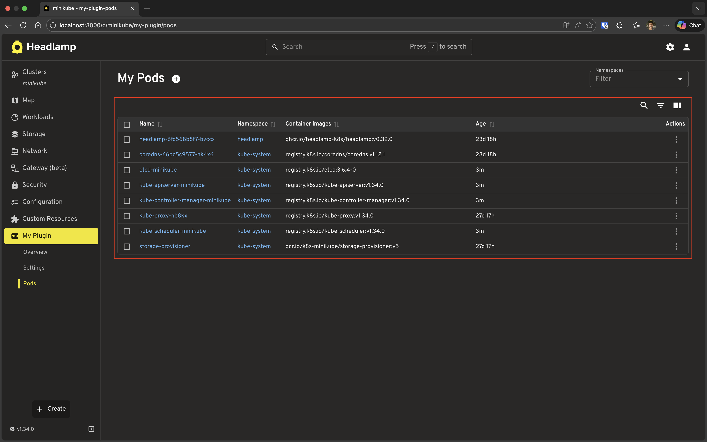
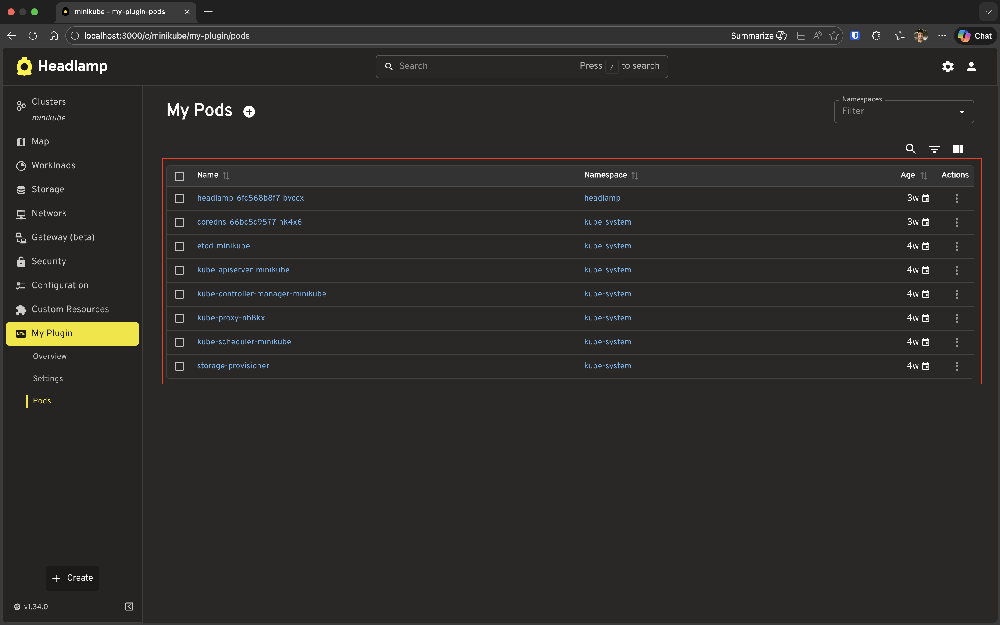
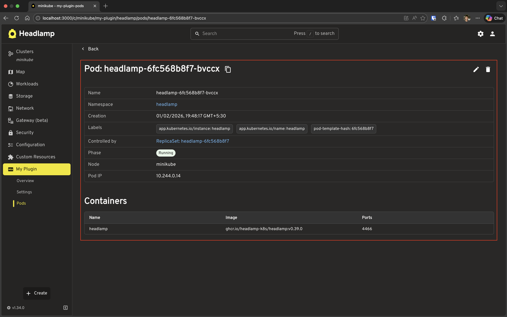
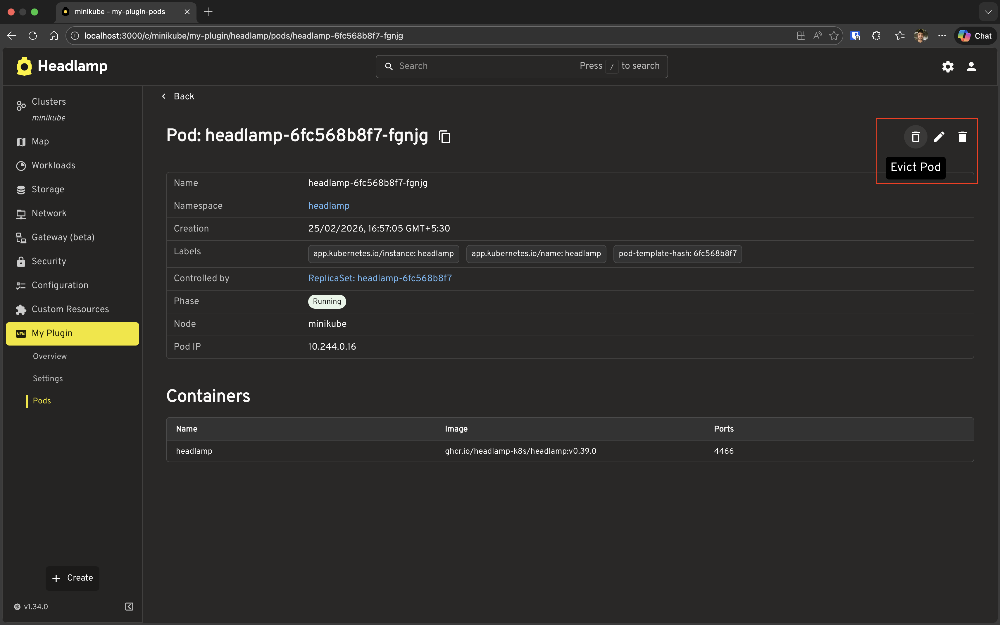
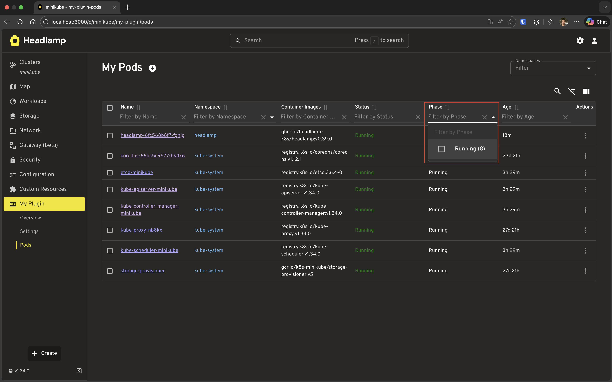

# Building List & Detail Pages

This tutorial shows you how to build list and detail pages that match Headlamp's core UI. We'll achieve this by using the Headlamp CommonComponents `ResourceListView` for powerful, feature-rich list pages and `DetailsGrid` for comprehensive detail views.

---

## Table of Contents

1. [Introduction](#introduction)
2. [Building a Pod List Page](#building-a-pod-list-page)
3. [Understanding ResourceListView](#understanding-resourcelistview)
4. [Building a Pod Detail Page](#building-a-pod-detail-page)
5. [Understanding DetailsGrid](#understanding-detailsgrid)
6. [Adding Actions to Detail Page](#adding-actions-to-detail-page)
7. [Navigation Between List and Detail](#navigation-between-list-and-detail)
8. [Customizing Columns and Details](#customizing-columns-and-details)
9. [Troubleshooting](#troubleshooting)
10. [What's Next](#whats-next)
11. [Quick Reference](#quick-reference)

---

## Introduction

In [Tutorial 5](../working-with-kubernetes-data-advanced/), you created a custom `MyPod` class and built a simple Pods page using a basic Material UI table. While that works, Headlamp provides powerful components that give you professional list and detail views with minimal code:

| Component | Purpose | Features |
|-----------|---------|----------|
| `ResourceListView` | Display lists of Kubernetes resources | Sorting, filtering, pagination, row actions |
| `DetailsGrid` | Display detailed information about a single resource | Automatic metadata display, extra info sections, event integration |

### What You'll Build

By the end of this tutorial, you'll have:

- A professional Pod list page using `ResourceListView` with:
  - Custom columns (Name, Namespace, Phase, Container Images, Age)
  - Sorting, filtering, and clickable names linking to the detail page
- A Pod detail page using `DetailsGrid` with:
  - Standard metadata display
  - Custom info fields (Phase, Node, Pod IP)
  - A custom Containers section using `SimpleTable`
  - An "Evict Pod" action button in the header
  - A back link to the list page

### Prerequisites

Before starting, ensure you have:

- ✅ Completed [Tutorial 5: Advanced Kubernetes Interactions](../working-with-kubernetes-data-advanced/)
- ✅ Your `hello-headlamp` plugin with the `MyPod` class from Tutorial 5
- ✅ Headlamp running with a connected cluster

**Time to complete:** ~30 minutes

---

## Building a Pod List Page

Let's replace the simple table from Tutorial 5 with `ResourceListView`.

### Step 1: Update Your Pod List Page

Open your `src/index.tsx` and update the `MyPodsPage` component:

```tsx
import {
  registerRoute,
  registerSidebarEntry,
} from '@kinvolk/headlamp-plugin/lib';
import { ResourceListView } from '@kinvolk/headlamp-plugin/lib/CommonComponents';
import { MyPod } from './resources/pod';

function MyPodsPage() {
  return (
    <ResourceListView
      title="My Pods"
      resourceClass={MyPod}
      columns={[
        'name',
        'namespace',
        {
          id: 'containerImages',
          label: 'Container Images',
          getValue: (pod: MyPod) => pod.containerImages?.join(', ') || '-',
        },
        {
          id: 'age',
          label: 'Age',
          getValue: (pod: MyPod) => pod.age,
        },
      ]}
    />
  );
}

registerRoute({
  path: '/my-plugin/pods',
  sidebar: 'my-plugin-pods',
  component: MyPodsPage,
  exact: true,
});

registerSidebarEntry({
  parent: 'my-plugin',
  name: 'my-plugin-pods',
  label: 'Pods',
  url: '/my-plugin/pods',
});
```

**What changed?**

| Before (Tutorial 5) | After (Tutorial 6) |
|---------------------|---------------------|
| Manual `useList()` hook | `resourceClass` prop handles it automatically |
| Manual loading/error states | Automatic handling |
| Basic `<Table>` component | Full-featured `ResourceListView` |
| Manual pagination | Built-in pagination |
| No filtering | Automatic namespace filtering |

### Step 2: Test It

1. Save the file
2. Navigate to **My Plugin** → **Pods** in the sidebar
3. You should see a professional list view with:
   - Sortable columns
   - Namespace filter (top-right)
   - Row selection checkboxes
   - Context menu on each row (three dots)

**Notice the improvements:**
- Click column headers to sort
- Use the namespace filter to show pods from specific namespaces
- Click the three dots on a row to see actions
- Select multiple rows with checkboxes



---

## Understanding ResourceListView

Now that you've seen it in action, let's look at what `ResourceListView` gave you for free. Under the hood it handles:

- **Data fetching** — Automatically calls `useList()` from your resource class — no manual hook needed
- **Loading & error states** — Automatic handling, no boilerplate required
- **Sorting** — Click any column header to sort
- **Filtering** — Namespace filter for namespaced resources; per-column filters when Show/Hide Filters button is clicked
- **Pagination** — Large datasets are paginated automatically
- **Row context menu** — Three-dot menu on every row (you'll extend this in the Customizing section)
- **Bulk operations** — Row checkboxes for selecting multiple resources

### The `resourceClass` vs `data` prop

`ResourceListView` supports two modes:

| Prop | When to use |
|------|-------------|
| `resourceClass={MyPod}` | Let the component fetch data — the standard approach |
| `data={items}` | Pass pre-fetched or transformed data yourself |

### Built-in column shortcuts

`'name'`, `'namespace'`, `'age'`, and `'cluster'` can be passed as plain strings. They are fully configured columns (including `getValue`, `render`, and sorting) — and `'name'` renders a link to Headlamp's native detail page for that resource. You can always replace a shortcut with a full column object to override its behaviour.

```tsx
// Sorting, labels, and links — all configured:
columns={['name', 'namespace', 'age']}
```



### Custom columns: `getValue` and `render`

Once you outgrow the built-in shortcuts, you define a column as an object. Two props control how the column behaves:

| Prop | Purpose | Required? |
|------|---------|-----------|
| `getValue` | Returns a **plain string or number** — used for sorting, filtering, and CSV export | Yes, for custom columns |
| `render` | Returns a **React node** — used for what's actually displayed in the cell | Optional; falls back to `getValue` if omitted |

The separation matters: the table sorts and filters against `getValue` (a consistent raw value), while `render` handles the visual presentation.

```tsx
{
  id: 'phase',
  label: 'Phase',
  // Used for sorting A→Z and multi-select filtering:
  getValue: (pod: MyPod) => pod.jsonData.status?.phase || 'Unknown',
  // Used for what the user actually sees in the cell:
  render: (pod: MyPod) => {
    const phase = pod.jsonData.status?.phase;
    const colorMap = { Running: 'success', Failed: 'error', Pending: 'warning' };
    return <Chip label={phase || 'Unknown'} color={colorMap[phase] ?? 'default'} size="small" />;
  },
}
```

If you only need plain text, you can omit `render` entirely — `getValue` covers both:

```tsx
{
  id: 'containerImages',
  label: 'Container Images',
  getValue: (pod: MyPod) => pod.containerImages?.join(', ') || '-',
}
```

---

## Building a Pod Detail Page

Let's create a detail page for individual pods.

### Step 1: Create the Detail Page Component

Add a new component to your `src/index.tsx`:

```tsx
import { useParams } from 'react-router-dom';
import {
  registerRoute,
  registerSidebarEntry,
} from '@kinvolk/headlamp-plugin/lib';
import { getCluster } from '@kinvolk/headlamp-plugin/lib/Utils';
import {
  DetailsGrid,
  SectionBox,
  SimpleTable,
} from '@kinvolk/headlamp-plugin/lib/CommonComponents';
import { Chip } from '@mui/material';
import { MyPod } from './resources/pod';

function MyPodDetailPage() {
    const params = useParams<{ name: string; namespace?: string }>();
    const { name, namespace } = params;
    const cluster = getCluster();

    return (
        <DetailsGrid
            resourceType={MyPod}
            name={name}
            namespace={namespace}
            backLink={`/c/${cluster}/my-plugin/pods`}
            extraInfo={pod => {
                if (!pod) return [];

                return [
                    {
                        name: 'Phase',
                        value: (
                            <Chip
                                label={pod.jsonData.status?.phase || 'Unknown'}
                                color={
                                    pod.jsonData.status?.phase === 'Running'
                                        ? 'success'
                                        : pod.jsonData.status?.phase === 'Failed'
                                            ? 'error'
                                            : pod.jsonData.status?.phase === 'Pending'
                                                ? 'warning'
                                                : 'default'
                                }
                                size="small"
                            />
                        ),
                    },
                    {
                        name: 'Node',
                        value: pod.jsonData.spec.nodeName || 'Not assigned',
                    },
                    {
                        name: 'Pod IP',
                        value: pod.jsonData.status?.podIP || 'Not assigned',
                    },
                ];
            }}
            extraSections={pod => {
                if (!pod) return [];

                return [
                    {
                        id: 'my-plugin-pod-containers',
                        section: (
                            <SectionBox title="Containers">
                                <SimpleTable
                                    data={pod.jsonData.spec.containers}
                                    columns={[
                                        { label: 'Name', getter: container => container.name },
                                        { label: 'Image', getter: container => container.image },
                                        {
                                            label: 'Ports',
                                            getter: container =>
                                                container.ports?.map(p => p.containerPort).join(', ') || '-',
                                        },
                                    ]}
                                />
                            </SectionBox>
                        ),
                    },
                ];
            }}
        />
    );
}
```

### Step 2: Register the Detail Route

Add the route registration for the detail page. The `:namespace` and `:name` segments in the path are **URL parameters**: for a URL like `/my-plugin/default/pods/nginx-pod`, `namespace` will be `"default"` and `name` will be `"nginx-pod"`. These values are injected into `MyPodDetailPage` via `useParams<{ name: string; namespace?: string }>()`, which is why we can read `const { name, namespace } = params;` in the component:

```tsx
registerRoute({
  path: '/my-plugin/:namespace/pods/:name',
  sidebar: 'my-plugin-pods',
  component: MyPodDetailPage,
});
```

### Step 3: Test It

1. Save the file
2. Navigate to the Pods list page
3. Click on a pod name (or use the context menu → View)
4. You should see the detail page with:
   - Standard metadata (name, namespace, labels, etc.)
   - Your custom fields (Phase, Node, Pod IP)
   - Your custom Containers section



---

## Understanding DetailsGrid

Now that you've seen it working, here's what `DetailsGrid` handled automatically:

- **Resource fetching** — Calls `useGet()` from your resource class using the `name` and `namespace` props
- **Loading & error states** — Automatic handling with consistent UI
- **Standard metadata display** — Name, namespace, labels, annotations, and creation time are always shown
- **Back navigation** — `backLink` renders a back button in the header
- **`extraInfo`** — A list of name/value pairs rendered as additional rows in the metadata table
- **`extraSections`** — Arbitrary React content rendered as full-width sections below the metadata
- **Events** — Pass `withEvents` to append the Kubernetes event stream for the resource:

```tsx
<DetailsGrid
  resourceType={MyPod}
  name={name}
  namespace={namespace}
  withEvents
/>
```

### The `extraInfo` vs `extraSections` choice

| Use | When |
|-----|------|
| `extraInfo` | Key/value facts that belong alongside the standard metadata (phase, node, pod IP) |
| `extraSections` | Richer content that needs its own heading and layout (container list, status table) |

### Basic Usage

```tsx
import { DetailsGrid } from '@kinvolk/headlamp-plugin/lib/CommonComponents';

<DetailsGrid
  resourceType={MyPod}
  name={podName}
  namespace={namespace}
/>
```

With just those three props you get the full standard detail layout — identical to what Headlamp shows for its own built-in resources.

---

## Adding Actions to Detail Page

`DetailsGrid` already provides default actions for common operations — for example, Pods automatically get Edit and Evict buttons in the header. But you'll often want to add your own custom actions.

The `actions` prop lets you place action buttons in the detail page header. Each action is rendered using `ActionButton`, a Headlamp CommonComponent that renders an icon button with a tooltip. It keeps your actions visually consistent with Headlamp's built-in actions.

```tsx
<ActionButton
  description="Tooltip text"    // Shown on hover
  icon="mdi:icon-name"          // Iconify icon identifier
  onClick={() => { ... }}        // Click handler
/>
```

> **Note:** Since `DetailsGrid` already provides a default evict action for Pods, we'll technically be adding a second one here. That's fine for learning — it lets us reuse the evict logic from Tutorial 5 while focusing on *how* custom actions work. In a real plugin you'd use this pattern for actions that aren't provided by default.

### Step 1: Add a Custom Evict Action to DetailsGrid

Let's integrate the evict functionality from Tutorial 5 into our `DetailsGrid` header. Update your `MyPodDetailPage`:

```tsx
import { useState } from 'react';
import { useParams, useHistory } from 'react-router-dom';
import {
  registerRoute,
  registerSidebarEntry,
} from '@kinvolk/headlamp-plugin/lib';
import { getCluster } from '@kinvolk/headlamp-plugin/lib/Utils';
import {
  DetailsGrid,
  SectionBox,
  SimpleTable,
  ActionButton,
} from '@kinvolk/headlamp-plugin/lib/CommonComponents';
import { Chip, Snackbar } from '@mui/material';
import { MyPod } from './resources/pod';

function MyPodDetailPage() {
  const params = useParams<{ name: string; namespace?: string }>();
  const { name, namespace } = params;
  const history = useHistory();
  const cluster = getCluster();
  const [snackbar, setSnackbar] = useState<{ open: boolean; message: string }>({
    open: false,
    message: '',
  });

  const handleEvict = async (pod: MyPod) => {
    if (!cluster) {
      setSnackbar({ open: true, message: 'No cluster selected' });
      return;
    }
    try {
      await pod.evict(cluster);
      setSnackbar({ open: true, message: `Evicting ${pod.metadata.name}...` });
      setTimeout(() => {
        history.push(`/c/${cluster}/my-plugin/pods`);
      }, 1000);
    } catch (err: any) {
      setSnackbar({ open: true, message: `Error: ${err.message}` });
    }
  };

  return (
    <>
      <DetailsGrid
        resourceType={MyPod}
        name={name}
        namespace={namespace}
        backLink={`/c/${cluster}/my-plugin/pods`}
        actions={pod => {
          if (!pod) return [];

          return [
            {
              id: 'evict-pod',
              action: (
                <ActionButton
                  description="Evict Pod"
                  icon="mdi:delete-outline"
                  onClick={() => {
                    if (window.confirm(`Are you sure you want to evict pod "${pod.metadata.name}"?`)) {
                      handleEvict(pod);
                    }
                  }}
                />
              ),
            },
          ];
        }}
        extraInfo={pod => {
          if (!pod) return [];

          return [
            {
              name: 'Phase',
              value: (
                <Chip
                  label={pod.jsonData.status?.phase || 'Unknown'}
                  color={
                    pod.jsonData.status?.phase === 'Running'
                      ? 'success'
                      : pod.jsonData.status?.phase === 'Failed'
                        ? 'error'
                        : pod.jsonData.status?.phase === 'Pending'
                          ? 'warning'
                          : 'default'
                  }
                  size="small"
                />
              ),
            },
            {
              name: 'Node',
              value: pod.jsonData.spec.nodeName || 'Not assigned',
            },
            {
              name: 'Pod IP',
              value: pod.jsonData.status?.podIP || 'Not assigned',
            },
          ];
        }}
        extraSections={pod => {
          if (!pod) return [];

          return [
            {
              id: 'my-plugin-pod-containers',
              section: (
                <SectionBox title="Containers">
                  <SimpleTable
                    data={pod.jsonData.spec.containers}
                    columns={[
                      { label: 'Name', getter: container => container.name },
                      { label: 'Image', getter: container => container.image },
                      {
                        label: 'Ports',
                        getter: container =>
                          container.ports?.map(p => p.containerPort).join(', ') || '-',
                      },
                    ]}
                  />
                </SectionBox>
              ),
            },
          ];
        }}
      />
      <Snackbar
        open={snackbar.open}
        autoHideDuration={4000}
        onClose={() => setSnackbar({ ...snackbar, open: false })}
        message={snackbar.message}
      />
    </>
  );
}
```

**What's new?**

| Addition | Purpose |
|----------|---------|
| `actions` prop | Function that returns an array of action objects for the header |
| `ActionButton` component | Pre-styled button component for header actions |
| `handleEvict` function | Reuses the evict logic from Tutorial 5 |
| Confirmation dialog | Uses `window.confirm` to confirm eviction |
| Navigation after eviction | Automatically navigates back to list after successful eviction |
| `Snackbar` | Shows success/error messages |

### Step 2: Test the Evict Action

1. Save the file
2. Navigate to a pod detail page
3. Look for the "Evict Pod" button in the header (top-right area)
4. Click the button
5. Confirm the eviction in the dialog
6. Watch the snackbar notification and automatic navigation back to the list



### Understanding Action Format

The `actions` prop accepts a function that receives the resource and returns an array of action objects:

```tsx
actions={pod => {
  if (!pod) return [];
  
  return [
    {
      id: 'unique-action-id',  // Unique identifier
      action: <ActionButton ... />,  // React node (typically ActionButton)
    },
  ];
}}
```

### Adding Multiple Actions

You can add multiple action buttons to the header:

```tsx
actions={pod => {
  if (!pod) return [];
  
  return [
    {
      id: 'view-logs',
      action: (
        <ActionButton
          description="View Logs"
          icon="mdi:file-document-box-outline"
          onClick={() => {
            // Navigate to logs or open log viewer
            console.log('View logs for', pod.metadata.name);
          }}
        />
      ),
    },
    {
      id: 'evict-pod',
      action: (
        <ActionButton
          description="Evict Pod"
          icon="mdi:delete-outline"
          onClick={() => {
            if (window.confirm(`Evict pod "${pod.metadata.name}"?`)) {
              handleEvict(pod);
            }
          }}
        />
      ),
    },
  ];
}}
```

### Conditional Actions

You can conditionally show actions based on the resource state:

```tsx
actions={pod => {
  if (!pod) return [];
  
  const actions = [];
  
  // Only show evict for running pods
  if (pod.jsonData.status?.phase === 'Running') {
    actions.push({
      id: 'evict-pod',
      action: (
        <ActionButton
          description="Evict Pod"
          icon="mdi:delete-outline"
          onClick={() => {
            if (window.confirm(`Evict pod "${pod.metadata.name}"?`)) {
              handleEvict(pod);
            }
          }}
        />
      ),
    });
  }
  
  return actions;
}}
```

**Key Points:**
- Actions are evaluated when the resource loads, so you can customize based on resource state
- Use `ActionButton` for consistent styling with Headlamp's design system
- Always provide user feedback (Snackbar, dialogs) for destructive actions
- Consider navigating away after successful destructive operations

---

## Navigation Between List and Detail

Now we need to make the list page link to the detail page. `ResourceListView` automatically makes resource names clickable, but we need to configure the route pattern.

### Step 1: Update ResourceListView to Link to Details

The built-in `'name'` column shortcut links to Headlamp's native detail page for a resource. Since we registered our own detail route at `/my-plugin/:namespace/pods/:name`, we need a custom name column that navigates there instead.

> **URL structure note:** Plugin routes are registered *without* the `/c/<cluster>` prefix (e.g. `path: '/my-plugin/:namespace/pods/:name'`). Headlamp's router adds `/c/<cluster-name>` in the browser automatically. When you build `href` values or `backLink` strings yourself, you must include it — which is why `getCluster()` is needed.

Replace only the `MyPodsPage` function in your `src/index.tsx` (keep `MyPodDetailPage` and all `registerRoute`/`registerSidebarEntry` calls). This version uses Headlamp's `Link` CommonComponent for navigation.

```tsx
import {
  registerRoute,
  registerSidebarEntry,
} from '@kinvolk/headlamp-plugin/lib';
import { getCluster } from '@kinvolk/headlamp-plugin/lib/Utils';
import { ResourceListView, Link } from '@kinvolk/headlamp-plugin/lib/CommonComponents';
import { MyPod } from './resources/pod';

function MyPodsPage() {
  const cluster = getCluster();

  return (
    <ResourceListView
      title="My Pods"
      resourceClass={MyPod}
      columns={[
        {
          id: 'name',
          label: 'Name',
          getValue: (pod: MyPod) => pod.metadata.name,
          render: (pod: MyPod) => (
            <Link
              to={`/c/${cluster}/my-plugin/${pod.metadata.namespace}/pods/${pod.metadata.name}`}
            >
              {pod.metadata.name}
            </Link>
          ),
        },
        'namespace',
        {
          id: 'containerImages',
          label: 'Container Images',
          getValue: (pod: MyPod) => pod.containerImages?.join(', ') || '-',
        },
        {
          id: 'age',
          label: 'Age',
          getValue: (pod: MyPod) => pod.age,
        },
      ]}
    />
  );
}
```

### Step 2: Back Link on the Detail Page

The `backLink` prop was already added to `MyPodDetailPage` in the [Building a Pod Detail Page](#building-a-pod-detail-page) section. It accepts a path string (including the `/c/<cluster>` prefix) and renders a back button in the detail page header.

### Step 3: Test Navigation

1. Save both files
2. Go to the Pods list page
3. Click on a pod name → should navigate to detail page
4. Click "Back" → should return to list page

---

## Customizing Columns and Details

### Custom Column Rendering

You can customize how columns are displayed using the `render` property:

```tsx
columns={[
  {
    id: 'phase',
    label: 'Phase',
    getValue: (pod: MyPod) => pod.jsonData.status?.phase || 'Unknown',
    render: (pod: MyPod) => {
      const phase = pod.jsonData.status?.phase;
      const color = phase === 'Running' ? 'green' : phase === 'Failed' ? 'red' : 'orange';
      return (
        <span style={{ color }}>
          {phase || 'Unknown'}
        </span>
      );
    },
  },
]}
```

### Column Filters

Add filtering to columns:

```tsx
columns={[
  {
    id: 'phase',
    label: 'Phase',
    getValue: (pod: MyPod) => pod.jsonData.status?.phase || 'Unknown',
    filterVariant: 'multi-select', // or 'text', 'select', etc.
  },
]}
```


### Custom Detail Sections

You can add multiple custom sections:

```tsx
extraSections={pod => {
  if (!pod) return [];
  
  return [
    {
      id: 'my-plugin-pod-containers',
      section: (
        <SectionBox title="Containers">
          {/* Your container details */}
        </SectionBox>
      ),
    },
    {
      id: 'my-plugin-pod-status',
      section: (
        <SectionBox title="Status">
          <Typography>
            Phase: {pod.jsonData.status?.phase}
          </Typography>
          <Typography>
            Pod IP: {pod.jsonData.status?.podIP || 'Not assigned'}
          </Typography>
        </SectionBox>
      ),
    },
  ];
}}
```

### Complete Example

Here's the final `src/index.tsx` for this tutorial. **Replace everything in the file with this.** It pulls together the list page (with Phase column and clickable names), the detail page (with custom info, sections, and the evict action), and navigation between them.

```tsx
import { useState } from 'react';
import { useParams, useHistory } from 'react-router-dom';
import {
  registerRoute,
  registerSidebarEntry,
} from '@kinvolk/headlamp-plugin/lib';
import { getCluster } from '@kinvolk/headlamp-plugin/lib/Utils';
import {
  ResourceListView,
  DetailsGrid,
  SectionBox,
  SimpleTable,
  ActionButton,
  Link,
} from '@kinvolk/headlamp-plugin/lib/CommonComponents';
import { Chip, Snackbar } from '@mui/material';
import { MyPod } from './resources/pod';

// List Page
function MyPodsPage() {
  const cluster = getCluster();

  return (
    <ResourceListView
      title="My Pods"
      resourceClass={MyPod}
      columns={[
        {
          id: 'name',
          label: 'Name',
          getValue: (pod: MyPod) => pod.metadata.name,
          render: (pod: MyPod) => (
            <Link
              to={`/c/${cluster}/my-plugin/${pod.metadata.namespace}/pods/${pod.metadata.name}`}
            >
              {pod.metadata.name}
            </Link>
          ),
        },
        'namespace',
        {
          id: 'phase',
          label: 'Phase',
          getValue: (pod: MyPod) => pod.jsonData.status?.phase || 'Unknown',
          filterVariant: 'multi-select',
          render: (pod: MyPod) => {
            const phase = pod.jsonData.status?.phase;
            const colorMap: { [key: string]: 'success' | 'error' | 'warning' | 'default' } = {
              Running: 'success',
              Failed: 'error',
              Pending: 'warning',
            };
            return (
              <Chip
                label={phase || 'Unknown'}
                color={colorMap[phase || ''] || 'default'}
                size="small"
              />
            );
          },
        },
        {
          id: 'containerImages',
          label: 'Container Images',
          getValue: (pod: MyPod) => pod.containerImages?.join(', ') || '-',
        },
        {
          id: 'age',
          label: 'Age',
          getValue: (pod: MyPod) => pod.age,
        },
      ]}
    />
  );
}

// Detail Page
function MyPodDetailPage() {
  const params = useParams<{ name: string; namespace?: string }>();
  const { name, namespace } = params;
  const history = useHistory();
  const cluster = getCluster();
  const [snackbar, setSnackbar] = useState<{ open: boolean; message: string }>({
    open: false,
    message: '',
  });

  const handleEvict = async (pod: MyPod) => {
    if (!cluster) {
      setSnackbar({ open: true, message: 'No cluster selected' });
      return;
    }
    try {
      await pod.evict(cluster);
      setSnackbar({ open: true, message: `Evicting ${pod.metadata.name}...` });
      setTimeout(() => {
        history.push(`/c/${cluster}/my-plugin/pods`);
      }, 1000);
    } catch (err: any) {
      setSnackbar({ open: true, message: `Error: ${err.message}` });
    }
  };

  return (
    <>
      <DetailsGrid
        resourceType={MyPod}
        name={name}
        namespace={namespace}
        backLink={`/c/${cluster}/my-plugin/pods`}
        actions={pod => {
          if (!pod) return [];

          return [
            {
              id: 'evict-pod',
              action: (
                <ActionButton
                  description="Evict Pod"
                  icon="mdi:delete-outline"
                  onClick={() => {
                    if (window.confirm(`Are you sure you want to evict pod "${pod.metadata.name}"?`)) {
                      handleEvict(pod);
                    }
                  }}
                />
              ),
            },
          ];
        }}
        extraInfo={pod => {
          if (!pod) return [];

          return [
            {
              name: 'Phase',
              value: (
                <Chip
                  label={pod.jsonData.status?.phase || 'Unknown'}
                  color={
                    pod.jsonData.status?.phase === 'Running'
                      ? 'success'
                      : pod.jsonData.status?.phase === 'Failed'
                        ? 'error'
                        : pod.jsonData.status?.phase === 'Pending'
                          ? 'warning'
                          : 'default'
                  }
                  size="small"
                />
              ),
            },
            {
              name: 'Node',
              value: pod.jsonData.spec.nodeName || 'Not assigned',
            },
            {
              name: 'Pod IP',
              value: pod.jsonData.status?.podIP || 'Not assigned',
            },
          ];
        }}
        extraSections={pod => {
          if (!pod) return [];

          return [
            {
              id: 'my-plugin-pod-containers',
              section: (
                <SectionBox title="Containers">
                  <SimpleTable
                    data={pod.jsonData.spec.containers}
                    columns={[
                      { label: 'Name', getter: container => container.name },
                      { label: 'Image', getter: container => container.image },
                      {
                        label: 'Ports',
                        getter: container =>
                          container.ports?.map(p => p.containerPort).join(', ') || '-',
                      },
                    ]}
                  />
                </SectionBox>
              ),
            },
          ];
        }}
      />
      <Snackbar
        open={snackbar.open}
        autoHideDuration={4000}
        onClose={() => setSnackbar({ ...snackbar, open: false })}
        message={snackbar.message}
      />
    </>
  );
}

// Register routes
registerRoute({
  path: '/my-plugin/pods',
  sidebar: 'my-plugin-pods',
  component: MyPodsPage,
  exact: true,
});

registerRoute({
  path: '/my-plugin/:namespace/pods/:name',
  sidebar: 'my-plugin-pods',
  component: MyPodDetailPage,
});

// Register sidebar entry
registerSidebarEntry({
  parent: 'my-plugin',
  name: 'my-plugin-pods',
  label: 'Pods',
  url: '/my-plugin/pods',
});
```

---

## Troubleshooting

### ResourceListView Not Showing Data

**Check your resource class:**
- Ensure `MyPod` extends `KubeObject` correctly
- Verify static properties (`apiVersion`, `apiName`, `kind`, `isNamespaced`) are set

**Check the columns:**
- Ensure `getValue` functions return valid data
- Check browser console for errors

### DetailsGrid Not Loading

**Check route parameters:**
- Ensure `name` is provided in the URL
- For namespaced resources, ensure `namespace` is provided

**Check resource class:**
- Verify `useGet()` works: `const [pod, error] = MyPod.useGet(name, namespace);`

### Navigation Not Working

**Check route registration:**
- Ensure the list route has `exact: true` to prevent it matching detail URLs
- The detail route (`/my-plugin/:namespace/pods/:name`) must match the URL pattern used in the `href`

**Check link implementation:**
- Verify the `href` includes the cluster prefix (`/c/${cluster}/...`)

### Columns Not Sorting/Filtering

**Check column configuration:**
- Ensure `getValue` is provided for sortable columns
- For filters, ensure `filterVariant` is set correctly

---

## What's Next

You've learned how to build professional list and detail pages:

- ✅ Using `ResourceListView` for feature-rich list pages
- ✅ Using `DetailsGrid` for comprehensive detail views
- ✅ Adding action buttons to `DetailsGrid` header
- ✅ Navigation between list and detail pages
- ✅ Customizing columns and detail sections

**Coming up in Tutorial 7: Extending Existing Resource Views**
- Adding custom sections to built-in resource detail pages
- Customizing existing list views
- Integrating with Headlamp's default views

---

## Quick Reference

### ResourceListView Props

```tsx
<ResourceListView
  title="My Resources"              // Page title (required)
  resourceClass={MyResource}        // Resource class — required unless using `data`
  columns={[...]}                   // Column definitions (required)
  hideColumns={['column-id']}       // Columns to hide (optional)
  actions={[...]}                   // Row context-menu actions — plain array, not a function (optional)
  data={items}                      // Pre-fetched data — use instead of resourceClass (optional)
/>
```

### Column Definition

```tsx
// Simple string (uses default getValue)
'name'

// Object with custom configuration
{
  id: 'custom-column',              // Unique identifier
  label: 'Display Name',             // Column header
  getValue: (item) => item.field,    // Value getter (for sorting/filtering)
  render: (item) => <Component />,  // Custom render function
  gridTemplate: 1,                  // Column width: number → "fr" (e.g. 1 → "1fr"), or string e.g. "1.5fr", "min-content"
  filterVariant: 'multi-select',     // 'autocomplete' | 'checkbox' | 'date' | 'date-range' | 'datetime' | 'datetime-range' | 'multi-select' | 'range' | 'range-slider' | 'select' | 'text' | 'time' | 'time-range'
  sort: true,                        // Enable/disable sorting
}
```

### DetailsGrid Props

```tsx
<DetailsGrid
  resourceType={MyResource}          // Resource class — uses useGet automatically (required)
  name={resourceName}                // Resource name (required)
  namespace={namespace}              // Namespace — required for namespaced resources
  cluster={cluster}                  // Cluster name (optional, defaults to current cluster)
  backLink="/path/to/list"           // Back button destination, must include /c/<cluster> prefix (optional)
  withEvents={true}                  // Append the Kubernetes event stream for this resource (optional)
  actions={item => [...]}            // Header action buttons — function, not an array (optional)
  extraInfo={item => [...]}          // Additional key/value info rows (optional)
  extraSections={item => [...]}      // Additional full-width sections (optional)
/>
```

### Actions Definition for DetailsGrid

```tsx
actions={item => {
  if (!item) return [];
  
  return [
    {
      id: 'action-id',               // Unique identifier
      action: <ActionButton          // React node (typically ActionButton)
        description="Action Label"
        icon="mdi:icon-name"
        onClick={() => {
          // Handle action
        }}
      />,
    },
  ];
}}
```

### Extra Info Field

```tsx
{
  name: 'Field Name',                 // Label
  value: 'Field Value',              // Value (string or React node)
  hide: (item) => boolean,           // Conditionally hide field
}
```

### Extra Section

```tsx
{
  id: 'unique-section-id',          // Unique identifier
  section: <ReactNode />,            // Section content (typically SectionBox)
}
```