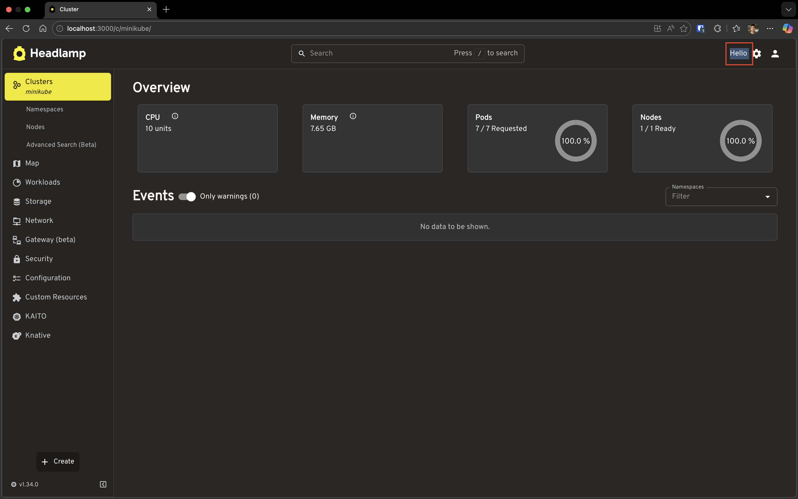
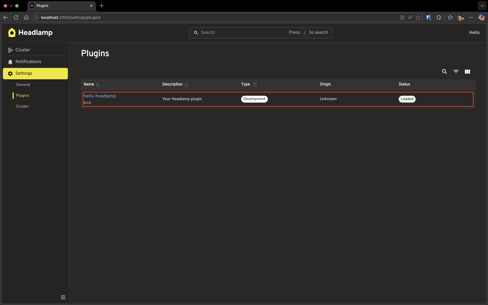
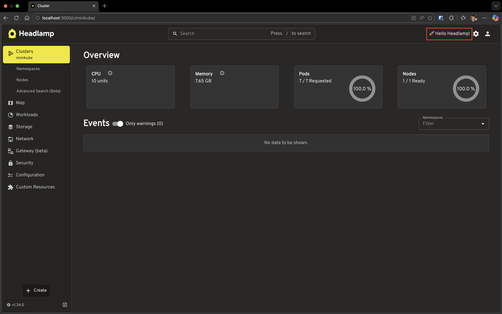
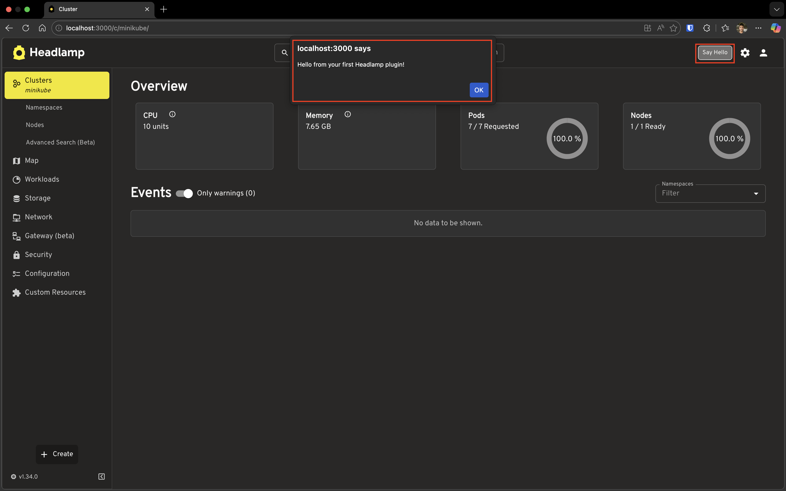

# Creating Your First Headlamp Plugin

This tutorial guides you through creating your first Headlamp plugin from scratch. By the end, you'll have a working plugin that appears in Headlamp's UI and you'll understand how hot reloading makes plugin development fast and enjoyable.

---

## Table of Contents

1. [Introduction](#introduction)
2. [Understanding the Plugin System](#understanding-the-plugin-system)
3. [Create Your First Plugin](#create-your-first-plugin)
4. [Explore the Plugin Structure](#explore-the-plugin-structure)
5. [Run the Plugin in Development Mode](#run-the-plugin-in-development-mode)
6. [See Your Plugin in Headlamp](#see-your-plugin-in-headlamp)
7. [Hot Reloading in Action](#hot-reloading-in-action)
8. [Understanding What Happened](#understanding-what-happened)
9. [Troubleshooting](#troubleshooting)
10. [What's Next](#whats-next)
11. [Quick Reference](#quick-reference)

---

## Introduction

In [Tutorial 1](../running-from-source/), you set up Headlamp to run locally from source. Now it's time to extend it!

**Plugins** let you add new features to Headlamp without modifying its core code. You can:

- Add buttons, menus, and panels to the UI
- Create entirely new pages
- Customize how Kubernetes resources are displayed
- Change themes and branding
- And much more!

### What You'll Build

In this tutorial, you'll create a simple plugin called `hello-headlamp` that:

1. Displays "Hello" in Headlamp's top navigation bar
2. Appears in the Settings → Plugins list

This gives you the foundation for all future plugin development.

### Prerequisites

Before starting, ensure you have:

- ✅ Completed [Tutorial 1: Running Headlamp from Source](../running-from-source/)
- ✅ Headlamp running locally (or ready to start)
- ✅ Node.js ≥20.11.1 and npm ≥10.0.0

Verify your setup:

```bash
node --version    # Should be v20.11.1 or higher
npm --version     # Should be 10.0.0 or higher
```

**Time to complete:** ~15 minutes

---

## Understanding the Plugin System

Before we dive into code, let's understand how plugins work at a high level.

### How Plugins Work

```
┌─────────────────────────────────────────────────────────┐
│                      Headlamp                           │
│  ┌─────────────────────────────────────────────────┐    │
│  │                  Plugin Registry                │    │
│  │  ┌─────────┐  ┌─────────┐  ┌─────────┐          │    │
│  │  │ Plugin A│  │ Plugin B│  │ Plugin C│   ...    │    │
│  │  └─────────┘  └─────────┘  └─────────┘          │    │
│  └─────────────────────────────────────────────────┘    │
│                         ↓                               │
│  ┌─────────────────────────────────────────────────┐    │
│  │               Headlamp UI                       │    │
│  │   (App Bar, Sidebar, Pages, Details Views...)   │    │
│  └─────────────────────────────────────────────────┘    │
└─────────────────────────────────────────────────────────┘
```

1. **Plugins are JavaScript/TypeScript modules** — They export code that Headlamp loads at startup
2. **Plugins register themselves** — Using functions like `registerAppBarAction()` to tell Headlamp where to display their components
3. **Headlamp discovers plugins automatically** — During development, plugins make themselves available to Headlamp

### Plugin Locations

Headlamp looks for plugins in specific directories depending on how you're running it:

| Mode | Plugin Location |
|------|-----------------|
| **Development** | `~/.config/Headlamp/plugins/` (Linux/macOS) or `%APPDATA%\Headlamp\Config\plugins\` (Windows) — plugins running `npm start` automatically copy here |
| **Desktop App** | `~/.config/Headlamp/plugins/` (Linux/macOS) or `%APPDATA%\Headlamp\Config\plugins\` (Windows) |
| **In-Cluster** | Configured via Headlamp deployment |

For this tutorial, we'll use **development mode**, the easiest way to build and test plugins.

---

## Create Your First Plugin

Let's create your first plugin! We'll use the `headlamp-plugin` tool which scaffolds a ready-to-use plugin project.

### Step 1: Choose a Location

Create your plugin **outside** the Headlamp repository. This keeps your plugin code separate and organized.

```bash
# Go to your projects directory (create one if needed)
mkdir -p ~/projects
cd ~/projects
```

> **Why outside the Headlamp repo?** Plugins are independent projects with their own dependencies. Keeping them separate makes them easier to manage, version, and share.

### Step 2: Create the Plugin

Run the following command to scaffold a new plugin:

```bash
npx --yes @kinvolk/headlamp-plugin create hello-headlamp
```

You'll see output like this:

```
Creating plugin: hello-headlamp...
...
Run `npm audit` for details.
"hello-headlamp" created.
1) Run the Headlamp app (so the plugin can be used).
2) Open hello-headlamp/src/index.tsx in your editor.
3) Start development server of the plugin watching for plugin changes.
  cd "hello-headlamp"
  npm run start
4) See the plugin inside Headlamp.
```

**What just happened?**

- `npx` downloaded and ran the `@kinvolk/headlamp-plugin` tool
- The `create` command generated a new plugin folder called `hello-headlamp`
- Dependencies were automatically installed (you saw `npm ci` in the output)
- The folder contains all the files you need to start developing

---

## Explore the Plugin Structure

Let's look at what was created:

```
hello-headlamp/
├── src/
│   └── index.tsx         # 👈 Main entry point - your plugin code goes here
├── package.json          # 👈 Plugin metadata and npm scripts
├── tsconfig.json         # TypeScript configuration
└── README.md             # Plugin documentation
```

### The Entry Point: `src/index.tsx`

Open `src/index.tsx` in your editor. You'll see:

```tsx
import { registerAppBarAction } from '@kinvolk/headlamp-plugin/lib';

// Below are some imports you may want to use.
//   See README.md for links to plugin development documentation.
// import { Headlamp, K8s, useTranslation } from '@kinvolk/headlamp-plugin/lib';
// import { SectionBox } from '@kinvolk/headlamp-plugin/lib/CommonComponents';
// import { K8s } from '@kinvolk/headlamp-plugin/lib/K8s';
// import { Typography } from '@mui/material';

registerAppBarAction(<span>Hello</span>);
```

**Let's break this down:**

| Line | What it does |
|------|--------------|
| `import { registerAppBarAction }` | Imports a function from the Headlamp plugin SDK |
| `registerAppBarAction(<span>Hello</span>)` | Registers a React component to display in the app bar |

That's it! Just two lines of meaningful code, and you have a working plugin.

### The Metadata: `package.json`

Open `package.json` to see your plugin's configuration:

```json
{
  "name": "hello-headlamp",
  "version": "0.1.0",
  "description": "Your Headlamp plugin",
  "scripts": {
    "start": "headlamp-plugin start",
    "build": "headlamp-plugin build",
    "format": "headlamp-plugin format",
    "lint": "headlamp-plugin lint",
    "lint-fix": "headlamp-plugin lint --fix",
    "tsc": "headlamp-plugin tsc",
    "test": "headlamp-plugin test",
    "package": "headlamp-plugin package"
  },
  ...
}
```

**Key scripts you'll use:**

| Script | Purpose |
|--------|---------|
| `npm start` | Run plugin in development mode with hot reloading |
| `npm run build` | Build plugin for production |
| `npm run lint` | Check code for issues |
| `npm run format` | Auto-format your code |

---

## Run the Plugin in Development Mode

Now let's see your plugin in action! You'll need two terminal windows.

### Terminal 1: Start Headlamp

Navigate to your Headlamp repository and start it:

```bash
cd ~/git/headlamp  # or wherever you cloned Headlamp
npm start
```

Wait until you see both backend and frontend are running:
- Frontend: http://localhost:3000
- Backend: http://localhost:4466

### Terminal 2: Start Your Plugin

In a new terminal, navigate to your plugin and start it:

```bash
cd ~/projects/hello-headlamp
npm start
```

You'll see output like:

```
Watching for changes...
Plugin is available for Headlamp
```

**What's happening?**

- The plugin is being compiled from TypeScript to JavaScript
- It's watching for file changes (for hot reloading)
- It's announcing itself to Headlamp running on localhost

> **Keep both terminals running!** Headlamp needs to be running for your plugin to appear. The plugin's `npm start` watches for changes and automatically rebuilds.

---

## See Your Plugin in Headlamp

Open your browser and go to **http://localhost:3000**.

### Step 1: Look for "Hello" in the App Bar

Look at the top-right area of the screen (the app bar). You should see **"Hello"** appearing among the icons!



### Step 2: View Your Plugin in Settings

1. Click the **Settings** icon (⚙️) in the app bar
2. Click on **Plugins** in the settings menu

You'll see a list of all loaded plugins, including your `hello-headlamp` plugin!



The plugin entry shows:
- **Name**: hello-headlamp
- **Version**: 0.1.0 (shown below the name)
- **Description**: Your Headlamp plugin (from package.json)
- **Type**: Development (indicates this is a development plugin)
- **Enable/Disable toggle** (Desktop App only): You can turn plugins on or off in the desktop app

🎉 **Congratulations!** Your plugin is running in Headlamp!

---

## Hot Reloading in Action

One of the best features of plugin development is **hot reloading**—changes you make appear instantly without restarting anything.

### Make a Change

Open `src/index.tsx` in your editor and change:

```tsx
registerAppBarAction(<span>Hello</span>);
```

To:

```tsx
registerAppBarAction(<span>🚀 Hello Headlamp!</span>);
```

### Save and Watch

1. Save the file
2. Look at your plugin terminal—you'll see it rebuilding
3. Look at your browser—the app bar updates automatically!



**No manual refresh needed!** This makes development fast and enjoyable.

### Try Another Change

Let's make it more interesting. Replace the entire content of `src/index.tsx`:

```tsx
import { registerAppBarAction } from '@kinvolk/headlamp-plugin/lib';
import { Button } from '@mui/material';

function HelloButton() {
  const handleClick = () => {
    alert('Hello from your first Headlamp plugin!');
  };

  return (
    <Button
      variant="outlined"
      size="small"
      onClick={handleClick}
      sx={{ color: 'inherit', borderColor: 'inherit', mx: 1 }}
    >
      Say Hello
    </Button>
  );
}

registerAppBarAction(<HelloButton />);
```

Save the file and watch the magic:

1. The text changes to a **"Say Hello"** button
2. Click the button to see an alert!



**What changed?**

- We imported `Button` from Material-UI (already available through Headlamp)
- We created a React component `HelloButton` with click handling
- We registered that component instead of a plain `<span>`

This is the foundation of all plugin development—creating React components and registering them with Headlamp.

---

## Understanding What Happened

Let's recap what makes your plugin work:

### The Register Function

```tsx
registerAppBarAction(<HelloButton />);
```

This tells Headlamp: *"Hey, I have a component. Please display it in the app bar."*

### Available Register Functions

`registerAppBarAction` is just one of many registration functions. Here are some others you'll learn about:

| Function | What it does |
|----------|--------------|
| `registerAppBarAction` | Add items to the top navigation bar |
| `registerSidebarEntry` | Add items to the left sidebar menu |
| `registerRoute` | Create new pages/routes |
| `registerDetailsViewSection` | Add sections to resource detail pages |
| `registerPluginSettings` | Add a settings panel for your plugin |

Each function lets you extend a different part of Headlamp. We'll explore these in upcoming tutorials!

### Shared Dependencies

Notice how we imported `Button` from `@mui/material`:

```tsx
import { Button } from '@mui/material';
```

You didn't need to install Material-UI—Headlamp provides it! These shared dependencies are available to all plugins:

- **React** — UI framework
- **Material-UI** (`@mui/material`) — Component library
- **React Router** — Navigation
- **And more...**

This keeps plugins small and ensures consistent styling across Headlamp.

---

## Troubleshooting

### Plugin Not Appearing in Headlamp

**Check if both are running:**
- Headlamp should be running (`npm start` in Headlamp folder)
- Plugin should be running (`npm start` in plugin folder)

**Check the plugin terminal for errors:**
```bash
# In your plugin folder
npm start
```

Look for any red error messages.

**Try restarting both:**
1. Stop the plugin (`Ctrl+C`)
2. Stop Headlamp (`Ctrl+C`)
3. Start Headlamp first, wait for it to be ready
4. Start the plugin

### Changes Not Reflecting (Hot Reload Not Working)

**Ensure you saved the file** — Hot reload only triggers on save.

**Check the plugin terminal** — You should see "Compiling..." when you save.

**Hard refresh the browser:**
- Windows/Linux: `Ctrl + Shift + R`
- macOS: `Cmd + Shift + R`

**Clear browser cache:**
1. Open Developer Tools (`F12`)
2. Right-click the refresh button
3. Select "Empty Cache and Hard Reload"

### Port Conflicts

If you see errors about ports being in use:

```bash
# Find what's using port 3000
lsof -i :3000

# Find what's using port 4466
lsof -i :4466
```

Kill the conflicting processes or use different ports.

### Build Errors

If you see TypeScript or build errors:

```bash
# Check for TypeScript issues
npm run tsc

# Check for linting issues
npm run lint

# Auto-fix some issues
npm run lint-fix
```

---

## What's Next

You've just created your first Headlamp plugin! 🎉

This tutorial covered `registerAppBarAction`—just one small piece of what plugins can do. Headlamp's plugin system offers many more capabilities:

- **Tutorial 3: Adding Sidebar Navigation** — Create menu items that link to your custom pages
- **Working with Kubernetes Data** — Fetch and display cluster information
- **Customizing Resource Views** — Modify how Kubernetes resources are displayed
- **Adding Custom Themes** — Change colors, fonts, and overall appearance
- **Publishing Plugins** — Share your creations with the community

We'll cover these in the upcoming tutorials. In the meantime, check out the [example plugins](https://github.com/kubernetes-sigs/headlamp/tree/main/plugins/examples) in the Headlamp repository for inspiration!

---

## Quick Reference

### Plugin Commands

Run these from your plugin directory (`hello-headlamp/`):

| Task | Command |
|------|---------|
| Start development mode | `npm start` |
| Build for production | `npm run build` |
| Check code for issues | `npm run lint` |
| Fix linting issues | `npm run lint-fix` |
| Format code | `npm run format` |
| Type check | `npm run tsc` |
| Run tests | `npm run test` |
| Package for distribution | `npm run package` |

### Headlamp Commands

Run these from your Headlamp directory:

| Task | Command |
|------|---------|
| Start Headlamp (backend + frontend) | `npm start` |
| Start desktop app | `npm run app:start` |

### Key Files

| File | Purpose |
|------|---------|
| `src/index.tsx` | Main plugin entry point |
| `package.json` | Plugin metadata and scripts |
| `tsconfig.json` | TypeScript configuration |

### Useful Links

- [Plugin API Documentation](https://headlamp.dev/docs/latest/development/plugins/)
- [Example Plugins](https://github.com/kubernetes-sigs/headlamp/tree/main/plugins/examples)
- [#headlamp on Kubernetes Slack](https://kubernetes.slack.com/messages/headlamp)
- [GitHub Issues](https://github.com/kubernetes-sigs/headlamp/issues)
