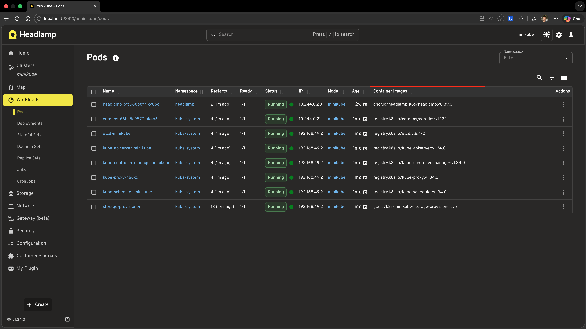
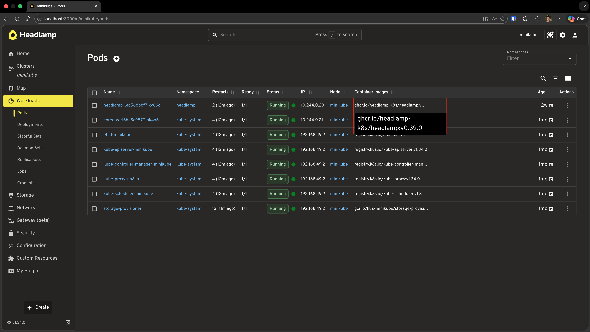
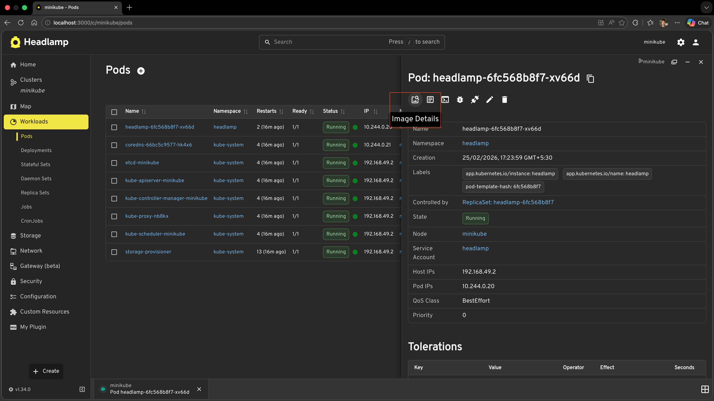
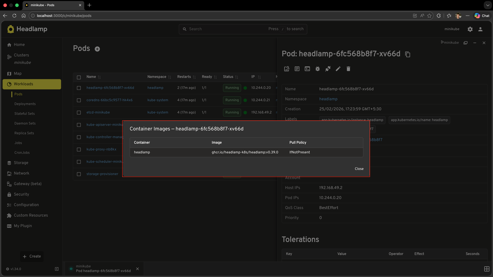
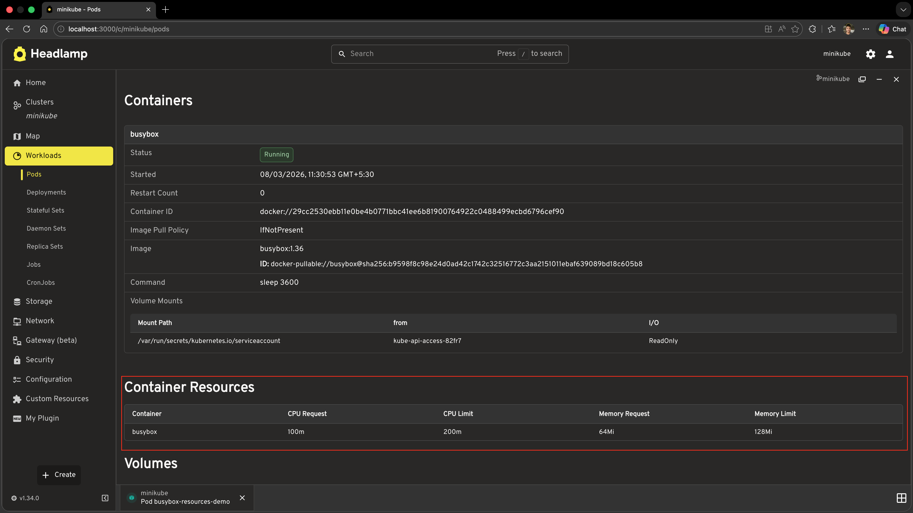

# Extending Existing Resource Views

In [Tutorial 6](../building-list-and-detail-pages/) we covered how to build entirely new list and detail pages for custom resources. In this tutorial we will cover how to extend and customise **existing** pages and views that are already built into Headlamp, without replacing them. This is one of the most powerful patterns in Headlamp plugin development: you can enrich Headlamp's built-in Pod, Deployment, Node, and other resource views with your own columns, actions, and sections by registering processors that Headlamp calls when it renders those views.

---

## Table of Contents

1. [Introduction](#introduction)
2. [Adding a Column to the Pods List](#adding-a-column-to-the-pods-list)
3. [Understanding registerResourceTableColumnsProcessor](#understanding-registerresourcetablecolumnsprocessor)
4. [Adding a Custom Action to the Pod Detail View](#adding-a-custom-action-to-the-pod-detail-view)
5. [Understanding registerDetailsViewHeaderAction](#understanding-registerdetailsviewheaderaction)
6. [Adding a Custom Section to the Pod Detail View](#adding-a-custom-section-to-the-pod-detail-view)
7. [Understanding registerDetailsViewSectionsProcessor](#understanding-registerdetailsviewsectionsprocessor)
8. [Complete Example](#complete-example)
9. [Troubleshooting](#troubleshooting)
10. [What's Next](#whats-next)
11. [Quick Reference](#quick-reference)

---

## Introduction

In previous tutorials you always built things from scratch — new routes, new pages, new components. The three APIs covered in this tutorial work differently: instead of creating a new page, they **inject** your content into existing pages that Headlamp already renders.

| API | What it does |
|-----|-------------|
| `registerResourceTableColumnsProcessor` | Add, remove, or reorder columns in any resource list table |
| `registerDetailsViewHeaderAction` | Add action buttons to any resource detail page header |
| `registerDetailsViewSectionsProcessor` | Add, remove, or reorder sections in any resource detail page |

All three follow the same mental model: you register a **processor function** (or component) once at module load time, and Headlamp calls it automatically every time it renders the relevant UI. This means your additions appear in Headlamp's own built-in views, not just in pages your plugin owns.

### What You'll Build

By the end of this tutorial you'll have extended the built-in Pods views with:

- A **Container Images** column in Headlamp's Pods list page
- An **Image Details** button in every Pod detail header that opens a popup showing each container's image and pull policy
- A **Container Resources** section in every Pod detail page showing CPU and memory requests/limits

### Prerequisites

Before starting, ensure you have:

- ✅ Completed [Tutorial 6: Building List & Detail Pages](../building-list-and-detail-pages/)
- ✅ Your `hello-headlamp` plugin open and running
- ✅ Headlamp running with a connected cluster

**Time to complete:** ~25 minutes

---

## Adding a Column to the Pods List

Headlamp's built-in Pods list already has columns like Name, Namespace, Restarts, Age etc. We'll add a **Container Images** column to it using `registerResourceTableColumnsProcessor`.

### Step 1: Import the API and Pod Type

Open `src/index.tsx` and add the following imports at the top of the file (alongside your existing imports):

```tsx
import {
  registerResourceTableColumnsProcessor,
} from '@kinvolk/headlamp-plugin/lib';
import { ResourceTableColumn } from '@kinvolk/headlamp-plugin/lib/CommonComponents';
import Pod from '@kinvolk/headlamp-plugin/lib/K8s/pod';
```

### Step 2: Register the Column Processor

Add this code **outside** any React component, at the module level (for example, at the bottom of `src/index.tsx`):

```tsx
registerResourceTableColumnsProcessor(function addContainerImagesColumn({ id, columns }) {
  // Only modify the built-in Pods list table.
  // The table ID follows the convention: headlamp-<plural-resource-name>
  if (id !== 'headlamp-pods') {
    return columns;
  }

  const podColumns = columns as ResourceTableColumn<Pod>[];

  podColumns.push({
    id: 'hello-headlamp-container-images',
    label: 'Container Images',
    // getValue is used for sorting and filtering — return a plain string
    getValue: (pod: Pod) =>
      pod.spec.containers.map(c => c.image).join(', '),
  });

  return columns;
});
```

### Step 3: Test It

1. Save the file
2. Navigate to **Workloads** → **Pods** in the Headlamp sidebar
3. You should see a new **Container Images** column on the right side of the table



> **Important:** This column appears in Headlamp's **own** built-in Pods page — not the custom `MyPodsPage` you built in Tutorial 6. You are injecting into Headlamp's view.


---

## Understanding registerResourceTableColumnsProcessor

The processor function you pass to `registerResourceTableColumnsProcessor` is called every time Headlamp renders any resource table. It receives an object with:

| Property | Type | Description |
|----------|------|-------------|
| `id` | `string` | Unique table identifier, e.g. `'headlamp-pods'` |
| `columns` | `ResourceTableColumn[]` | The current column array — mutate it or return a new one |

And it must **return** the (modified) columns array.

### Finding table IDs

Table IDs follow the convention `headlamp-<plural-resource-name>`:

| Resource | Table ID |
|----------|----------|
| Pods | `headlamp-pods` |
| Deployments | `headlamp-deployments` |
| Nodes | `headlamp-nodes` |
| Namespaces | `headlamp-namespaces` |
| Services | `headlamp-services` |

For tables that don't directly represent a resource list (like the events table on the cluster overview), the ID will reflect the section's role (e.g. `headlamp-cluster.overview.events`). During development, you can `console.log(id)` inside your processor to discover the exact ID of any table.

### Column definition

Each column follows the same structure as custom columns in `ResourceListView` from Tutorial 6:

```tsx
{
  id: 'my-unique-column-id',  // Prefix with your plugin name to avoid clashes
  label: 'Column Header',
  getValue: (item) => 'sortable plain value',   // Used for sorting and filtering
  render: (item) => <ReactNode />,              // Optional — falls back to getValue
}
```

### Adding a render function for richer cells

The column above shows images as a plain comma-separated string. You can enrich the display with a `render` function while keeping `getValue` for sorting:

```tsx
import { Tooltip, Typography } from '@mui/material';

podColumns.push({
  id: 'hello-headlamp-container-images',
  label: 'Container Images',
  getValue: (pod: Pod) =>
    pod.spec.containers.map(c => c.image).join(', '),
  render: (pod: Pod) => {
    const images = pod.spec.containers.map(c => c.image);
    return (
      <Tooltip title={images.join('\n')} placement="bottom-start">
        <Typography noWrap style={{ maxWidth: 240, fontSize: 'inherit' }}>
          {images[0]}{images.length > 1 ? ` (+${images.length - 1} more)` : ''}
        </Typography>
      </Tooltip>
    );
  },
});
```

In the previous screenshot, the Container Images column is added at the end of the table (after Age). If you prefer to keep the Age column always last, you can use JavaScript array methods to insert your column before it. Find the index of the Age column (columns may be string ids or objects with an `id` property) and use `splice` to insert the new column:

```tsx
import { Tooltip, Typography } from '@mui/material';

const ageIndex = columns.findIndex(
  col => col === 'age' || (typeof col === 'object' && col !== null && 'id' in col && col.id === 'age')
);
const containerImagesColumn: ResourceTableColumn<Pod> = {
  id: 'hello-headlamp-container-images',
  label: 'Container Images',
  getValue: (pod: Pod) => pod.spec.containers.map(c => c.image).join(', '),
  render: (pod: Pod) => {
    const images = pod.spec.containers.map(c => c.image);
    return (
      <Tooltip title={images.join('\n')} placement="bottom-start">
        <Typography noWrap style={{ maxWidth: 240, fontSize: 'inherit' }}>
          {images[0]}{images.length > 1 ? ` (+${images.length - 1} more)` : ''}
        </Typography>
      </Tooltip>
    );
  },
};
const podColumns = columns as ResourceTableColumn<Pod>[];
if (ageIndex >= 0) {
  podColumns.splice(ageIndex, 0, containerImagesColumn);
} else {
  podColumns.push(containerImagesColumn);
}
return columns;
```



---

## Adding a Custom Action to the Pod Detail View

Now let's add an **Image Details** button to the Pod detail page header. Clicking it will open a popup (MUI Dialog) listing every container's image name and pull policy.

### Step 1: Import the Dependencies

Add these to your imports:

```tsx
import {
  registerResourceTableColumnsProcessor,
  registerDetailsViewHeaderAction,
} from '@kinvolk/headlamp-plugin/lib';
import { ActionButton, SimpleTable } from '@kinvolk/headlamp-plugin/lib/CommonComponents';
import {
  Dialog,
  DialogTitle,
  DialogContent,
  DialogActions,
  Button,
} from '@mui/material';
```

### Step 2: Create the Action Component

Create the component that will be rendered as the header action button. The component receives the current resource as an `item` prop:

```tsx
function ImageDetailsAction({ item }: { item: any }) {
  const [open, setOpen] = useState(false);

  // Only show this action on Pod detail pages
  if (!item || item.kind !== 'Pod') {
    return null;
  }

  const containers: Array<{
    name: string;
    image: string;
    imagePullPolicy?: string;
  }> = item.spec?.containers || [];

  return (
    <>
      <ActionButton
        description="Image Details"
        icon="mdi:image-search-outline"
        onClick={() => setOpen(true)}
      />
      <Dialog open={open} onClose={() => setOpen(false)} maxWidth="md" fullWidth>
        <DialogTitle>Container Images — {item.metadata?.name}</DialogTitle>
        <DialogContent>
          <SimpleTable
            data={containers}
            columns={[
              { label: 'Container', getter: c => c.name },
              { label: 'Image', getter: c => c.image },
              {
                label: 'Pull Policy',
                getter: c => c.imagePullPolicy || 'IfNotPresent (default)',
              },
            ]}
          />
        </DialogContent>
        <DialogActions>
          <Button onClick={() => setOpen(false)}>Close</Button>
        </DialogActions>
      </Dialog>
    </>
  );
}
```

### Step 3: Register the Action

Add this at the module level:

```tsx
registerDetailsViewHeaderAction(ImageDetailsAction);
```

### Step 4: Test It

1. Save the file
2. Navigate to **Workloads** → **Pods** → click on any pod
3. Look for the image search icon in the top-right area of the detail page header (alongside Edit and Delete)
4. Click it — a dialog should open showing each container's name, image, and pull policy





---

## Understanding registerDetailsViewHeaderAction

`registerDetailsViewHeaderAction` accepts a **React component function**. Headlamp calls this component for every detail page it renders, passing the current resource as the `item` prop.

```tsx
function MyAction({ item }: { item: any }) {
  // item is the KubeObject for the resource being viewed
  // Return null to show nothing for this resource type
  if (!item || item.kind !== 'Pod') return null;

  return <ActionButton description="My Action" icon="mdi:icon-name" onClick={...} />;
}

registerDetailsViewHeaderAction(MyAction);
```

### Key points

- The component is rendered for **every** detail view across the entire app, so always check `item.kind` (or any other condition) and return `null` when it shouldn't appear.
- Use `ActionButton` from `@kinvolk/headlamp-plugin/lib/CommonComponents` for consistent styling with Headlamp's existing action buttons.
- Because the component is a regular React component, you can use `useState`, `useEffect`, and any other hooks inside it — which is how the popup pattern above works.
- You can register multiple header actions; they all appear side by side in the header.

### Registering with a stable ID

If you want to reference or replace your action later (e.g. via `registerDetailsViewHeaderActionsProcessor`), pass an object with an explicit `id`:

```tsx
registerDetailsViewHeaderAction({
  id: 'hello-headlamp-image-details',
  action: ImageDetailsAction,
});
```

---

## Adding a Custom Section to the Pod Detail View

Now let's add a **Container Resources** section to the Pod detail page. This section will show each container's CPU and memory requests and limits — information that is not shown by default in Headlamp's Pod detail view.

### Step 1: Import the Section APIs

Add these to your imports:

```tsx
import {
  registerResourceTableColumnsProcessor,
  registerDetailsViewHeaderAction,
  registerDetailsViewSectionsProcessor,
} from '@kinvolk/headlamp-plugin/lib';
import { SectionBox, SimpleTable } from '@kinvolk/headlamp-plugin/lib/CommonComponents';
```

### Step 2: Register the Sections Processor

Add this at the module level:

```tsx
registerDetailsViewSectionsProcessor(function addContainerResourcesSection(resource, sections) {
  // Only add the section on Pod detail pages
  if (!resource || resource.kind !== 'Pod') {
    return sections;
  }

  // Guard against being called multiple times — avoid duplicate sections
  const sectionId = 'hello-headlamp-container-resources';
  if (sections.some(s => typeof s === 'object' && s !== null && 'id' in s && s.id === sectionId)) {
    return sections;
  }

  // Build the row data from the pod spec
  const containers: Array<{
    name: string;
    cpuRequest: string;
    cpuLimit: string;
    memoryRequest: string;
    memoryLimit: string;
  }> = (resource.jsonData?.spec?.containers ?? []).map((c: any) => ({
    name: c.name,
    cpuRequest: c.resources?.requests?.cpu ?? '—',
    cpuLimit: c.resources?.limits?.cpu ?? '—',
    memoryRequest: c.resources?.requests?.memory ?? '—',
    memoryLimit: c.resources?.limits?.memory ?? '—',
  }));

  const newSection = {
    id: sectionId,
    section: (
      <SectionBox title="Container Resources">
        <SimpleTable
          data={containers}
          columns={[
            { label: 'Container', getter: c => c.name ?? '—' },
            { label: 'CPU Request', getter: c => c.cpuRequest ?? '—' },
            { label: 'CPU Limit', getter: c => c.cpuLimit ?? '—' },
            { label: 'Memory Request', getter: c => c.memoryRequest ?? '—' },
            { label: 'Memory Limit', getter: c => c.memoryLimit ?? '—' },
          ]}
        />
      </SectionBox>
    ),
  };

  // Insert our section right after the headlamp.pod-containers section
  const hasId = (s: (typeof sections)[number]): s is { id: string } =>
    typeof s === 'object' && s !== null && 'id' in s;
  const podContainersIdx = sections.findIndex(
    s => hasId(s) && s.id === 'headlamp.pod-containers'
  );

  if (podContainersIdx === -1) {
    // headlamp.pod-containers not found — append to the end as a fallback
    return [...sections, newSection];
  }

  const updated = [...sections];
  updated.splice(podContainersIdx + 1, 0, newSection);
  return updated;
});
```

### Step 3: Test It

1. Save the file
2. Navigate to any Pod's detail page
3. Just below the standard metadata header you should see a new **Container Resources** section with a table showing CPU and memory requests/limits for each container



---

## Understanding registerDetailsViewSectionsProcessor

The processor function you pass to `registerDetailsViewSectionsProcessor` is called every time Headlamp renders a detail page. It receives:

| Parameter | Type | Description |
|-----------|------|-------------|
| `resource` | `KubeObject \| null` | The resource being viewed (null while loading) |
| `sections` | `DetailsViewSection[]` | Current ordered array of sections |

And it must **return** the (modified) sections array.

### Sections array structure

Each entry in the `sections` array is an object with an `id` and `section` (a React node):

```tsx
{
  id: 'my-section-id',
  section: <SectionBox title="...">...</SectionBox>,
}
```

Headlamp's own built-in sections use IDs from `DefaultDetailsViewSection`:

| Constant | What it is |
|----------|------------|
| `DefaultDetailsViewSection.MAIN_HEADER` | The standard metadata header (name, namespace, labels, etc.) |
| `DefaultDetailsViewSection.EVENTS` | The Kubernetes events table |
| `DefaultDetailsViewSection.BACK_LINK` | The back navigation link |

You can use these constants to precisely position your sections relative to Headlamp's built-in ones.

### Positioning strategies

**Append to the end (simplest):**

```tsx
return [...sections, newSection];
```

**Insert after a specific section (e.g. pod containers):**

```tsx
const hasId = (s: (typeof sections)[number]): s is { id: string } =>
  typeof s === 'object' && s !== null && 'id' in s;
const idx = sections.findIndex(s => hasId(s) && s.id === 'headlamp.pod-containers');
if (idx === -1) {
  return [...sections, newSection]; // section not found — append as fallback
}
const updated = [...sections];
updated.splice(idx + 1, 0, newSection);
return updated;
```

**Insert before a specific section (e.g. events):**

```tsx
const hasId = (s: (typeof sections)[number]): s is { id: string } =>
  typeof s === 'object' && s !== null && 'id' in s;
const eventsIdx = sections.findIndex(s => hasId(s) && s.id === DefaultDetailsViewSection.EVENTS);
if (eventsIdx !== -1) {
  const updated = [...sections];
  updated.splice(eventsIdx, 0, newSection);
  return updated;
}
return [...sections, newSection];
```

### Idempotency guard

Headlamp may call your processor multiple times as the component re-renders. Always check whether your section is already present before adding it, to avoid duplicates:

```tsx
const alreadyAdded = sections.some(
  s => typeof s === 'object' && s !== null && 'id' in s && s.id === 'my-section-id'
);
if (alreadyAdded) return sections;
```

---

## Complete Example

Here is the full set of additions to your `src/index.tsx` for this tutorial. These lines can be added **after** all the existing code from Tutorial 6 (the `registerRoute` and `registerSidebarEntry` calls at the bottom):

```tsx
import { useState } from 'react';
import {
  registerResourceTableColumnsProcessor,
  registerDetailsViewHeaderAction,
  registerDetailsViewSectionsProcessor,
  DefaultDetailsViewSection,
} from '@kinvolk/headlamp-plugin/lib';
import {
  ActionButton,
  ResourceTableColumn,
  SectionBox,
  SimpleTable,
} from '@kinvolk/headlamp-plugin/lib/CommonComponents';
import Pod from '@kinvolk/headlamp-plugin/lib/K8s/pod';
import {
  Button,
  Dialog,
  DialogActions,
  DialogContent,
  DialogTitle,
  Tooltip,
  Typography,
} from '@mui/material';

// ─── 1. Add Container Images column to the built-in Pods list ────────────────

registerResourceTableColumnsProcessor(function addContainerImagesColumn({ id, columns }) {
  if (id !== 'headlamp-pods') {
    return columns;
  }

  const podColumns = columns as ResourceTableColumn<Pod>[];

  podColumns.push({
    id: 'hello-headlamp-container-images',
    label: 'Container Images',
    getValue: (pod: Pod) => pod.spec.containers.map(c => c.image).join(', '),
    render: (pod: Pod) => {
      const images = pod.spec.containers.map(c => c.image);
      return (
        <Tooltip title={images.join('\n')} placement="bottom-start">
          <Typography noWrap style={{ maxWidth: 240, fontSize: 'inherit' }}>
            {images[0]}
            {images.length > 1 ? ` (+${images.length - 1} more)` : ''}
          </Typography>
        </Tooltip>
      );
    },
  });

  return columns;
});

// ─── 2. Add Image Details action to the Pod detail header ────────────────────

function ImageDetailsAction({ item }: { item: any }) {
  const [open, setOpen] = useState(false);

  if (!item || item.kind !== 'Pod') {
    return null;
  }

  const containers: Array<{
    name: string;
    image: string;
    imagePullPolicy?: string;
  }> = item.spec?.containers || [];

  return (
    <>
      <ActionButton
        description="Image Details"
        icon="mdi:image-search-outline"
        onClick={() => setOpen(true)}
      />
      <Dialog open={open} onClose={() => setOpen(false)} maxWidth="md" fullWidth>
        <DialogTitle>Container Images — {item.metadata?.name}</DialogTitle>
        <DialogContent>
          <SimpleTable
            data={containers}
            columns={[
              { label: 'Container', getter: (c: any) => c.name },
              { label: 'Image', getter: (c: any) => c.image },
              {
                label: 'Pull Policy',
                getter: (c: any) => c.imagePullPolicy || 'IfNotPresent (default)',
              },
            ]}
          />
        </DialogContent>
        <DialogActions>
          <Button onClick={() => setOpen(false)}>Close</Button>
        </DialogActions>
      </Dialog>
    </>
  );
}

registerDetailsViewHeaderAction(ImageDetailsAction);

// ─── 3. Add Container Resources section to the Pod detail page ───────────────

registerDetailsViewSectionsProcessor(function addContainerResourcesSection(resource, sections) {
  if (!resource || resource.kind !== 'Pod') {
    return sections;
  }

  const sectionId = 'hello-headlamp-container-resources';
  if (sections.some(s => typeof s === 'object' && s !== null && 'id' in s && s.id === sectionId)) {
    return sections;
  }

  const containers: Array<{
    name: string;
    cpuRequest: string;
    cpuLimit: string;
    memoryRequest: string;
    memoryLimit: string;
  }> = (resource.jsonData?.spec?.containers ?? []).map((c: any) => ({
    name: c.name,
    cpuRequest: c.resources?.requests?.cpu ?? '—',
    cpuLimit: c.resources?.limits?.cpu ?? '—',
    memoryRequest: c.resources?.requests?.memory ?? '—',
    memoryLimit: c.resources?.limits?.memory ?? '—',
  }));

  const newSection = {
    id: sectionId,
    section: (
      <SectionBox title="Container Resources">
        <SimpleTable
          data={containers}
          columns={[
            { label: 'Container', getter: (c: any) => c.name ?? '—' },
            { label: 'CPU Request', getter: (c: any) => c.cpuRequest ?? '—' },
            { label: 'CPU Limit', getter: (c: any) => c.cpuLimit ?? '—' },
            { label: 'Memory Request', getter: (c: any) => c.memoryRequest ?? '—' },
            { label: 'Memory Limit', getter: (c: any) => c.memoryLimit ?? '—' },
          ]}
        />
      </SectionBox>
    ),
  };

  const hasId = (s: (typeof sections)[number]): s is { id: string } =>
    typeof s === 'object' && s !== null && 'id' in s;
  const podContainersIdx = sections.findIndex(
    s => hasId(s) && s.id === 'headlamp.pod-containers'
  );

  if (podContainersIdx === -1) {
    return [...sections, newSection];
  }

  const updated = [...sections];
  updated.splice(podContainersIdx + 1, 0, newSection);
  return updated;
});
```

---

## Troubleshooting

### Column not appearing in the Pods list

- Check that you are navigating to **Workloads** → **Pods** (Headlamp's built-in page), not the custom `MyPodsPage` from Tutorial 6.
- `console.log(id)` inside your processor and check the browser DevTools console to confirm the table ID is `'headlamp-pods'`.
- Make sure the processor call is at module level (outside any component or function), so it runs when the plugin loads.

### Action button not appearing on Pod detail pages

- Confirm your component returns `null` for non-Pod resources and a valid React node for Pods.
- Check the browser console for errors inside `ImageDetailsAction`.
- Verify the `useState` import is at the top of the file.

### Section not appearing or appearing multiple times

- Check the idempotency guard: the `sections.some(...)` check must match the exact `id` string you use when constructing `newSection`.
- If `headlamp.pod-containers` is not found (`podContainersIdx === -1`), the section falls back to appending at the end — `console.log(sections.map(s => s?.id))` inside your processor to inspect the current section IDs and confirm the expected anchor section is present.
- `console.log(sections)` inside your processor to inspect the full sections array.

---

## What's Next

You've learned how to extend Headlamp's built-in views without replacing them:

- ✅ Using `registerResourceTableColumnsProcessor` to add columns to existing resource tables
- ✅ Using `registerDetailsViewHeaderAction` to add action buttons to existing detail pages
- ✅ Using `registerDetailsViewSectionsProcessor` to inject sections into existing detail pages

**Coming up in Tutorial 8: Adding Plugin Settings**
- Defining a settings schema for your plugin
- Reading settings values at runtime
- Making plugin behaviour configurable by users

---

## Quick Reference

### registerResourceTableColumnsProcessor

```tsx
import { registerResourceTableColumnsProcessor } from '@kinvolk/headlamp-plugin/lib';

registerResourceTableColumnsProcessor(function myProcessor({ id, columns }) {
  if (id !== 'headlamp-pods') return columns;   // target a specific table

  columns.push({
    id: 'my-plugin-column-id',      // prefix with plugin name to avoid clashes
    label: 'Column Header',
    getValue: item => 'plain value', // for sorting and filtering (required)
    render: item => <Node />,        // for cell display (optional)
  });

  return columns;
});
```

**Common table IDs:** `headlamp-pods`, `headlamp-deployments`, `headlamp-nodes`, `headlamp-namespaces`, `headlamp-services`

### registerDetailsViewHeaderAction

```tsx
import { registerDetailsViewHeaderAction } from '@kinvolk/headlamp-plugin/lib';
import { ActionButton } from '@kinvolk/headlamp-plugin/lib/CommonComponents';

function MyAction({ item }: { item: any }) {
  if (!item || item.kind !== 'Pod') return null; // filter by resource kind

  return (
    <ActionButton
      description="Tooltip text"
      icon="mdi:icon-name"
      onClick={() => { /* ... */ }}
    />
  );
}

registerDetailsViewHeaderAction(MyAction);

// Or with an explicit ID (for later reference/replacement):
registerDetailsViewHeaderAction({ id: 'my-plugin-action', action: MyAction });
```

### registerDetailsViewSectionsProcessor

```tsx
import {
  registerDetailsViewSectionsProcessor,
  DefaultDetailsViewSection,
} from '@kinvolk/headlamp-plugin/lib';
import { SectionBox } from '@kinvolk/headlamp-plugin/lib/CommonComponents';

registerDetailsViewSectionsProcessor(function myProcessor(resource, sections) {
  if (!resource || resource.kind !== 'Pod') return sections;  // filter by kind

  const sectionId = 'my-plugin-section';
  // Idempotency guard
  if (sections.some(s => typeof s === 'object' && s !== null && 'id' in s && s.id === sectionId)) {
    return sections;
  }

  const newSection = {
    id: sectionId,
    section: <SectionBox title="My Section">...</SectionBox>,
  };

  // Insert after the main header
  const idx = sections.findIndex(
    s => typeof s === 'object' && s !== null && 'id' in s && s.id === DefaultDetailsViewSection.MAIN_HEADER
  );
  const updated = [...sections];
  updated.splice(idx + 1, 0, newSection);
  return updated;
});
```

**DefaultDetailsViewSection constants:** `MAIN_HEADER`, `EVENTS`, `BACK_LINK`
