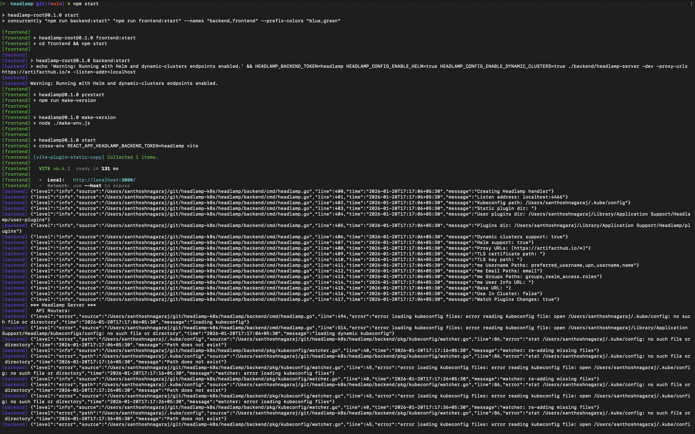
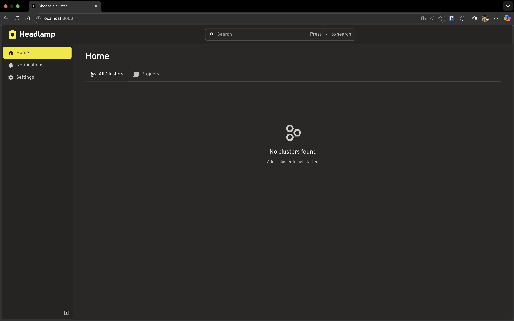
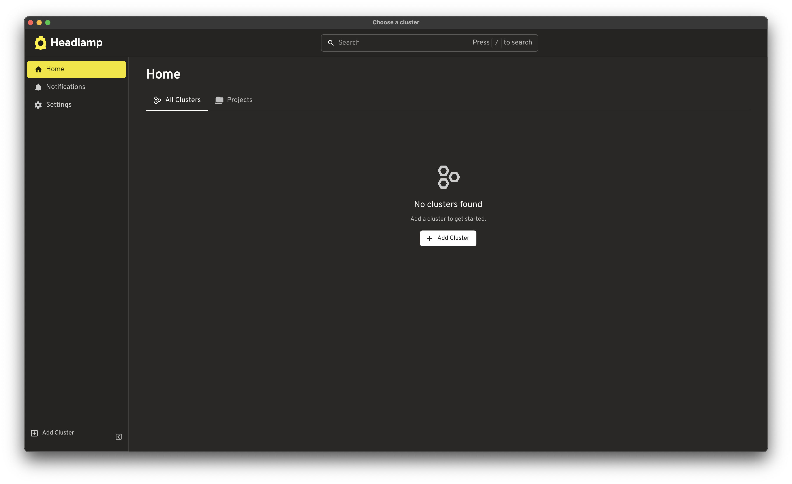
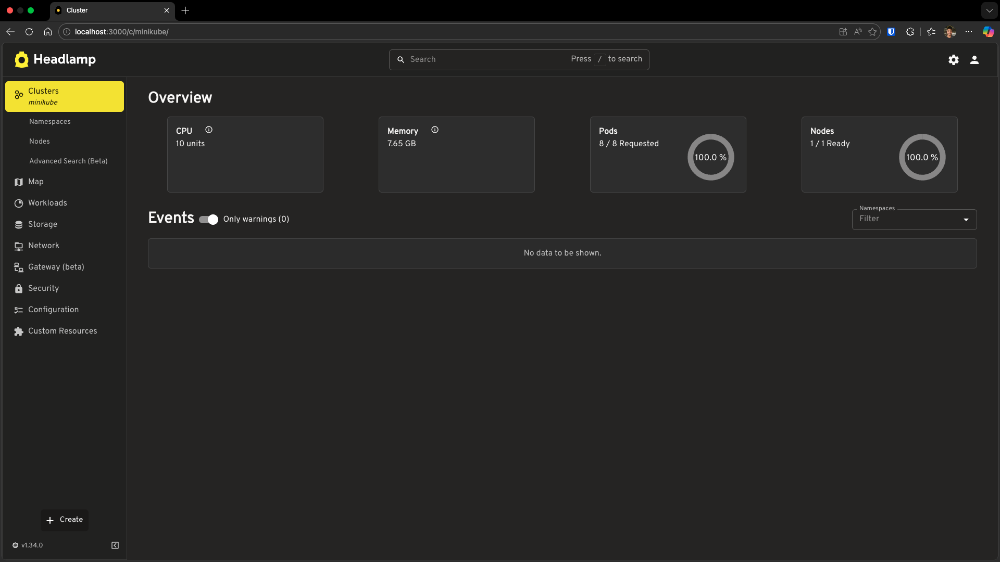

# Running Headlamp from Source

This tutorial guides you through building and running Headlamp from source code. By the end, you'll have Headlamp running locally in development mode—ready for plugin development or contributing to the project.

---

## Table of Contents

1. [Introduction](#introduction)
2. [Prerequisites](#prerequisites)
3. [Clone the Repository](#clone-the-repository)
4. [Repository Structure](#repository-structure)
5. [Install Dependencies](#install-dependencies)
6. [Build the Code](#build-the-code)
7. [Run in Development Mode](#run-in-development-mode)
8. [Run the Desktop App](#run-the-desktop-app)
9. [Connect to a Kubernetes Cluster](#connect-to-a-kubernetes-cluster)
10. [Troubleshooting](#troubleshooting)
11. [Next Steps](#next-steps)

---

## Introduction

**Headlamp** is an open-source, extensible Kubernetes web UI. It provides:

- A clean, modern interface for managing Kubernetes clusters
- Multi-cluster support
- A powerful plugin system for customization
- Desktop and in-cluster deployment options

Headlamp has three main components:

| Component | Technology | Purpose |
|-----------|------------|---------|
| **Frontend** | TypeScript, React | The web UI you interact with |
| **Backend** | Go | API server that proxies requests to Kubernetes |
| **Desktop App** | Electron | Native app wrapper for macOS, Windows, Linux |

Building from source lets you modify Headlamp, develop plugins with live reload, and contribute to the project.

---

## Prerequisites

Install these tools before proceeding:

### Required

| Tool | Version | Installation |
|------|---------|--------------|
| **Git** | Latest | [git-scm.com](https://git-scm.com/downloads) |
| **Node.js** | ≥20.11.1 LTS | [nodejs.org](https://nodejs.org/en/download) or use [nvm](https://github.com/nvm-sh/nvm) |
| **npm** | ≥10.0.0 | Included with Node.js |
| **Go** | ≥1.24 | [go.dev/doc/install](https://go.dev/doc/install) |

### Optional (for testing with a cluster)

| Tool | Purpose | Installation |
|------|---------|--------------|
| **minikube** | Local Kubernetes cluster | [minikube.sigs.k8s.io](https://minikube.sigs.k8s.io/docs/start/) |
| **kubectl** | Kubernetes CLI | [kubernetes.io/docs/tasks/tools](https://kubernetes.io/docs/tasks/tools/) |

### Verify Installation

```bash
# Check versions
node --version    # Should be v20.11.1 or higher
npm --version     # Should be 10.0.0 or higher
go version        # Should be go1.24 or higher
git --version     # Any recent version
```

---

## Clone the Repository

### Option A: Fork First (for contributors)

1. Fork the repo at [github.com/kubernetes-sigs/headlamp](https://github.com/kubernetes-sigs/headlamp)
2. Clone your fork:

```bash
git clone https://github.com/YOUR_USERNAME/headlamp.git
cd headlamp
```

### Option B: Clone Directly

```bash
git clone https://github.com/kubernetes-sigs/headlamp.git
cd headlamp
```

---

## Repository Structure

Headlamp is organized as a monorepo with three main components: a React **frontend** for the UI, a Go **backend** that proxies requests to Kubernetes, and an Electron **app** for the desktop version. All build commands are orchestrated from the root `package.json`.

```
headlamp/
├── frontend/          # React/TypeScript web UI
│   ├── src/           # Source code, components, and tests
│   └── package.json   # Frontend dependencies
│
├── backend/           # Go server
│   ├── cmd/           # Main application entry point
│   ├── pkg/           # Reusable packages (auth, cache, helm, etc.)
│   └── go.mod         # Go dependencies
│
├── app/               # Electron desktop application
│   ├── electron/      # Main process code
│   └── package.json   # App dependencies
│
├── plugins/           # Plugin system
│   ├── examples/      # Example plugins to learn from
│   └── headlamp-plugin/  # Plugin development tools
│
├── docs/              # Documentation (markdown)
├── package.json       # Root scripts for building/running
└── README.md          # Project overview
```

**Key insight**: The root `package.json` contains npm scripts that orchestrate building and running all components. You'll use commands like `npm run backend:build` and `npm run frontend:start` from the root directory.

---

## Install Dependencies

From the repository root, install all dependencies:

```bash
# Install root dependencies
npm install

# Install frontend dependencies
npm run frontend:install

# Install app dependencies (only needed if running desktop app)
npm run app:install
```

> **Note**: Go dependencies are fetched automatically during the build step. No separate install is needed for the backend.

**Quick install everything:**

```bash
npm run install:all
```

---

## Build the Code

### Build Everything

```bash
npm run build
```

This runs `backend:build` and `frontend:build` sequentially.

### Build Individually

```bash
# Build backend only (compiles Go → backend/headlamp-server binary)
npm run backend:build

# Build frontend only (compiles TypeScript → frontend/build/)
npm run frontend:build
```

> **Note**: Building creates the artifacts but doesn't run them. See the next section to start Headlamp.

---

## Run in Development Mode

### Option 1: Run Both Together (Recommended)

```bash
npm start
```

This starts both backend and frontend with live reload. You'll see color-coded output:
- 🔵 Blue: Backend logs
- 🟢 Green: Frontend logs



**Access points:**
- Frontend: [http://localhost:3000](http://localhost:3000)
- Backend API: [http://localhost:4466](http://localhost:4466)

Open http://localhost:3000 in your browser. You should see Headlamp's welcome screen:



### Option 2: Run Separately (Two Terminals)

**Terminal 1 - Backend:**

```bash
npm run backend:build   # Build first (required)
npm run backend:start
```

**Terminal 2 - Frontend:**

```bash
npm run frontend:start
```

> **Tip**: Running separately is useful when you only want to restart one component.

---

## Run the Desktop App

The desktop app wraps the frontend and backend into a native application.

### Option 1: Full App Mode

Builds frontend and runs the complete Electron app:

```bash
npm run app:start
```



### Option 2: App-Only Mode (Development)

If you already have `npm start` running (backend + frontend), you can run just the Electron shell:

```bash
npm run app:start:client
```

This connects to your running dev servers—useful for faster iteration on app-specific code.

### Option 3: Everything Together

Run backend, frontend, and desktop app all at once:

```bash
npm run start:with-app
```

---

## Connect to a Kubernetes Cluster

Headlamp automatically detects Kubernetes clusters from your kubeconfig file. By default, it looks for the file at `~/.kube/config` on macOS/Linux or `%USERPROFILE%\.kube\config` on Windows. If you have multiple clusters configured, Headlamp will show all of them and let you switch between them.

> **Already have a cluster?** If you already have `kubectl` working with a cluster (try `kubectl get nodes`), you can skip to the next section—Headlamp will pick it up automatically.

### Quick Setup with minikube

```bash
# Start a local cluster
minikube start

# Verify it's running
kubectl get nodes
```

Now refresh Headlamp, it should detect your cluster automatically.



---

## Troubleshooting

### Port Already in Use

```bash
# Find and kill process on port 3000 (frontend)
lsof -i :3000  # macOS/Linux
netstat -ano | findstr :3000  # Windows

# Find and kill process on port 4466 (backend)
lsof -i :4466  # macOS/Linux
```

### Backend Won't Start

Ensure the binary exists:

```bash
ls backend/headlamp-server  # macOS/Linux
dir backend\headlamp-server.exe  # Windows
```

If missing, rebuild:

```bash
npm run backend:build
```

### Node/Go Version Mismatch

```bash
# Check versions match requirements
node --version  # Need ≥20.11.1
go version      # Need ≥1.24
```

### kubeconfig Not Found

Headlamp looks for `~/.kube/config` by default. Verify it exists:

```bash
cat ~/.kube/config  # macOS/Linux
type %USERPROFILE%\.kube\config  # Windows
```

### Clean Rebuild

When in doubt, clean and rebuild:

```bash
npm run clean
npm run install:all
npm run build
```

---

## Next Steps

🎉 **Congratulations!** You now have Headlamp running from source!

Here's where to go next:

- **[Tutorial 2: Creating Your First Plugin](../creating-your-first-plugin/)** — Create your first Headlamp plugin
- **[Architecture Overview](https://headlamp.dev/docs/latest/development/architecture/)** — Understand how Headlamp is built
- **[Frontend Development](https://headlamp.dev/docs/latest/development/frontend/)** — Deep dive into the Frontend
- **[Backend Development](https://headlamp.dev/docs/latest/development/backend/)** — Learn about the Backend Server
- **[Contributing Guidelines](https://headlamp.dev/docs/latest/contributing/)** — How to submit changes

### Get Help

- 💬 [#headlamp on Kubernetes Slack](https://kubernetes.slack.com/messages/headlamp)
- 🐛 [GitHub Issues](https://github.com/kubernetes-sigs/headlamp/issues)
- 📖 [FAQ](https://headlamp.dev/docs/latest/faq/)

---

## Quick Reference

| Task | Command |
|------|---------|
| Install all dependencies | `npm run install:all` |
| Build everything | `npm run build` |
| Run dev mode (backend + frontend) | `npm start` |
| Run desktop app | `npm run app:start` |
| Run desktop app (dev, connects to running servers) | `npm run app:start:client` |
| Run everything including app | `npm run start:with-app` |
| Build backend only | `npm run backend:build` |
| Build frontend only | `npm run frontend:build` |
| Run tests | `npm test` |
| Lint code | `npm run lint` |
| Clean build artifacts | `npm run clean` |
