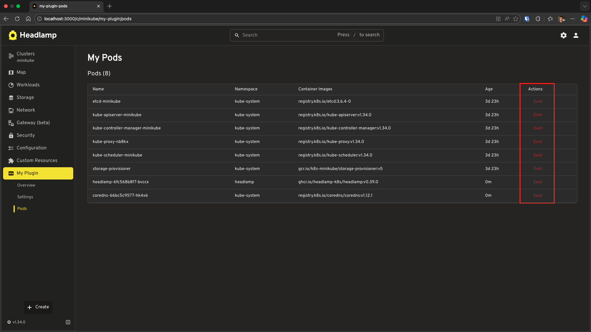

# Advanced Kubernetes Interactions

This tutorial covers advanced patterns for working with Kubernetes data: creating custom resource classes for type-safe access and using the API to modify resources.

---

## Table of Contents

1. [Introduction](#introduction)
2. [Creating Custom Resource Classes](#creating-custom-resource-classes)
3. [Using Your Custom Resource Class](#using-your-custom-resource-class)
4. [Modifying Kubernetes Resources](#modifying-kubernetes-resources)
5. [Troubleshooting](#troubleshooting)
6. [What's Next](#whats-next)
7. [Quick Reference](#quick-reference)

---

## Introduction

In [Tutorial 4](../working-with-kubernetes-data/), you learned to fetch data using built-in resource classes and `ApiProxy`. This tutorial takes you further:

| Topic | What You'll Learn |
|-------|-------------------|
| Custom Resource Classes | Create type-safe classes for any Kubernetes resource |
| Resource Mutations | Update, patch, and modify resources via API |

### What You'll Build

By the end of this tutorial, you'll have:

- A custom `MyPod` resource class with helper methods
- A Pods page that allows you to **evict** pods (building on your custom class)

### Prerequisites

Before starting, ensure you have:

- ✅ Completed [Tutorial 4: Working with Kubernetes Data](../working-with-kubernetes-data/)
- ✅ Your `hello-headlamp` plugin with the Overview page showing namespaces and API server version
- ✅ Headlamp running with a connected cluster

**Time to complete:** ~30 minutes

---

## Creating Custom Resource Classes

While `K8s.ResourceClasses` provides built-in classes for standard Kubernetes resources, you might need custom classes to:

1. **Add helper methods** — Compute derived values (e.g., container images, age)
2. **Work with CRDs** — Custom Resource Definitions don't have built-in classes

### Understanding the Building Blocks

Headlamp provides these base types for creating resource classes:

```tsx
import {
  KubeObject,
  KubeObjectInterface,
  KubeMetadata,
} from '@kinvolk/headlamp-plugin/lib/k8s/cluster';
```

| Type | Purpose |
|------|---------|
| `KubeMetadata` | Interface for `.metadata` (name, namespace, labels, etc.) |
| `KubeObjectInterface` | Base interface all Kubernetes objects extend |
| `KubeObject<T>` | Base class with built-in hooks (`useList`, `useGet`) |

### Step 1: Create a Custom Pod Class

Let's create a custom Pod class with helper methods. First, create a new file `src/resources/pod.ts`:

```tsx
import {
  KubeObject,
  KubeObjectInterface,
} from '@kinvolk/headlamp-plugin/lib/k8s/cluster';

// Define the Pod spec interface (simplified)
interface PodSpec {
  containers: {
    name: string;
    image: string;
    ports?: { containerPort: number }[];
  }[];
  nodeName?: string;
  restartPolicy?: string;
}

// Define container status
interface ContainerStatus {
  name: string;
  ready: boolean;
  restartCount: number;
  state?: {
    running?: { startedAt: string };
    waiting?: { reason: string };
    terminated?: { reason: string; exitCode: number };
  };
}

// Define the Pod status interface
interface PodStatus {
  phase: string;
  conditions?: { type: string; status: string }[];
  containerStatuses?: ContainerStatus[];
  hostIP?: string;
  podIP?: string;
  startTime?: string;
}

// Define the full Pod interface
export interface MyPodInterface extends KubeObjectInterface {
  spec: PodSpec;
  status?: PodStatus;
}

// Create the custom Pod class
export class MyPod extends KubeObject<MyPodInterface> {
  // Required static properties for Kubernetes API
  static apiVersion = 'v1';
  static apiName = 'pods';  
  static kind = 'Pod';
  static isNamespaced = true;

  // Helper: Get container images
  get containerImages(): string[] {
    return this.jsonData.spec.containers.map(c => c.image);
  }

  // Helper: Get pod age in human-readable format
  get age(): string {
    const startTime = this.jsonData.status?.startTime;
    if (!startTime) return 'Unknown';

    const start = new Date(startTime);
    const now = new Date();
    const diffMs = now.getTime() - start.getTime();

    const days = Math.floor(diffMs / (1000 * 60 * 60 * 24));
    const hours = Math.floor((diffMs % (1000 * 60 * 60 * 24)) / (1000 * 60 * 60));
    const minutes = Math.floor((diffMs % (1000 * 60 * 60)) / (1000 * 60));

    if (days > 0) return `${days}d ${hours}h`;
    if (hours > 0) return `${hours}h ${minutes}m`;
    return `${minutes}m`;
  }
}
```

**Key Points:**

| Property | Purpose |
|----------|---------|
| `static apiVersion` | API version (e.g., `v1`, `apps/v1`, `custom.io/v1alpha1`) |
| `static apiName` | API resource name (plural, e.g., `pods`, `deployments`) |
| `static kind` | Kubernetes resource kind |
| `static isNamespaced` | Whether resource is namespace-scoped |
| `this.jsonData` | Access to the raw Kubernetes object |

### Step 2: Use the Custom Class

Now let's create a page that uses our custom `MyPod` class. We'll add a new Pods page to display pods using our custom class.

**First, add the sidebar entry** for the new Pods page. Then create the page component. Update your `src/index.tsx`:

```tsx
import {
  K8s,
  registerRoute,
  registerSidebarEntry,
} from '@kinvolk/headlamp-plugin/lib';
import { SectionBox } from '@kinvolk/headlamp-plugin/lib/CommonComponents';
import {
  Typography,
  Box,
  CircularProgress,
  Table,
  TableBody,
  TableCell,
  TableContainer,
  TableHead,
  TableRow,
  Paper,
  Alert,
} from '@mui/material';
import { MyPod } from './resources/pod';

// ... (keep your existing OverviewPage and SettingsPage from Tutorial 4)

// New: Pods page using our custom MyPod class
function MyPodsPage() {
  // Use our custom class - it has the same useList() hook!
  const [pods, podsError] = MyPod.useList();

  if (!pods && !podsError) {
    return (
      <SectionBox title="My Pods">
        <Box sx={{ display: 'flex', alignItems: 'center', gap: 2 }}>
          <CircularProgress size={20} />
          <Typography>Loading pods...</Typography>
        </Box>
      </SectionBox>
    );
  }

  if (podsError) {
    return (
      <SectionBox title="My Pods">
        <Alert severity="error">Error: {podsError.message}</Alert>
      </SectionBox>
    );
  }

  return (
    <SectionBox title="My Pods">
      <Typography variant="h6" sx={{ mb: 2 }}>
        Pods ({pods?.length || 0})
      </Typography>

      {/* Pods table */}
      <TableContainer component={Paper} variant="outlined">
        <Table size="small">
          <TableHead>
            <TableRow>
              <TableCell>Name</TableCell>
              <TableCell>Namespace</TableCell>
              <TableCell>Container Images</TableCell>
              <TableCell>Age</TableCell>
            </TableRow>
          </TableHead>
          <TableBody>
            {pods?.slice(0, 20).map(pod => (
              <TableRow key={pod.metadata.uid}>
                <TableCell>{pod.metadata.name}</TableCell>
                <TableCell>{pod.metadata.namespace}</TableCell>
                <TableCell>
                  {pod.containerImages?.join(', ') || 'N/A'}
                </TableCell>
                <TableCell>{pod.age}</TableCell>
              </TableRow>
            ))}
          </TableBody>
        </Table>
      </TableContainer>

      {pods && pods.length > 20 && (
        <Typography sx={{ mt: 2, color: 'text.secondary' }}>
          Showing first 20 of {pods.length} pods
        </Typography>
      )}
    </SectionBox>
  );
}

// Register the route for the Pods page
// Add these after your existing route/sidebar registrations from Tutorial 4
registerRoute({
  path: '/my-plugin/pods',
  sidebar: 'my-plugin-pods',
  component: MyPodsPage,
  exact: true,
});

registerSidebarEntry({
  parent: 'my-plugin',
  name: 'my-plugin-pods',
  label: 'Pods',
  url: '/my-plugin/pods',
});
```

### Test Your Custom Class

1. Save both files (`src/resources/pod.ts` and `src/index.tsx`)
2. Navigate to **My Plugin** → **Pods** in the sidebar
3. You should see a table with pod information showing Name, Namespace, Container Images, and Age


**Notice how we use our helper methods:**

```tsx
// These are our custom helpers from MyPod class
pod.containerImages  // string[] - array of container image names
pod.age              // string - formatted age like "5h 30m"
```

---

## Using Your Custom Resource Class

The `KubeObject` base class provides many built-in methods and hooks. While we focus on `useList` and `useGet` below, you can refer to the [KubeObject API documentation](https://headlamp.dev/docs/latest/development/api/lib/k8s/KubeObject/classes/KubeObject) for the full list of capabilities, including:

### useList() Hook

```tsx
// List all pods across all namespaces
const [pods, error] = MyPod.useList();

// List pods in a specific namespace
const [pods, error] = MyPod.useList({ namespace: 'default' });
```

### useGet() Hook

```tsx
// Get a specific pod by name and namespace
const [pod, error] = MyPod.useGet('nginx-pod', 'default');
```

### Accessing Raw Data

```tsx
// Your custom class extends the raw data
const pod = pods[0];

// Access via helpers
console.log(pod.containerImages);  // string[]
console.log(pod.age);               // string like "5h 30m"

// Access via metadata (inherited)
console.log(pod.metadata.name);
console.log(pod.metadata.namespace);
console.log(pod.metadata.labels);

// Access raw JSON data
console.log(pod.jsonData.spec.containers);
```

The same pattern works for **Custom Resource Definitions (CRDs)!** Since CRDs don't have built-in resource classes in `K8s.ResourceClasses`, you can create your own:

```tsx
// Example: Custom class for a CRD
export class MyCustomResource extends KubeObject<MyCustomResourceInterface> {
  static apiVersion = 'custom.io/v1alpha1';
  static apiName = 'mycustomresources';
  static kind = 'MyCustomResource';
  static isNamespaced = true;

  // Add your custom helper methods
  get customHelper(): string {
    return this.jsonData.spec.someField;
  }
}
```

---

## Modifying Kubernetes Resources

Now let's learn how to modify Kubernetes resources. We'll start by adding functionality to our `MyPod` example.

### Understanding Kubernetes Mutations

There are several ways to modify resources:

| Method | Use Case | HTTP Verb | Example |
|--------|----------|-----------|---------|
| Replace | Replace entire resource | PUT | Update entire pod spec |
| Patch | Update specific fields | PATCH | Add/update labels, annotations |
| Delete | Remove resource | DELETE | Delete a pod |
| Subresource | Special operations | POST | Evict pod, scale deployment |

### Pod Eviction (Subresource POST)

Building on our `MyPod` example, let's add a "one-click" eviction feature. This demonstrates how to use **subresources** (like `/eviction`) and shows off Headlamp's automatic UI updates.

### Step 1: Add Evict Method to MyPod Class

Update your `src/resources/pod.ts` to include an `evict` helper. This method uses `ApiProxy` (which we touched upon in the previous tutorial) to send a POST request:

```tsx
import {
  KubeObject,
  KubeObjectInterface,
} from '@kinvolk/headlamp-plugin/lib/k8s/cluster';
import { ApiProxy } from '@kinvolk/headlamp-plugin/lib';

// ... (keep your existing interfaces)

export class MyPod extends KubeObject<MyPodInterface> {
  // ... (keep static properties and getters)

  // Method to evict a pod
  async evict(cluster: string): Promise<void> {
    if (!this.metadata.namespace) {
      throw new Error('Pod must have a namespace to evict');
    }
    await ApiProxy.request(
      `/api/v1/namespaces/${this.metadata.namespace}/pods/${this.metadata.name}/eviction`,
      {
        cluster: cluster,
        method: 'POST',
        headers: {
          'Content-Type': 'application/json',
        },
        body: JSON.stringify({
          apiVersion: 'policy/v1',
          kind: 'Eviction',
          metadata: {
            name: this.metadata.name,
            namespace: this.metadata.namespace,
          },
        }),
      }
    );
  }
}
```

### Step 2: Add Evict Button to MyPodsPage

Now, let's update `MyPodsPage` in `src/index.tsx` to use this new method. When a pod is evicted, it will gracefully terminate and eventually be removed from the list.

```tsx
import {
  K8s,
  registerRoute,
  registerSidebarEntry,
} from '@kinvolk/headlamp-plugin/lib';
import { SectionBox } from '@kinvolk/headlamp-plugin/lib/CommonComponents';
import { getCluster } from '@kinvolk/headlamp-plugin/lib/Utils';
import {
  Typography,
  Box,
  CircularProgress,
  Table,
  TableBody,
  TableCell,
  TableContainer,
  TableHead,
  TableRow,
  Paper,
  Alert,
  Button,
  Snackbar,
} from '@mui/material';
import { useState } from 'react';
import { MyPod } from './resources/pod';

function MyPodsPage() {
  const [pods, podsError] = MyPod.useList();
  const cluster = getCluster(); // Covered in Tutorial 4
  const [snackbar, setSnackbar] = useState<{ open: boolean; message: string }>({
    open: false,
    message: '',
  });

  const handleEvict = async (pod: MyPod) => {
    if (!cluster) return;
    try {
      await pod.evict(cluster);
      setSnackbar({ open: true, message: `Evicting ${pod.metadata.name}...` });
      // The table updates automatically because useList() subscribes to changes!
    } catch (err: any) {
      setSnackbar({ open: true, message: `Error: ${err.message}` });
    }
  };

  if (!pods && !podsError) {
    return (
      <SectionBox title="My Pods">
        <Box sx={{ display: 'flex', alignItems: 'center', gap: 2 }}>
          <CircularProgress size={20} />
          <Typography>Loading pods...</Typography>
        </Box>
      </SectionBox>
    );
  }

  if (podsError) {
    return (
      <SectionBox title="My Pods">
        <Alert severity="error">Error: {podsError.message}</Alert>
      </SectionBox>
    );
  }

  return (
    <SectionBox title="My Pods">
      <Typography variant="h6" sx={{ mb: 2 }}>
        Pods ({pods?.length || 0})
      </Typography>

      <TableContainer component={Paper} variant="outlined">
        <Table size="small">
          <TableHead>
            <TableRow>
              <TableCell>Name</TableCell>
              <TableCell>Namespace</TableCell>
              <TableCell>Container Images</TableCell>
              <TableCell>Age</TableCell>
              <TableCell>Actions</TableCell> {/* New Column */}
            </TableRow>
          </TableHead>
          <TableBody>
            {pods?.slice(0, 20).map(pod => (
              <TableRow key={pod.metadata.uid}>
                <TableCell>{pod.metadata.name}</TableCell>
                <TableCell>{pod.metadata.namespace}</TableCell>
                <TableCell>
                  {pod.containerImages?.join(', ') || 'N/A'}
                </TableCell>
                <TableCell>{pod.age}</TableCell>
                <TableCell>
                  <Button
                    size="small"
                    color="error"
                    onClick={() => handleEvict(pod)}
                  >
                    Evict
                  </Button>
                </TableCell>
              </TableRow>
            ))}
          </TableBody>
        </Table>
      </TableContainer>

      {/* Feedback Snackbar */}
      <Snackbar
        open={snackbar.open}
        autoHideDuration={4000}
        onClose={() => setSnackbar({ ...snackbar, open: false })}
        message={snackbar.message}
      />
    </SectionBox>
  );
}
```

**Try it out:** Click "Evict" and watch the pod disappear from the table. This happens because the `useList()` hook automatically refreshes when it detects the resource is gone!



---

## Troubleshooting

### Custom Class Not Working

If you encounter errors when using your custom class (e.g. methods not working or API calls failing), ensure your class has all required static properties configured correctly:

```tsx
export class MyPod extends KubeObject<MyPodInterface> {
  static apiVersion = 'v1';      // Required (API version)
  static apiName = 'pods';       // Required (plural resource name)
  static kind = 'Pod';           // Required
  static isNamespaced = true;    // Required
}
```

> [!NOTE]
> **Summary**: In this tutorial, we learned how to create custom resource classes and how to use the `ApiProxy` for advanced uses like eviction. This and the previous example together cover Kubernetes data access and changes clearly.

---

## What's Next

You've mastered advanced Kubernetes data patterns:

- ✅ Creating custom resource classes with helper methods
- ✅ Using `useList()` and `useGet()` on custom classes
- ✅ Modifying resources with **Subresources** (Eviction POST)
- ✅ Handling errors and understanding automatic UI updates


**Next: [Tutorial 6 – Building List & Detail Pages](../building-list-and-detail-pages/)**

- Using `ResourceListView` component for professional list pages
- Creating detail pages with `DetailsGrid`
- Navigation between list and detail views
- Custom columns and formatting

---

## Quick Reference

### Creating a Custom Resource Class

```tsx
import {
  KubeObject,
  KubeObjectInterface,
} from '@kinvolk/headlamp-plugin/lib/k8s/cluster';

interface MyResourceInterface extends KubeObjectInterface {
  spec: { /* your spec fields */ };
  status?: { /* your status fields */ };
}

export class MyResource extends KubeObject<MyResourceInterface> {
  static apiVersion = 'v1';           // API version (e.g., 'apps/v1', 'custom.io/v1alpha1')
  static apiName = 'myresources';     // Plural resource name
  static kind = 'MyResource';
  static isNamespaced = true;         // or false for cluster-scoped

  // Add helper methods
  get myHelper(): string {
    return this.jsonData.spec.someField;
  }
}
```

### Using Custom Classes

```tsx
// List all resources
const [items, error] = MyResource.useList();

// List in specific namespace
const [items, error] = MyResource.useList({ namespace: 'default' });

// Get single resource
const [item, error] = MyResource.useGet('name', 'namespace');
```

### Useful Links

- [KubeObject API Reference](https://headlamp.dev/docs/latest/development/api/lib/k8s/KubeObject/classes/KubeObject)
- [ApiProxy API Reference](https://headlamp.dev/docs/latest/development/api/classes/lib_k8s_apiProxy.ApiProxy/)
- [Kubernetes API Concepts](https://kubernetes.io/docs/reference/using-api/api-concepts/)
