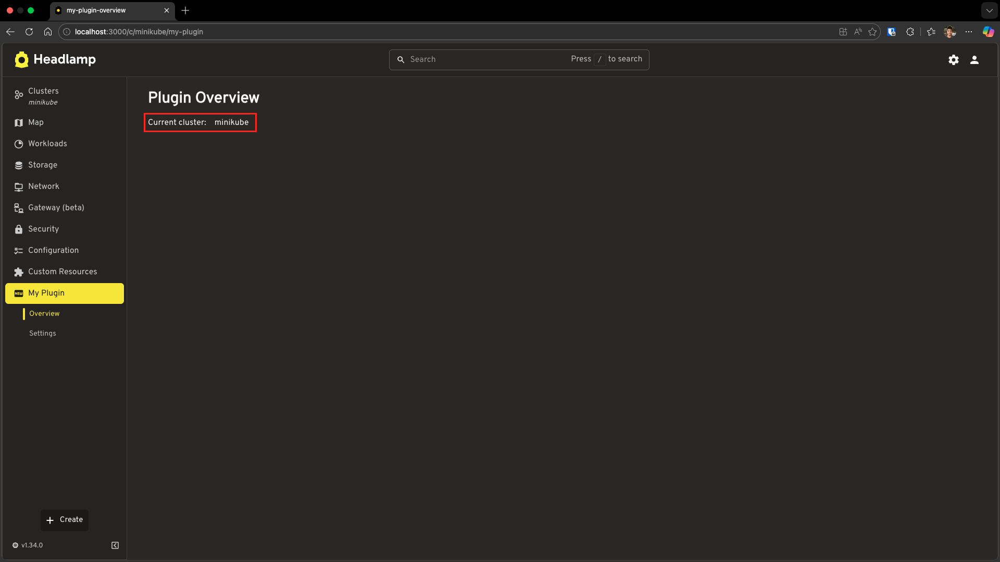
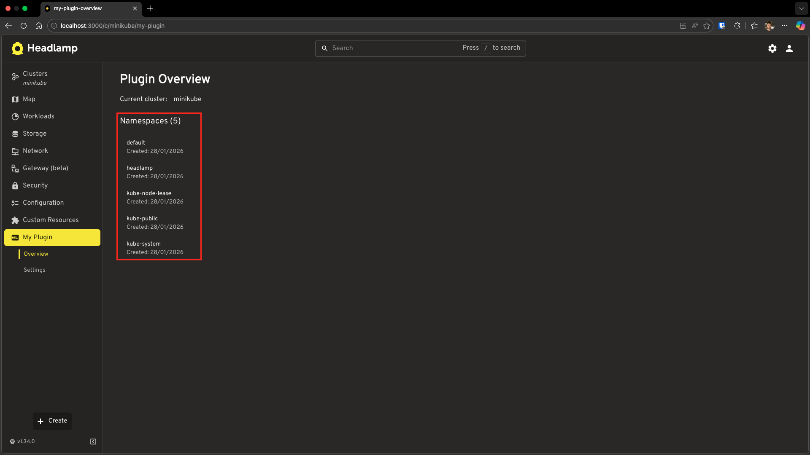
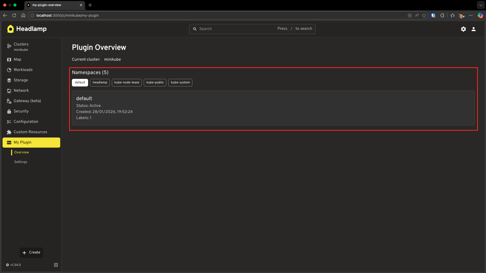
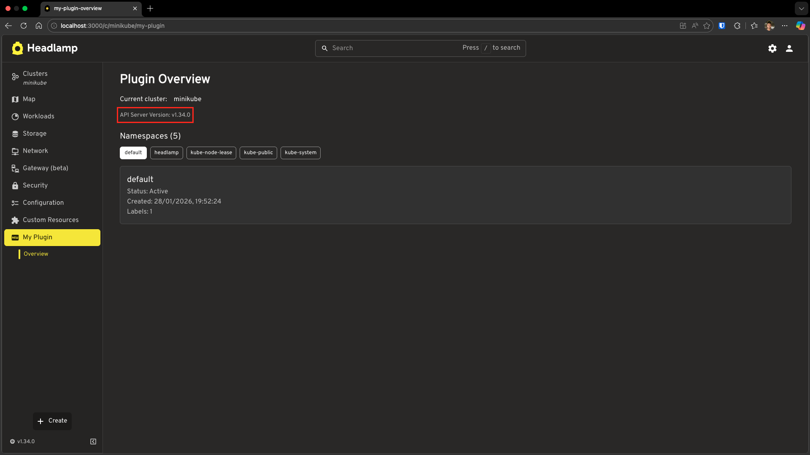
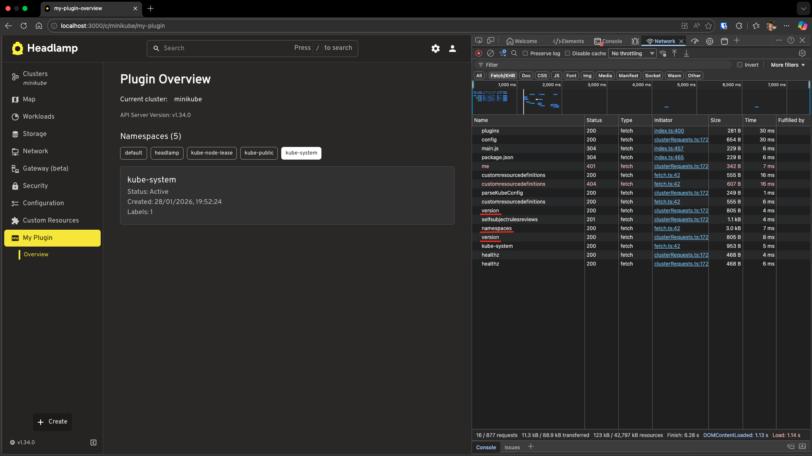

# Working with Kubernetes Data

This tutorial teaches you how to fetch and display Kubernetes data in your plugin. You'll learn three different approaches: using cluster context, built-in resource classes, and direct API calls.

---

## Table of Contents

1. [Introduction](#introduction)
2. [Understanding Cluster Context](#understanding-cluster-context)
3. [Using Built-in Resource Classes](#using-built-in-resource-classes)
4. [Fetching Single Resources](#fetching-single-resources)
5. [Direct API Calls with ApiProxy](#direct-api-calls-with-apiproxy)
6. [Troubleshooting](#troubleshooting)
7. [What's Next](#whats-next)
8. [Quick Reference](#quick-reference)

---

## Introduction

In [Tutorial 3](../adding-pages-and-sidebar-navigation/), you created pages with static content. Real plugins need to display live Kubernetes data like pods, deployments, nodes, etc.

This tutorial covers three ways to fetch Kubernetes data:

| Approach | Best For | Example |
|----------|----------|---------|
| `getCluster()` | Getting current cluster context | Display cluster name |
| `K8s.ResourceClasses` | Standard Kubernetes resources | List namespaces, nodes |
| `ApiProxy.request()` | Custom endpoints, raw API calls | Fetch API server version |

### What You'll Build

By the end of this tutorial, your plugin will:

- Display the current cluster name
- Show a list of namespaces
- List namespaces as clickable buttons
- Display namespace details when clicked
- Fetch and display API server version information

### Prerequisites

Before starting, ensure you have:

- ✅ Completed [Tutorial 3: Adding Pages and Sidebar Navigation](../adding-pages-and-sidebar-navigation/)
- ✅ Your `hello-headlamp` plugin ready
- ✅ Headlamp running with a connected cluster (minikube, kind, or any Kubernetes cluster)

**Time to complete:** ~25 minutes

---

## Understanding Cluster Context

When a user navigates to a cluster-specific page, your plugin needs to know which cluster they're viewing. Headlamp provides the `getCluster()` utility for this.

### Display the Current Cluster

Let's update your Overview page to show the current cluster name.

Open `src/index.tsx` and update it:

```tsx
import {
  registerRoute,
  registerSidebarEntry,
} from '@kinvolk/headlamp-plugin/lib';
import { getCluster } from '@kinvolk/headlamp-plugin/lib/Utils';
import { SectionBox } from '@kinvolk/headlamp-plugin/lib/CommonComponents';
import { Typography, Box } from '@mui/material';

function OverviewPage() {
  const cluster = getCluster();

  return (
    <SectionBox title="Plugin Overview">
      <Box sx={{ display: 'flex', alignItems: 'center', gap: 2 }}>
        <Typography>Current cluster:</Typography>
        {cluster ? <>{cluster}</> : <>{'N/A'}</>}
      </Box>
    </SectionBox>
  );
}

// Register the route (cluster view)
registerRoute({
  path: '/my-plugin',
  sidebar: 'my-plugin-overview',
  component: OverviewPage,
  exact: true,
});

// Register sidebar entries
registerSidebarEntry({
  name: 'my-plugin',
  label: 'My Plugin',
  icon: 'mdi:new-box',
  url: '/my-plugin',
});

registerSidebarEntry({
  parent: 'my-plugin',
  name: 'my-plugin-overview',
  label: 'Overview',
  url: '/my-plugin',
});
```

### Test It

1. Save the file
2. Navigate to a cluster in Headlamp
3. Click **My Plugin** → **Overview** in the sidebar
4. You should see the cluster name displayed!



**What's happening?**

| Code | Purpose |
|------|---------|
| `getCluster()` | Returns the current cluster name from the URL (e.g., `minikube`) |
| Returns `null` | When not in a cluster context (home view) |

> **Note:** `getCluster()` reads the cluster from the URL path (`/c/:cluster/...`). It only works on cluster-specific pages where `useClusterURL: true` (the default).

---

## Using Built-in Resource Classes

Now let's fetch actual Kubernetes resources. Headlamp provides `K8s.ResourceClasses` with built-in hooks for all standard Kubernetes resources including Pod, Namespace, Node, Deployment, Service, ConfigMap, Secret, and many more.

> **📚 Full list:** See [ResourceClasses API Reference](https://headlamp.dev/docs/latest/development/api/lib/k8s/variables/ResourceClasses) for all available resource classes.

Each class provides two hooks:
- **`useList()`** — Fetch multiple resources
- **`useGet(name, namespace?)`** — Fetch a single resource

### List Namespaces

Let's display all namespaces in the cluster. Update your `src/index.tsx`:

```tsx
import {
  K8s,
  registerRoute,
  registerSidebarEntry,
} from '@kinvolk/headlamp-plugin/lib';
import { getCluster } from '@kinvolk/headlamp-plugin/lib/Utils';
import { SectionBox } from '@kinvolk/headlamp-plugin/lib/CommonComponents';
import {
  Typography,
  Box,
  CircularProgress,
  List,
  ListItem,
  ListItemText,
} from '@mui/material';

function OverviewPage() {
  const cluster = getCluster();

  // Fetch all namespaces
  const [namespaces, namespacesError] = K8s.ResourceClasses.Namespace.useList();

  // Loading state
  if (!namespaces && !namespacesError) {
    return (
      <SectionBox title="Plugin Overview">
        <Box sx={{ display: 'flex', alignItems: 'center', gap: 2 }}>
          <CircularProgress size={20} />
          <Typography>Loading namespaces...</Typography>
        </Box>
      </SectionBox>
    );
  }

  // Error state
  if (namespacesError) {
    return (
      <SectionBox title="Plugin Overview">
        <Typography color="error">
          Error loading namespaces: {namespacesError.message}
        </Typography>
      </SectionBox>
    );
  }

  return (
    <SectionBox title="Plugin Overview">
      <Box sx={{ display: 'flex', alignItems: 'center', gap: 2, mb: 3 }}>
        <Typography>Current cluster:</Typography>
        {cluster ? <>{cluster}</> : <>{'N/A'}</>}
      </Box>

      <Typography variant="h6" sx={{ mb: 1 }}>
        Namespaces ({namespaces?.length || 0})
      </Typography>

      <List dense>
        {namespaces?.slice(0, 5).map(ns => (
          <ListItem key={ns.metadata.name}>
            <ListItemText
              primary={ns.metadata.name}
              secondary={`Created: ${new Date(
                ns.metadata.creationTimestamp
              ).toLocaleDateString()}`}
            />
          </ListItem>
        ))}
        {namespaces && namespaces.length > 5 && (
          <ListItem>
            <ListItemText
              secondary={`... and ${namespaces.length - 5} more`}
            />
          </ListItem>
        )}
      </List>
    </SectionBox>
  );
}

registerRoute({
  path: '/my-plugin',
  sidebar: 'my-plugin-overview',
  component: OverviewPage,
  exact: true,
});

registerSidebarEntry({
  name: 'my-plugin',
  label: 'My Plugin',
  icon: 'mdi:new-box',
  url: '/my-plugin',
});

registerSidebarEntry({
  parent: 'my-plugin',
  name: 'my-plugin-overview',
  label: 'Overview',
  url: '/my-plugin',
});
```

### Test It

Save and navigate to your plugin page. You should see:
- The cluster name
- A count of namespaces
- The first 5 namespaces listed



**Understanding the useList Hook**

```tsx
const [namespaces, error] = K8s.ResourceClasses.Namespace.useList();
```

| Return Value | Type | Description |
|--------------|------|-------------|
| `namespaces` | `Namespace[] \| null` | Array of namespace objects, or `null` while loading |
| `error` | `Error \| null` | Error object if the request failed |

**The Three States:**

```tsx
// Loading: data is null, no error
if (!namespaces && !namespacesError) {
  return <Loading />;
}

// Error: request failed
if (namespacesError) {
  return <Error message={namespacesError.message} />;
}

// Success: data is available
return <DisplayData namespaces={namespaces} />;
```

---

## Fetching Single Resources

Sometimes you need to fetch a specific resource by name. Use `useGet()` for this.

### Add Namespace Details

Let's enhance our `OverviewPage` to show details when a namespace is clicked. Update your `src/index.tsx`:

```tsx
import { useState } from 'react';
import {
  K8s,
  registerRoute,
  registerSidebarEntry,
} from '@kinvolk/headlamp-plugin/lib';
import { getCluster } from '@kinvolk/headlamp-plugin/lib/Utils';
import { SectionBox } from '@kinvolk/headlamp-plugin/lib/CommonComponents';
import {
  Typography,
  Box,
  CircularProgress,
  Button,
  Paper,
} from '@mui/material';

// Component to show details of a selected namespace
function NamespaceDetail({ namespace }: { namespace: string }) {
  // Fetch a single namespace by name using useGet()
  const [ns, nsError] = K8s.ResourceClasses.Namespace.useGet(namespace);

  if (!ns && !nsError) {
    return <CircularProgress size={20} />;
  }

  if (nsError) {
    return <Typography color="error">Namespace not found</Typography>;
  }

  return (
    <Paper variant="outlined" sx={{ p: 2 }}>
      <Typography variant="h6">{ns.metadata.name}</Typography>
      <Typography color="text.secondary">
        Status: {ns.status?.phase}
      </Typography>
      <Typography color="text.secondary">
        Created: {new Date(ns.metadata.creationTimestamp).toLocaleString()}
      </Typography>
      <Typography color="text.secondary">
        Labels: {Object.keys(ns.metadata.labels || {}).length}
      </Typography>
    </Paper>
  );
}

function OverviewPage() {
  const cluster = getCluster();
  const [selectedNamespace, setSelectedNamespace] = useState<string | null>(null);

  // Fetch all namespaces using useList()
  const [namespaces, namespacesError] = K8s.ResourceClasses.Namespace.useList();

  if (!namespaces && !namespacesError) {
    return (
      <SectionBox title="Plugin Overview">
        <Box sx={{ display: 'flex', alignItems: 'center', gap: 2 }}>
          <CircularProgress size={20} />
          <Typography>Loading namespaces...</Typography>
        </Box>
      </SectionBox>
    );
  }

  if (namespacesError) {
    return (
      <SectionBox title="Plugin Overview">
        <Typography color="error">
          Error loading namespaces: {namespacesError.message}
        </Typography>
      </SectionBox>
    );
  }

  return (
    <SectionBox title="Plugin Overview">
      <Box sx={{ display: 'flex', alignItems: 'center', gap: 2, mb: 3 }}>
        <Typography>Current cluster:</Typography>
        {cluster ? <>{cluster}</> : <>{'N/A'}</>}
      </Box>

      <Typography variant="h6" sx={{ mb: 1 }}>
        Namespaces ({namespaces?.length || 0})
      </Typography>

      {/* Namespace buttons - click to see details */}
      <Box sx={{ display: 'flex', flexWrap: 'wrap', gap: 1, mb: 2 }}>
        {namespaces?.slice(0, 5).map(ns => (
          <Button
            key={ns.metadata.name}
            variant={selectedNamespace === ns.metadata.name ? 'contained' : 'outlined'}
            size="small"
            onClick={() => setSelectedNamespace(ns.metadata.name)}
          >
            {ns.metadata.name}
          </Button>
        ))}
      </Box>

      {/* Show details when a namespace is selected */}
      {selectedNamespace && (
        <NamespaceDetail namespace={selectedNamespace} />
      )}
    </SectionBox>
  );
}

registerRoute({
  path: '/my-plugin',
  sidebar: 'my-plugin-overview',
  component: OverviewPage,
  exact: true,
});

registerSidebarEntry({
  name: 'my-plugin',
  label: 'My Plugin',
  icon: 'mdi:new-box',
  url: '/my-plugin',
});

registerSidebarEntry({
  parent: 'my-plugin',
  name: 'my-plugin-overview',
  label: 'Overview',
  url: '/my-plugin',
});
```



**What changed from the previous example:**

| Addition | Purpose |
|----------|---------|
| `useState` for `selectedNamespace` | Track which namespace is selected |
| `NamespaceDetail` component | Uses `useGet()` to fetch single namespace |
| `Button` instead of `List` | Clickable namespace selection |
| Conditional render | Only show details when a namespace is selected |

**useGet Signature:**

| Resource Type | Signature | Example |
|---------------|-----------|---------|
| Cluster-scoped | `useGet(name)` | `Node.useGet('node-1')` |
| Namespaced | `useGet(name, namespace)` | `Pod.useGet('nginx', 'default')` |

---

## Direct API Calls with ApiProxy

Sometimes you need to call Kubernetes APIs that don't have a built-in resource class, or you want more control over the request. `ApiProxy` provides direct access to the Kubernetes API server.

### Example: Add API Server Version to Overview Page

Let's enhance our `OverviewPage` to also display the Kubernetes API server version using `ApiProxy.request()`. This builds on the previous example:

```tsx
import { useState, useEffect } from 'react';
import {
  ApiProxy,
  K8s,
  registerRoute,
  registerSidebarEntry,
} from '@kinvolk/headlamp-plugin/lib';
import { getCluster } from '@kinvolk/headlamp-plugin/lib/Utils';
import { SectionBox } from '@kinvolk/headlamp-plugin/lib/CommonComponents';
import {
  Typography,
  Box,
  CircularProgress,
  Button,
  Paper,
} from '@mui/material';

// Component to show details of a selected namespace
function NamespaceDetail({ namespace }: { namespace: string }) {
  const [ns, nsError] = K8s.ResourceClasses.Namespace.useGet(namespace);

  if (!ns && !nsError) {
    return <CircularProgress size={20} />;
  }

  if (nsError) {
    return <Typography color="error">Namespace not found</Typography>;
  }

  return (
    <Paper variant="outlined" sx={{ p: 2 }}>
      <Typography variant="h6">{ns.metadata.name}</Typography>
      <Typography color="text.secondary">
        Status: {ns.status?.phase}
      </Typography>
      <Typography color="text.secondary">
        Created: {new Date(ns.metadata.creationTimestamp).toLocaleString()}
      </Typography>
      <Typography color="text.secondary">
        Labels: {Object.keys(ns.metadata.labels || {}).length}
      </Typography>
    </Paper>
  );
}

function OverviewPage() {
  const cluster = getCluster();
  const [selectedNamespace, setSelectedNamespace] = useState<string | null>(null);
  const [versionInfo, setVersionInfo] = useState<{ gitVersion?: string } | null>(null);

  // Fetch all namespaces using useList()
  const [namespaces, namespacesError] = K8s.ResourceClasses.Namespace.useList();

  // Fetch API server version using ApiProxy
  useEffect(() => {
    async function fetchVersion() {
      if (!cluster) return;

      try {
        const response = await ApiProxy.request('/version', {
          cluster: cluster,
        });
        setVersionInfo(response);
      } catch (err) {
        // Silently fail - version info is optional
        console.error('Failed to fetch version:', err);
      }
    }

    fetchVersion();
  }, [cluster]);

  if (!namespaces && !namespacesError) {
    return (
      <SectionBox title="Plugin Overview">
        <Box sx={{ display: 'flex', alignItems: 'center', gap: 2 }}>
          <CircularProgress size={20} />
          <Typography>Loading namespaces...</Typography>
        </Box>
      </SectionBox>
    );
  }

  if (namespacesError) {
    return (
      <SectionBox title="Plugin Overview">
        <Typography color="error">
          Error loading namespaces: {namespacesError.message}
        </Typography>
      </SectionBox>
    );
  }

  return (
    <SectionBox title="Plugin Overview">
      <Box sx={{ display: 'flex', alignItems: 'center', gap: 2, mb: 2 }}>
        <Typography>Current cluster:</Typography>
        {cluster ? <>{cluster}</> : <>{'N/A'}</>}
      </Box>

      {/* API Server Version Info - added using ApiProxy */}
      {versionInfo?.gitVersion && (
        <Box sx={{ mb: 3 }}>
          <Typography variant="body2" color="text.secondary">
            API Server Version: {versionInfo.gitVersion}
          </Typography>
        </Box>
      )}

      <Typography variant="h6" sx={{ mb: 1 }}>
        Namespaces ({namespaces?.length || 0})
      </Typography>

      {/* Namespace buttons - click to see details */}
      <Box sx={{ display: 'flex', flexWrap: 'wrap', gap: 1, mb: 2 }}>
        {namespaces?.slice(0, 5).map(ns => (
          <Button
            key={ns.metadata.name}
            variant={selectedNamespace === ns.metadata.name ? 'contained' : 'outlined'}
            size="small"
            onClick={() => setSelectedNamespace(ns.metadata.name)}
          >
            {ns.metadata.name}
          </Button>
        ))}
      </Box>

      {/* Show details when a namespace is selected */}
      {selectedNamespace && (
        <NamespaceDetail namespace={selectedNamespace} />
      )}
    </SectionBox>
  );
}

registerRoute({
  path: '/my-plugin',
  sidebar: 'my-plugin-overview',
  component: OverviewPage,
  exact: true,
});

registerSidebarEntry({
  name: 'my-plugin',
  label: 'My Plugin',
  icon: 'mdi:new-box',
  url: '/my-plugin',
});

registerSidebarEntry({
  parent: 'my-plugin',
  name: 'my-plugin-overview',
  label: 'Overview',
  url: '/my-plugin',
});
```

**What's new:**
- Added `ApiProxy` import and `useEffect` hook
- Added `versionInfo` state to store API server version
- Added `useEffect` to fetch version when cluster changes
- Display version info below cluster name



### Explore the Network Requests

To better understand how these API calls work, let's inspect the network traffic:

1. **Open your browser's Developer Tools** (F12 or right-click → Inspect)
2. **Go to the Network tab**
3. **Refresh your plugin page** or navigate to it
4. **Look for the API requests:**

You should see requests like:
- `/api/v1/namespaces` - This is the `useList()` call fetching all namespaces
- `/version` - This is the `ApiProxy.request()` call fetching API server version
- `/api/v1/namespaces/{name}` - This appears when you click a namespace (the `useGet()` call)



### Understanding ApiProxy.request

```tsx
const response = await ApiProxy.request('/version', {
  cluster: cluster,
});
```

| Parameter | Description |
|-----------|-------------|
| First arg: `/version` | The API endpoint path (relative to cluster API server) |
| `cluster` option | Which cluster to send the request to |

**Recommendations:**

- **Use `K8s.ResourceClasses`** for standard Kubernetes resources—it handles caching, error handling, and real-time updates automatically
- **Use `ApiProxy.request()`** for custom endpoints or when you need full control
- **Always handle loading and error states** for a good user experience

---

## Troubleshooting

### "No cluster selected" Error

**Problem:** `getCluster()` returns `null`

**Solution:** Make sure you're on a cluster-specific page:
- URL should be `/c/:cluster/your-path`
- Route should have `useClusterURL: true` (default)

### Data Not Loading

**Check the console for errors:**
1. Open browser DevTools (F12)
2. Look at the Console tab for error messages
3. Check the Network tab for failed API requests

**Common issues:**
- RBAC permissions — User may not have permission to list resources
- Cluster connectivity — Check if Headlamp can reach the cluster

### useList Returns Empty Array

**Possible causes:**
- The resource type doesn't exist in the cluster
- No resources of that type exist
- Filtered by namespace (for namespaced resources)

**For namespaced resources, you can filter by namespace:**

```tsx
// List pods only in the 'default' namespace
const [pods, error] = K8s.ResourceClasses.Pod.useList({
  namespace: 'default'
});
```

### ApiProxy.request Fails

**Check the endpoint path:**
- Ensure the path starts with `/`
- Use the correct API group (`/api/v1/` vs `/apis/apps/v1/`)

**Check cluster parameter:**
```tsx
const cluster = getCluster();
if (!cluster) {
  // Handle no cluster case
  return;
}

const response = await ApiProxy.request('/version', {
  cluster: cluster, // Must be provided
});
```

---

## What's Next

You've learned three ways to fetch Kubernetes data:

- ✅ `getCluster()` for cluster context
- ✅ `K8s.ResourceClasses.useList()` for listing resources
- ✅ `K8s.ResourceClasses.useGet()` for single resources
- ✅ `ApiProxy.request()` for direct API calls
- ✅ Handling loading and error states

In the next tutorial, you'll learn advanced techniques:

**Coming up in Tutorial 5: Advanced Kubernetes Interactions**
- Creating custom resource classes for type-safe data access
- Using `ApiProxy` to modify resources (add labels, update resources)
- Error handling for write operations

---

## Quick Reference

### getCluster

```tsx
import { getCluster } from '@kinvolk/headlamp-plugin/lib/Utils';

const cluster = getCluster(); // Returns cluster name or null
```

### K8s.ResourceClasses

```tsx
import { K8s } from '@kinvolk/headlamp-plugin/lib';

// List all resources
const [items, error] = K8s.ResourceClasses.Namespace.useList();

// List with filters
const [pods, error] = K8s.ResourceClasses.Pod.useList({
  namespace: 'default',
});

// Get single resource (cluster-scoped)
const [node, error] = K8s.ResourceClasses.Node.useGet('node-name');

// Get single resource (namespaced)
const [pod, error] = K8s.ResourceClasses.Pod.useGet('pod-name', 'namespace');
```

### ApiProxy.request

```tsx
import { ApiProxy } from '@kinvolk/headlamp-plugin/lib';

// GET request
const response = await ApiProxy.request('/api/v1/namespaces', {
  cluster: 'my-cluster',
});

// With error handling
try {
  const data = await ApiProxy.request('/version', { cluster });
} catch (error) {
  console.error('Request failed:', error);
}
```

### Useful Links

- [ResourceClasses API Reference](https://headlamp.dev/docs/latest/development/api/lib/k8s/variables/ResourceClasses) — Full list of built-in resource classes
- [K8s Module API Reference](https://headlamp.dev/docs/latest/development/api/modules/lib_k8s/)
- [ApiProxy API Reference](https://headlamp.dev/docs/latest/development/api/classes/lib_k8s_apiProxy.ApiProxy/)
- [Kubernetes API Reference](https://kubernetes.io/docs/reference/kubernetes-api/)
