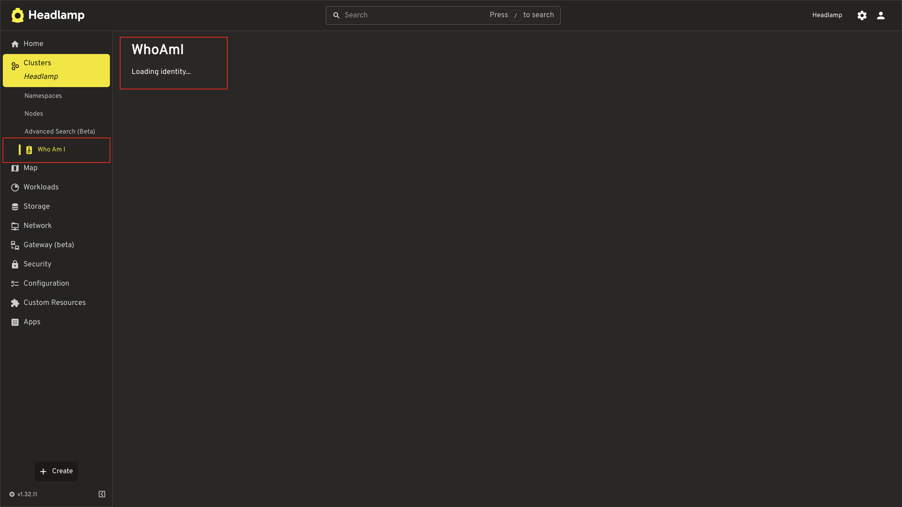
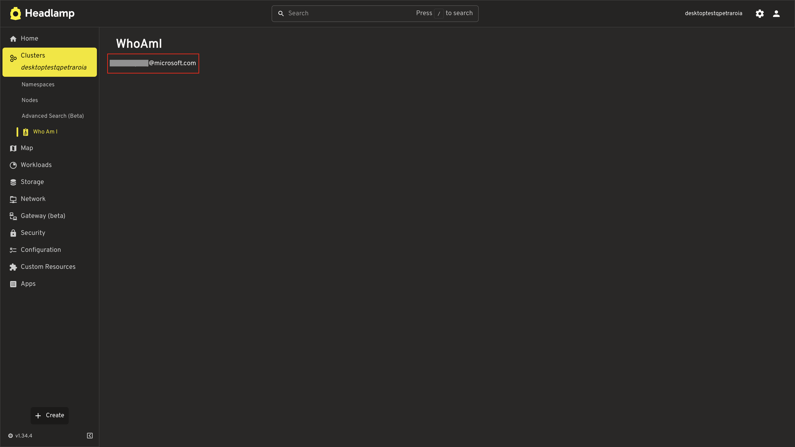
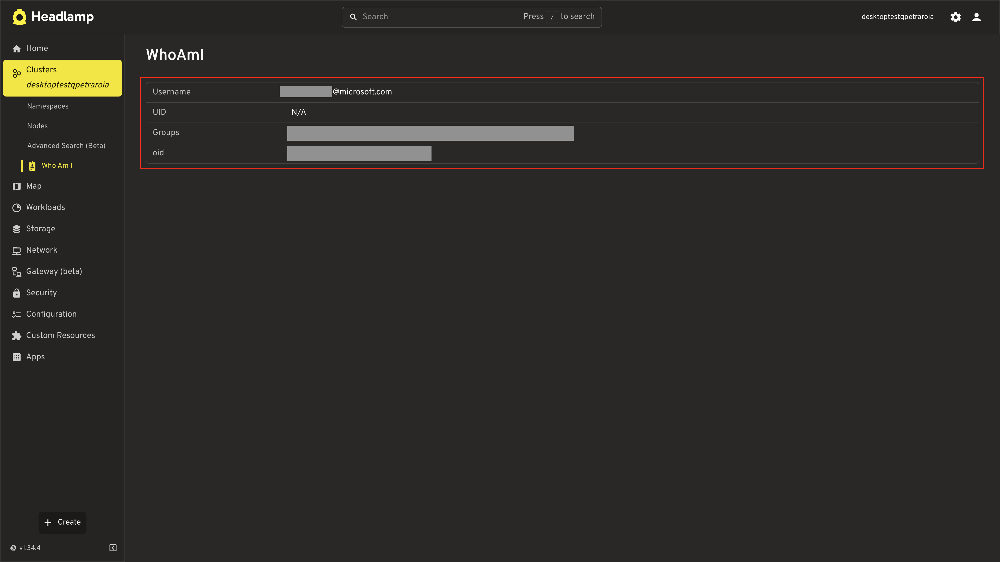
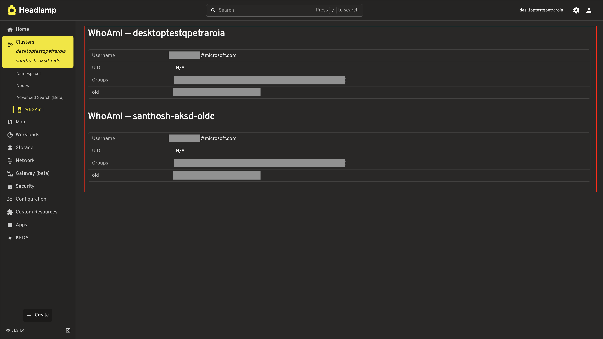

# Building a WhoAmI Plugin

In the [Getting Started](../getting-started/) series, you learned the full toolkit for Headlamp plugin development — scaffolding, sidebar navigation, Kubernetes data fetching, pages, and more. Now let's apply that knowledge to solve a real problem: **"Who am I in this cluster?"**

In this tutorial, you'll build a focused, single-purpose plugin that adds a **WhoAmI** entry under the **Cluster** section in the cluster sidebar — alongside Namespaces and Nodes. When clicked, it shows the current user's identity — username, UID, and groups — just like `kubectl auth whoami`.

---

## Table of Contents

1. [Introduction](#introduction)
2. [What You'll Build](#what-youll-build)
3. [Create the Plugin](#create-the-plugin)
4. [Add the Sidebar Entry](#add-the-sidebar-entry)
5. [Build the WhoAmI Page](#build-the-whoami-page)
6. [Fetch User Identity](#fetch-user-identity)
7. [Display the Identity](#display-the-identity)
8. [Supporting Multi-Cluster](#supporting-multi-cluster)
9. [Troubleshooting](#troubleshooting)
10. [Quick Reference](#quick-reference)

---

## Introduction

Kubernetes tracks who is making API requests. Every request carries an identity — a username, a UID, and a set of groups. You've probably used `kubectl auth whoami` to see this:

```
ATTRIBUTE   VALUE
Username    user@example.com
UID         abc-123-def
Groups      [system:authenticated, developers]
```

But when you're working in Headlamp's UI, there's no built-in way to see this identity at a glance. Let's fix that by building a plugin that calls the same Kubernetes API (`SelfSubjectReview`) and displays the result in a clean page.

### Prerequisites

Before starting, ensure you have:

- Completed the [Getting Started](../getting-started/) tutorial series (at least Tutorials 1-4)
- Headlamp running locally with a connected cluster
- Node.js >= 20.11.1 and npm >= 10.0.0
- Your cluster running Kubernetes >= 1.28 (for `SelfSubjectReview` API)

**Time to complete:** ~20 minutes

---

## What You'll Build

A plugin called `whoami-headlamp` that:

1. Adds a **WhoAmI** entry under **Cluster** in the cluster sidebar (alongside Namespaces and Nodes)
2. Calls the `SelfSubjectReview` API to fetch the current user's identity
3. Displays username, UID, groups, and extra info in a clean layout

```
Sidebar (Cluster View):
├── Home
├── Cluster
│   ├── Namespaces
│   ├── Nodes
│   └── WhoAmI              → /whoami
├── Workloads
└── ...
```

---

## Create the Plugin

Scaffold a new plugin project:

```bash
cd ~/projects
npx --yes @kinvolk/headlamp-plugin create whoami-headlamp
cd whoami-headlamp
```

Start the plugin in development mode:

```bash
npm start
```

> Make sure Headlamp is also running in a separate terminal (`npm start` in the Headlamp directory).

---

## Add the Sidebar Entry

Open `src/index.tsx` and replace its contents with:

```tsx
import { registerRoute, registerSidebarEntry } from '@kinvolk/headlamp-plugin/lib';
import { SectionBox } from '@kinvolk/headlamp-plugin/lib/CommonComponents';
import { Typography } from '@mui/material';

function WhoAmIPage() {
  return (
    <SectionBox title="WhoAmI">
      <Typography>Loading identity...</Typography>
    </SectionBox>
  );
}

// Register the sidebar entry under Cluster (alongside Namespaces, Nodes)
registerSidebarEntry({
  parent: 'cluster',
  name: 'whoami',
  label: 'Who Am I',
  url: '/whoami',
  icon: 'mdi:badge-account',
});

// Register the route
registerRoute({
  path: '/whoami',
  sidebar: 'whoami',
  component: WhoAmIPage,
  exact: true,
});
```

**What's happening here?**

| Code | Purpose |
|------|---------|
| `parent: 'cluster'` | Places the entry under the Cluster section, alongside Namespaces and Nodes |
| `icon: 'mdi:badge-account'` | An identity-themed icon from [Iconify](https://icon-sets.iconify.design/mdi/badge-account/) |
| `sidebar: 'whoami'` | Links the route to the sidebar entry so it highlights when active |

### Test It

1. Save the file
2. Navigate to a cluster in Headlamp
3. Expand the **Cluster** section in the sidebar
4. You should see **WhoAmI** alongside Namespaces and Nodes
5. Click it — you'll see the placeholder page



---

## Fetch User Identity

Now let's call the Kubernetes `SelfSubjectReview` API to get the current user's identity. This is the same API that `kubectl auth whoami` uses.

The API works by sending a POST request to `/apis/authentication.k8s.io/v1/selfsubjectreviews` with an empty body, and the server responds with the authenticated user's info.

Update `src/index.tsx`:

```tsx
import { useState, useEffect } from 'react';
import {
  ApiProxy,
  registerRoute,
  registerSidebarEntry,
} from '@kinvolk/headlamp-plugin/lib';
import { getCluster } from '@kinvolk/headlamp-plugin/lib/Utils';
import { SectionBox } from '@kinvolk/headlamp-plugin/lib/CommonComponents';
import { Typography, CircularProgress, Box } from '@mui/material';

// Type for the SelfSubjectReview response
interface UserInfo {
  username: string;
  uid?: string;
  groups?: string[];
  extra?: Record<string, string[]>;
}

function WhoAmIPage() {
  const cluster = getCluster();
  const [userInfo, setUserInfo] = useState<UserInfo>();
  const [error, setError] = useState<string | null>(null);

  useEffect(() => {
    async function fetchIdentity() {
      if (!cluster) return;

      try {
        const response = await ApiProxy.request(
          '/apis/authentication.k8s.io/v1/selfsubjectreviews',
          {
            cluster,
            method: 'POST',
            body: JSON.stringify({
              apiVersion: 'authentication.k8s.io/v1',
              kind: 'SelfSubjectReview',
            }),
            headers: {
              'Content-Type': 'application/json',
            },
          }
        );
        setUserInfo(response.status?.userInfo);
      } catch (err) {
        setError(err instanceof Error ? err.message : 'Failed to fetch identity');
      }
    }

    fetchIdentity();
  }, [cluster]);

  if (error) {
    return (
      <SectionBox title="WhoAmI">
        <Typography color="error">{error}</Typography>
      </SectionBox>
    );
  }

  if (!userInfo) {
    return (
      <SectionBox title="WhoAmI">
        <Box sx={{ display: 'flex', alignItems: 'center', gap: 2 }}>
          <CircularProgress size={20} />
          <Typography>Loading identity...</Typography>
        </Box>
      </SectionBox>
    );
  }

  return (
    <SectionBox title="WhoAmI">
      <Typography>{userInfo.username}</Typography>
    </SectionBox>
  );
}

registerSidebarEntry({
  parent: 'cluster',
  name: 'whoami',
  label: 'Who Am I',
  url: '/whoami',
  icon: 'mdi:badge-account',
});

registerRoute({
  path: '/whoami',
  sidebar: 'whoami',
  component: WhoAmIPage,
  exact: true,
});
```

**Key details about the API call:**

| Parameter | Value | Why |
|-----------|-------|-----|
| Endpoint | `/apis/authentication.k8s.io/v1/selfsubjectreviews` | The SelfSubjectReview API endpoint |
| Method | `POST` | This API requires a POST, not a GET |
| Body | `{ apiVersion, kind }` | Minimal required body — the server fills in the response |
| `cluster` | From `getCluster()` | Routes the request to the correct cluster |

The response has this structure:

```json
{
  "apiVersion": "authentication.k8s.io/v1",
  "kind": "SelfSubjectReview",
  "status": {
    "userInfo": {
      "username": "user@example.com",
      "uid": "abc-123-def",
      "groups": ["system:authenticated", "developers"],
      "extra": {
        "some-key": ["some-value"]
      }
    }
  }
}
```

### Test It

Save the file and click WhoAmI in the sidebar. You should see the username displayed. Now let's make it look better.

> **Note:** The username format depends on your cluster's authentication provider. For example, Azure (AKS) typically shows your email address, minikube shows a client certificate CN, and OIDC providers may show a custom claim. This is expected — the API returns whatever identity the cluster sees for your requests.



---

## Display the Identity

Let's use Headlamp's `NameValueTable` component to display the identity information cleanly, matching the style of built-in resource detail pages.

Update the `WhoAmIPage` component:

```tsx
import { useState, useEffect } from 'react';
import {
  ApiProxy,
  registerRoute,
  registerSidebarEntry,
} from '@kinvolk/headlamp-plugin/lib';
import { getCluster } from '@kinvolk/headlamp-plugin/lib/Utils';
import {
  NameValueTable,
  SectionBox,
} from '@kinvolk/headlamp-plugin/lib/CommonComponents';
import { Typography, CircularProgress, Box, Chip } from '@mui/material';

interface UserInfo {
  username: string;
  uid?: string;
  groups?: string[];
  extra?: Record<string, string[]>;
}

function WhoAmIPage() {
  const cluster = getCluster();
  const [userInfo, setUserInfo] = useState<UserInfo>();
  const [error, setError] = useState<string | null>(null);

  useEffect(() => {
    async function fetchIdentity() {
      if (!cluster) return;

      try {
        const response = await ApiProxy.request(
          '/apis/authentication.k8s.io/v1/selfsubjectreviews',
          {
            cluster,
            method: 'POST',
            body: JSON.stringify({
              apiVersion: 'authentication.k8s.io/v1',
              kind: 'SelfSubjectReview',
            }),
            headers: {
              'Content-Type': 'application/json',
            },
          }
        );
        setUserInfo(response.status?.userInfo);
      } catch (err) {
        setError(err instanceof Error ? err.message : 'Failed to fetch identity');
      }
    }

    fetchIdentity();
  }, [cluster]);

  if (error) {
    return (
      <SectionBox title="WhoAmI">
        <Typography color="error">{error}</Typography>
      </SectionBox>
    );
  }

  if (!userInfo) {
    return (
      <SectionBox title="WhoAmI">
        <Box sx={{ display: 'flex', alignItems: 'center', gap: 2 }}>
          <CircularProgress size={20} />
          <Typography>Loading identity...</Typography>
        </Box>
      </SectionBox>
    );
  }

  // Build the rows for the NameValueTable
  const rows = [
    {
      name: 'Username',
      value: userInfo.username,
    },
    {
      name: 'UID',
      value: userInfo.uid || 'N/A',
    },
    {
      name: 'Groups',
      value: (
        <Box sx={{ display: 'flex', flexWrap: 'wrap', gap: 0.5 }}>
          {userInfo.groups?.map(group => (
            <Chip key={group} label={group} size="small" variant="outlined" />
          )) || 'None'}
        </Box>
      ),
    },
  ];

  // Add extra fields if present
  if (userInfo.extra && Object.keys(userInfo.extra).length > 0) {
    Object.entries(userInfo.extra).forEach(([key, values]) => {
      rows.push({
        name: key,
        value: (
          <Box sx={{ display: 'flex', flexWrap: 'wrap', gap: 0.5 }}>
            {values.map(v => (
              <Chip key={v} label={v} size="small" variant="outlined" />
            ))}
          </Box>
        ),
      });
    });
  }

  return (
    <SectionBox title="WhoAmI">
      <NameValueTable rows={rows} />
    </SectionBox>
  );
}

registerSidebarEntry({
  parent: 'cluster',
  name: 'whoami',
  label: 'Who Am I',
  url: '/whoami',
  icon: 'mdi:badge-account',
});

registerRoute({
  path: '/whoami',
  sidebar: 'whoami',
  component: WhoAmIPage,
  exact: true,
});
```

**What's new?**

| Component | Purpose |
|-----------|---------|
| `NameValueTable` | Headlamp's built-in key-value display, matching the style of resource detail pages |
| `Chip` | MUI component for displaying groups as tags |
| Extra fields | Dynamically renders any additional identity attributes the API returns |

### Test It

Save the file and navigate to the WhoAmI page. You should see a clean table showing:

- **Username** — your authenticated identity
- **UID** — your unique identifier (if available)
- **Groups** — displayed as chips (e.g., `system:authenticated`, `system:masters`)
- **Extra** — any additional attributes (varies by authentication provider)



---

## Supporting Multi-Cluster

Our plugin works, but there's a problem: it uses `getCluster()`, which returns only a **single** cluster name. Headlamp supports multi-cluster views where users can select and work with several clusters at once. If a user has multiple clusters selected, our plugin will only show the identity for one of them.

This is a common oversight in plugin development. Let's fix it by using the `useSelectedClusters()` hook, which returns **all** currently selected clusters.

| | `getCluster()` | `useSelectedClusters()` |
|--|----------------|------------------------|
| Returns | Single cluster name (`string \| null`) | All selected clusters (`string[]`) |
| Multi-cluster | Only sees the first/primary cluster | Sees every cluster the user selected |

### Update the Plugin

Replace the contents of `src/index.tsx` with the multi-cluster version:

```tsx
import { useState, useEffect } from 'react';
import {
  ApiProxy,
  registerRoute,
  registerSidebarEntry,
} from '@kinvolk/headlamp-plugin/lib';
import { useSelectedClusters } from '@kinvolk/headlamp-plugin/lib/k8s';
import {
  NameValueTable,
  SectionBox,
} from '@kinvolk/headlamp-plugin/lib/CommonComponents';
import { Typography, CircularProgress, Box, Chip } from '@mui/material';

interface UserInfo {
  username: string;
  uid?: string;
  groups?: string[];
  extra?: Record<string, string[]>;
}

// Fetches identity for a single cluster
async function fetchClusterIdentity(cluster: string): Promise<UserInfo> {
  const response = await ApiProxy.request(
    '/apis/authentication.k8s.io/v1/selfsubjectreviews',
    {
      cluster,
      method: 'POST',
      body: JSON.stringify({
        apiVersion: 'authentication.k8s.io/v1',
        kind: 'SelfSubjectReview',
      }),
      headers: {
        'Content-Type': 'application/json',
      },
    }
  );
  return response.status?.userInfo;
}

// Renders the identity table for a single cluster
function ClusterIdentity({
  cluster,
  userInfo,
  error,
}: {
  cluster: string;
  userInfo?: UserInfo;
  error?: string;
}) {
  if (error) {
    return (
      <SectionBox title={`WhoAmI — ${cluster}`}>
        <Typography color="error">{error}</Typography>
      </SectionBox>
    );
  }

  if (!userInfo) return null;

  const rows = [
    { name: 'Username', value: userInfo.username },
    { name: 'UID', value: userInfo.uid || 'N/A' },
    {
      name: 'Groups',
      value: (
        <Box sx={{ display: 'flex', flexWrap: 'wrap', gap: 0.5 }}>
          {userInfo.groups?.map(group => (
            <Chip key={group} label={group} size="small" variant="outlined" />
          )) || 'None'}
        </Box>
      ),
    },
  ];

  if (userInfo.extra && Object.keys(userInfo.extra).length > 0) {
    Object.entries(userInfo.extra).forEach(([key, values]) => {
      rows.push({
        name: key,
        value: (
          <Box sx={{ display: 'flex', flexWrap: 'wrap', gap: 0.5 }}>
            {values.map(v => (
              <Chip key={v} label={v} size="small" variant="outlined" />
            ))}
          </Box>
        ),
      });
    });
  }

  return (
    <SectionBox title={`WhoAmI — ${cluster}`}>
      <NameValueTable rows={rows} />
    </SectionBox>
  );
}

function WhoAmIPage() {
  // useSelectedClusters() returns all clusters the user currently has selected,
  // supporting Headlamp's multi-cluster feature.
  const selectedClusters = useSelectedClusters();
  const [clusterIdentities, setClusterIdentities] = useState<
    Record<string, { userInfo?: UserInfo; error?: string }>
  >({});
  const [loading, setLoading] = useState(true);

  useEffect(() => {
    if (selectedClusters.length === 0) {
      setLoading(false);
      return;
    }

    async function fetchIdentities() {
      setLoading(true);
      const results: Record<string, { userInfo?: UserInfo; error?: string }> = {};

      // Fetch identity for all selected clusters in parallel
      await Promise.all(
        selectedClusters.map(async cluster => {
          try {
            const userInfo = await fetchClusterIdentity(cluster);
            results[cluster] = { userInfo };
          } catch (err) {
            results[cluster] = {
              error: err instanceof Error ? err.message : 'Failed to fetch identity',
            };
          }
        })
      );

      setClusterIdentities(results);
      setLoading(false);
    }

    fetchIdentities();
  }, [selectedClusters.join(',')]);

  if (loading) {
    return (
      <SectionBox title="WhoAmI">
        <Box sx={{ display: 'flex', alignItems: 'center', gap: 2 }}>
          <CircularProgress size={20} />
          <Typography>Loading identity...</Typography>
        </Box>
      </SectionBox>
    );
  }

  if (selectedClusters.length === 0) {
    return (
      <SectionBox title="WhoAmI">
        <Typography>No cluster selected.</Typography>
      </SectionBox>
    );
  }

  return (
    <>
      {selectedClusters.map(cluster => (
        <ClusterIdentity
          key={cluster}
          cluster={cluster}
          {...clusterIdentities[cluster]}
        />
      ))}
    </>
  );
}

registerSidebarEntry({
  parent: 'cluster',
  name: 'whoami',
  label: 'Who Am I',
  url: '/whoami',
  icon: 'mdi:badge-account',
});

registerRoute({
  path: '/whoami',
  sidebar: 'whoami',
  component: WhoAmIPage,
  exact: true,
});
```

**What changed?**

| Change | Why |
|--------|-----|
| `getCluster()` → `useSelectedClusters()` | Gets all selected clusters instead of just one |
| Import from `lib/k8s` instead of `lib/Utils` | `useSelectedClusters` is exported from the K8s module |
| `fetchClusterIdentity()` helper | Extracted so we can call it once per cluster |
| `ClusterIdentity` component | Renders one identity section — reused for each cluster |
| `Promise.all(...)` | Fetches identities for all clusters in parallel |
| `SectionBox title={`WhoAmI — ${cluster}`}` | Labels each section with the cluster name so users can tell them apart |

With a single cluster selected, the page looks exactly like before (just with the cluster name in the title). With multiple clusters, users see one section per cluster — matching how Headlamp's built-in list pages show resources across clusters.

### Test It

1. Save the file
2. With a single cluster selected, the page should work as before
3. If you have multiple clusters configured, select more than one using the cluster chooser in the top bar — you should see a separate identity section for each cluster



---

## Troubleshooting

### "Failed to fetch identity" Error

**Check your Kubernetes version:**

The `SelfSubjectReview` API requires Kubernetes >= 1.28. Check your version:

```bash
kubectl version --short
```

If your cluster is older, the API won't be available.

**Check RBAC permissions:**

The `SelfSubjectReview` API is available to all authenticated users by default. If you see a 403 error, your cluster may have non-standard RBAC policies.

### Sidebar Entry Not Under Cluster

**Verify `parent: 'cluster'`:**

The entry must use `parent: 'cluster'` (lowercase) to appear under the Cluster section alongside Namespaces and Nodes:

```tsx
registerSidebarEntry({
  parent: 'cluster',    // Must be exactly 'cluster'
  name: 'whoami',
  // ...
});
```

### UID Shows "N/A"

Some authentication providers don't set a UID. This is normal — not all identity systems provide one. The username and groups are the primary identity attributes.

### Groups or Extra Fields Empty

The groups and extra fields depend on your authentication provider:

| Auth Method | Typical Groups | Extra Fields |
|-------------|---------------|--------------|
| Client certificate | `system:masters`, `system:authenticated` | None |
| OIDC | `system:authenticated`, custom groups | Varies by provider |
| Service account | `system:serviceaccounts`, namespace groups | None |
| Token webhook | Depends on provider | Depends on provider |

---

## Quick Reference

### SelfSubjectReview API

```tsx
const response = await ApiProxy.request(
  '/apis/authentication.k8s.io/v1/selfsubjectreviews',
  {
    cluster,
    method: 'POST',
    body: JSON.stringify({
      apiVersion: 'authentication.k8s.io/v1',
      kind: 'SelfSubjectReview',
    }),
    headers: {
      'Content-Type': 'application/json',
    },
  }
);

const userInfo = response.status?.userInfo;
// userInfo.username  — string
// userInfo.uid       — string | undefined
// userInfo.groups    — string[] | undefined
// userInfo.extra     — Record<string, string[]> | undefined
```

### Sidebar Under Cluster

```tsx
registerSidebarEntry({
  parent: 'cluster',           // Places entry under Cluster (alongside Namespaces, Nodes)
  name: 'whoami',
  label: 'Who Am I',
  url: '/whoami',
  icon: 'mdi:badge-account',
});
```

### Key Concepts Used

| Concept | From Tutorial | Applied Here |
|---------|---------------|--------------|
| `registerSidebarEntry` with `parent` | [Tutorial 3](../getting-started/adding-pages-and-sidebar-navigation/) | Sidebar entry under Cluster |
| `registerRoute` | [Tutorial 3](../getting-started/adding-pages-and-sidebar-navigation/) | WhoAmI page route |
| `ApiProxy.request` with POST | [Tutorial 4](../getting-started/working-with-kubernetes-data/) | SelfSubjectReview API call |
| `NameValueTable` | [Tutorial 6](../getting-started/building-list-and-detail-pages/) | Identity display |
| `getCluster()` | [Tutorial 4](../getting-started/working-with-kubernetes-data/) | Cluster context |

### Useful Links

- [SelfSubjectReview API](https://kubernetes.io/docs/reference/kubernetes-api/authentication-resources/self-subject-review-v1/) — Kubernetes API reference
- [kubectl auth whoami](https://kubernetes.io/docs/reference/kubectl/generated/kubectl_auth/kubectl_auth_whoami/) — CLI equivalent
- [Headlamp Plugin API](https://headlamp.dev/docs/latest/development/plugins/) — Plugin development docs
